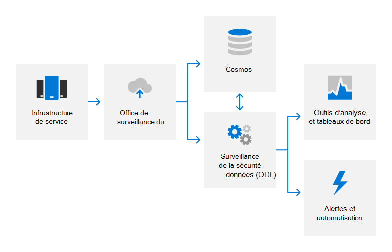

# Aperçu sur la journalisation d’audit

## Comment utiliser Microsoft 365 journalisation d’audit ?

Microsoft 365 utilise la journalisation d’audit pour détecter les activités non autorisées dans ses produits et services et assurer la responsabilité du personnel Microsoft. Les journaux d’audit capturent des détails sur les modifications de configuration système et les événements d’accès, avec des détails pour identifier qui était responsable de l’activité, quand et où l’activité a eu lieu, et quel était le résultat de l’activité. L’analyse automatisée des journaux prend en charge la détection en temps quasi réel de comportements suspects. Les incidents potentiels sont signalés à l’équipe de Microsoft 365 sécurité pour examen plus approfondie.

Microsoft 365'audit interne capture les données du journal à partir de différentes sources, telles que :

- Journaux d’événements
- Journaux AppLocker
- Données de performances
- System Center données
- Enregistrements des détails des appels
- Données de qualité de l’expérience
- Journaux du serveur web IIS
- SQL Server journaux
- Données Syslog
- Journaux d’audit de sécurité

## Comment est-Microsoft 365 centraliser et signaler les journaux d’audit ?

De nombreux types différents de données de journal sont téléchargés à partir de serveurs Microsoft 365 vers une solution de surveillance de la sécurité propriétaire pour l’analyse en temps quasi réel (NRT) et un service de big data computing interne (Cosmos) pour le stockage à long terme. Ce transfert de données se produit via une connexion TLS validée PAR LA FIPS 140-2 sur des ports et protocoles approuvés à l’aide d’un outil d’automatisation propriétaire appelé odl (Office Data Loader).

Les journaux sont traitées dans NRT à l’aide de méthodes basées sur des règles, statistiques et machine learning pour détecter les indicateurs de performances système et les événements de sécurité potentiels. Les modèles d’apprentissage automatique utilisent les données des journaux entrants et les données de journal historique stockées dans Cosmos pour améliorer en permanence les fonctionnalités de détection. Les détections liées à la sécurité génèrent des alertes, avertissant les ingénieurs de l’appel d’un incident potentiel et déclenchant des actions de correction automatisées le cas échéant. Outre la surveillance automatisée de la sécurité, les équipes de service utilisent des outils d’analyse et des tableaux de bord pour la corrélation de données, les requêtes interactives et l’analyse des données. Ces rapports sont utilisés pour surveiller et améliorer les performances globales du service.

Pour plus d’informations sur la surveillance de la sécurité et les alertes, voir la [vue d’ensemble de la surveillance de la sécurité.](assurance-security-monitoring.md)

## Comment protéger Microsoft 365 journaux d’audit ?

Les outils utilisés dans Microsoft 365 pour collecter et traiter les enregistrements d’audit n’autorisent pas les modifications définitives ou irréversibles apportées au contenu ou à l’ordre des enregistrements d’audit d’origine. L’accès Microsoft 365 données stockées dans Cosmos est limité au personnel autorisé. En outre, Microsoft 365 la gestion des journaux d’audit à un sous-ensemble limité de membres de l’équipe de sécurité responsables des fonctionnalités d’audit. L’équipe de sécurité n’a pas d’accès administratif permanent aux Cosmos. L’accès administratif nécessite une approbation d’accès juste-à-temps (JIT) et toutes les modifications apportées aux mécanismes de journalisation pour Cosmos sont enregistrées et auditées. Les journaux d’audit sont conservés suffisamment longtemps pour prendre en charge les enquêtes sur les incidents et répondre aux exigences réglementaires. La période exacte de rétention des données du journal d’audit dans Cosmos est déterminée par les équipes de service ; la plupart des données du journal d’audit sont conservées pendant 90 jours ou plus.

## Comment protéger Microsoft 365 les informations identifiables de l’utilisateur final qui peuvent être capturées dans les journaux d’audit ?

Avant de charger les données du journal, l’application ODL utilise un service de nettoyage pour supprimer les champs qui contiennent des données client, telles que les informations client et les informations d’identification de l’utilisateur final, et remplacer ces champs par une valeur de hachage. Les journaux anonymisés et hachés sont réécrits, puis chargés dans Cosmos. Tous les transferts de journaux ont lieu sur une connexion chiffrée TLS (FIPS 140-2).

## Réglementations externes associées & certifications

Les services en ligne de Microsoft sont régulièrement audités pour assurer la conformité avec les réglementations et certifications externes. Reportez-vous au tableau suivant pour la validation des contrôles liés à la journalisation d’audit.

| **Audits externes** | **Section** | **Date de rapport la plus récente** |
|:--------------------|:------------|:-----------------------|
| [FedRAMP (Office 365)](https://compliance.microsoft.com/compliancemanager) | AU-2 : Événements d’audit   AU-3 : Contenu des enregistrements d’audit   AU-4 : Auditer la capacité de stockage   AU-5 : Réponse aux échecs de traitement d’audit   AU-6 : vérification, analyse et rapport d’audit   AU-7 : Réduction d’audit et génération de rapports   AU-8 : Horodats   AU-9 : Protection des informations d’audit    AU-10 : non-répudiation   AU-11 : Rétention d’enregistrement d’audit   AU-12 : génération d’audit  | 24 septembre 2020 | 
| [ISO 27001/27002 (Office 365)](https://servicetrust.microsoft.com/ViewPage/MSComplianceGuideV3?command=Download&downloadType=Document&downloadId=8d625374-4f2d-49f8-9d37-a4281ba98222&tab=7027ead0-3d6b-11e9-b9e1-290b1eb4cdeb&docTab=7027ead0-3d6b-11e9-b9e1-290b1eb4cdeb_ISO_Reports)    [Déclaration d’applicabilité](https://servicetrust.microsoft.com/ViewPage/MSComplianceGuideV3?command=Download&downloadType=Document&downloadId=c0df4ce8-c77e-4183-84eb-c8688470d8b1&tab=7027ead0-3d6b-11e9-b9e1-290b1eb4cdeb&docTab=7027ead0-3d6b-11e9-b9e1-290b1eb4cdeb_ISO_Reports)   [Certification](https://servicetrust.microsoft.com/ViewPage/MSComplianceGuideV3?command=Download&downloadType=Document&downloadId=1e84a14a-2468-45ac-9412-5e53250d57ec&tab=7027ead0-3d6b-11e9-b9e1-290b1eb4cdeb&docTab=7027ead0-3d6b-11e9-b9e1-290b1eb4cdeb_ISO_Reports) | A.12.4 : Journalisation et surveillance | 20 avril 2021 |
| [ISO 27017 (Office 365)](https://servicetrust.microsoft.com/ViewPage/MSComplianceGuideV3?command=Download&downloadType=Document&downloadId=8d625374-4f2d-49f8-9d37-a4281ba98222&tab=7027ead0-3d6b-11e9-b9e1-290b1eb4cdeb&docTab=7027ead0-3d6b-11e9-b9e1-290b1eb4cdeb_ISO_Reports)    [Déclaration d’applicabilité](https://servicetrust.microsoft.com/ViewPage/MSComplianceGuideV3?command=Download&downloadType=Document&downloadId=c0df4ce8-c77e-4183-84eb-c8688470d8b1&tab=7027ead0-3d6b-11e9-b9e1-290b1eb4cdeb&docTab=7027ead0-3d6b-11e9-b9e1-290b1eb4cdeb_ISO_Reports)   [Certification](https://servicetrust.microsoft.com/ViewPage/MSComplianceGuideV3?command=Download&downloadType=Document&downloadId=70de0999-5451-43a3-9ef4-761e8fbfb1a3&tab=7027ead0-3d6b-11e9-b9e1-290b1eb4cdeb&docTab=7027ead0-3d6b-11e9-b9e1-290b1eb4cdeb_ISO_Reports) | A.12.4 : Journalisation et surveillance | 20 avril 2021 |
| [SOC 1 (Office 365)](https://servicetrust.microsoft.com/ViewPage/MSComplianceGuideV3?command=Download&downloadType=Document&downloadId=90df3f9c-3aaf-4dbf-99d0-ca9f2991721b&tab=7027ead0-3d6b-11e9-b9e1-290b1eb4cdeb&docTab=7027ead0-3d6b-11e9-b9e1-290b1eb4cdeb_SOC_%2F_SSAE_16_Reports) | CA-48 : journalisation du centre de données   CA-60 : Journalisation d’audit | 24 décembre 2020 |
| [SOC 2 (Office 365)](https://servicetrust.microsoft.com/ViewPage/MSComplianceGuideV3?command=Download&downloadType=Document&downloadId=a73c1738-7892-42b7-acd3-87b6371c53f6&tab=7027ead0-3d6b-11e9-b9e1-290b1eb4cdeb&docTab=7027ead0-3d6b-11e9-b9e1-290b1eb4cdeb_SOC_%2F_SSAE_16_Reports) | CA-48 : journalisation du centre de données   CA-60 : Journalisation d’audit | 24 décembre 2020|