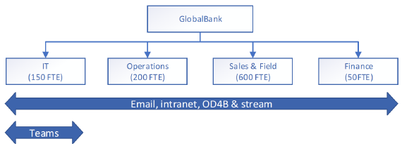

# Développement de votre plan de continuité d’activitéDeveloping your business continuity plan

Cette rubrique fournit des conseils sur le développement d’un plan de continuité d’activité qui prend en compte les dépendances de Microsoft 365.This topic provides guidance on developing a business continuity plan that takes Microsoft 365 dependencies into account. Nous vous recommandons ici d’utiliser des méthodes pour analyser vos fonctions et identifier celles qui dépendent des services Microsoft 365.Here we recommend methods for analyzing your business functions and identifying the ones which depend on Microsoft 365 services. Vous effectuerez cette analyse en vous attendant à ce qu’il y ait des défaillances de service et à ce que vous deviez vous préparer à ces éventualités.You'll perform this analysis with the anticipation that there will be service failures and that you have to prepare for those possibilities.

De manière générale, la planification de la continuité d’activité de l’entreprise comporte quatre aspects : l’évaluation, la planification, la validation des capacités, ainsi que la communication et la coordination.Broadly speaking, business continuity planning involves four aspects, assessment, planning, capability validation, and communication and coordination.

## ÉvaluationAssessment
Tout d’abord, vous devez identifier les fonctions dans votre organisation, ainsi que les services et processus qui les prennent en charge.First you must identify the business functions in your org and the services and processes that support them. Cela comprend la réalisation d’une analyse de l’impact sur l’entreprise, où chaque fonction de l’entreprise est classée en fonction de son degré d’importance et où vous identifiez les processus et les services dont dépend chacun d’eux.This includes completing a business impact analysis, where each business function is ranked according to how critical it is and you identify the processes and services that each one depends on. Voici un exemple de tableau que vous pouvez consulter pour vous aider à commencer votre propre évaluation.Here's a sample table you can refer to help you get started with your own assessment.

**Exemple d’évaluation d’impact commercial (BIA)****Sample Business Impact Assessment (BIA)**

Il s’agit d’un document BIA pour `name of the service, system, process, or function`This is a BIA document for `name of the service, system, process, or function`

|Champs BIABIA fields|DescriptionDescription|
|---------|---------|
|Type de BIABIA type|`is it a business process or technology, service or system?`|
|Nom du BIABIA name|`name of the service/system/function/process`|
|description de serviceservice description|`give a full description of the service, process, or function`|
|fonction de l’entrepriseenterprise function|`some examples: customer services; legal; marketing; risk management, security, sales, information technology, production, manufacturing`|
|exercice fiscalfiscal year|`the current fiscal year, re-evaluate these on a regular basis`|
|criticitécriticality|`develop your own classifications, but here are some examples: mission critical, important, deferrable`|
|unité commercialebusiness unit|`name of the business unit that owns this business function`|
|processus (service, fonctionnalité)process (service, feature)|`the name of the process, service, or feature`|
|responsable principal de groupe professionnelbusiness group senior leader|`the name and contact information of the senior leader of the business group that owns this business process`|
|La technologie dispose-t-elle d’un contrat SLA ou OLA interne établi ?Does the technology have an established **internal** SLA or OLA?|`please explain in as much detail as possible`|
|La technologie dispose-t-elle d’un contrat SLA ou OLA **externe** établi ?Does the technology have an established **external** SLA or OLA?|`please explain in as much detail as possible`|
|La technologie dispose-t-elle d’un mandat connu responsable de l’adoption d’un contrat SLA spécifique ?Does the technology have a known executive mandate driving a specific process SLA? Si oui, expliquez en détail.If yes, explain in detail.|`details here`|
|La perte ou la compromission des données associées à ce service déclenchera-t-elle un événement majeur ?Will the loss or compromise of the data associated with this service trigger a major event? Si oui, expliquez en détail.If yes, explain in detail.|`details here`|
|Le service dispose-t-il d’une solution de contournement ou d’une alternative pour certaines ou l’ensemble de ses fonctions et fonctionnalités clés ?Does the service have a workaround or alternative in place for some or all of its key functions and features? Si oui, expliquez en détail.If yes, explain in detail.|`details here`|
|Est-ce que le service traite, stocke ou transmet les données client, telles que les informations d’identification personnelle (PII) ?Does the service process, store, or transmit customer data, such as personally identifiable information (PII)? Si oui, expliquez en détail.If yes, explain in detail.|`details here`|
|état BIABIA status|`develop your own status classification, here are some examples: planned, started, in-progress, complete, on-hold, expired`|
|date de finalisationcompletion date|`the date this BIA was completed`|
|facilitateur BIABIA facilitator|`name of the person or group who is responsible for developing and maintaining this BIA`|
|approbation BIABIA approval|`name of the person or group who is the executive sponsor of this BIA and who has responsibility for approving it.`|
|contributeurscontributors|`optional list of the people who helped develop this BIA and their contact information`|
|emplacement d’approbation BIABIA approval location|`indicate where the executive approval is located, or attach proof to this document`|

## PlanificationPlanning

Ensuite, vous examinez les processus d’entreprise pour voir s’il existe des relations de dépendance en cascade.Next, you look across business processes to see where any cascading dependency relationships exist. En fonction des résultats, vous définissez les priorités et élaborez les stratégies de résilience, ainsi que les procédures d’exploitation standard prenant en charge vos stratégies.Based on the outcome, you prioritize and form resiliency strategies, and standard operating procedures supporting your strategies.

Vous pouvez utiliser [Microsoft Service Map](/azure/azure-monitor/insights/service-map) pour vous aider à effectuer ce mappage.You can use [Microsoft Service Map](/azure/azure-monitor/insights/service-map) to help you in with this mapping. Microsoft Service Map découvre automatiquement les composants d’application sur les systèmes Windows et Linux et mappe toutes les dépendances TCP, identifie les connexions et les systèmes tiers distants dont dépend l’application.Microsoft Service Map automatically discovers application components on Windows and Linux systems and maps all TCP dependencies, identifies connections,  and remote third-party systems that the app depends on. Il mappe également les dépendances aux zones de votre réseau qui sont traditionnellement sombres comme Active Directory.It also maps dependencies to areas of your network that are traditionally dark, such as Active Directory.

Voici un exemple d’analyse de dépendances (DA) à partir duquel vous pouvez commencer.Here's a sample dependency analysis (DA) you can start from. Dans votre analyse de dépendances (DA), vous identifierez et examinerez les dépendances de processus.In your dependency analysis (DA), you will identify and examine the process dependencies. Veillez à inclure des personnes, des fournisseurs, des clients, des partenariats et des installations.Make sure you include people, suppliers, customers, partnerships, and facilities. Les données de cette analyse seront utilisées pour identifier les écarts entre les exigences de récupération d’un processus et les fonctionnalités de récupération des dépendances.The data from this analysis will be used to identify gaps between the recovery requirements of a process and the recovery capabilities of supporting dependencies.

|champfield|descriptiondescription|
|---------|---------|
|type de processusprocess type|         |
|facilitateurfacilitator|         |
|réalisé parcompleted by|         |
|date de réalisationcompleted date|         |
|contributeurscontributors|         |
  
## Validation de la fonctionnalitéCapability validation

Une fois que vous avez répertorié vos processus d’entreprise et établi des relations avec d’autres processus et technologies, vous devez élaborer des scénarios de validation pour tous les processus.Once you have inventoried your business processes and mapped out relationships to other process and technologies, you need to build validation scenarios for all the processes. Pour résumer, vous devez déterminer comment vous devez valider vos plans de continuité des processus d’entreprise.Basically, figure out how you are going to validate your business process continuity plans. Vous constaterez probablement que certains sont plus importants que d’autres et vous voudrez établir des priorités.You'll probably find that some are more important that others and you'll want to prioritize those.
N’oubliez pas que la formation régulière des employés sur les mesures d’intervention en cas d’incident et sur les mesures de continuité est importante une fois que le plan est établi.Don't forget that regularly training employees on incident response and continuity measures is important once the plan is established. Les révisions post-incidents devraient être effectuées pour améliorer vos stratégies de résilience en incorporant ce que vous avez appris de chaque validation ou test.Post incident reviews should be used to enhance your resiliency strategies by incorporating learnings from each validation or test.

## Coordination et communication des incidentsIncident coordination and communication

Au cours d’un incident de service, les canaux de communication normaux peuvent être affectés ou détériorés. Vous devez donc trouver d’autres solutions pour aider votre organisation à rester connectée pendant un incident.During a service incident, normal communications channels may be impacted or degraded, so you should pre-arrange alternatives to help your organization stay connected during an incident. Il est essentiel que les canaux de communication soient établis, vérifiés pour assurer la sécurité et la conformité, et que les utilisateurs reçoivent une formation sur leur utilisation avant une interruption.It is critical that the communication channels be established, vetted for security and compliance, and users trained on their use prior to a disruption. Lors d’une défaillance, il est préférable de passer d’un état connu à un autre état connu plutôt que de trouver des solutions ad hoc et inconnues au milieu d’une crise.Failing from a known state to another known state is far preferable to users coming up with ad-hoc, unknown solutions in the middle of a crisis.

Chez Microsoft, chaque équipe de service a mis en place d’autres canaux de communication internes pour nous aider à coordonner les cas où nos canaux de communication normaux ne sont pas disponibles.At Microsoft, each service team has established internal alternative communication channels to help us coordinate when our normal communications channels aren't available. Celles-ci incluent des solutions de téléphonie et d’audioconférence de secours, des groupes Yammer, des groupes d’équipes, des tableaux de bord internes Intégrité des services et des logiciels internes de gestion des incidents.These include backup telephony and audio-conferencing solutions, Yammer groups, Teams groups, internal Service Health Dashboards, and internal Incident Management software.

Au cours de l’analyse de l’impact et de l’analyse de dépendances de votre entreprise, vous devez mapper les processus critiques et les technologies ou services dont ils dépendent.During your Business Impact Analysis and Dependency Analysis, you will be mapping critical processes and the technologies or services they depend on. Portez une attention particulière à la communication pendant cette phase de planification et pensez à des alternatives.Pay special attention to communication during this phase of planning and think of alternatives. En voici quelques exemples.Here are some examples.

- Si la messagerie électronique constitue votre méthode principale pour informer vos utilisateurs et parties prenantes, et que votre service de messagerie est détérioré ou indisponible, vous pouvez utiliser un autre service tel que Microsoft Teams, Yammer ou un autre service tiers comme solution de secours.If email is your primary method of keeping your users and stakeholders informed, and your email service is degraded or unavailable, you can use another service such as Microsoft Teams, Yammer, or another 3rd-party service as a backup. L’essentiel est de les établir à l’avance et de former vos utilisateurs pour qu’ils sachent comment procéder.The key is to establish these beforehand and train your users on where to go. Un Yammer thread n’est pas utile si personne ne sait qu’il existe ou si personne ne l’a mis en signet.A Yammer thread isn't going to be useful if no one knows it exists or if no one has it bookmarked.  
- Si vos processus de gestion des incidents internes s’appuient sur des communications vocales pour coordonner vos réponses, établissez une solution de téléphonie alternative à utiliser en cas d’urgence.If your internal Incident Management processes rely on voice communications to coordinate your responses, establish an alternative telephony solution for use during a crisis. Cette solution n’a pas besoin d’avoir une parité totale avec votre service principal, mais elle doit fournir le niveau minimal de collaboration pour coordonner vos équipes de continuité d’activité et de gestion des incidents.This solution doesn't need to have full parity with your primary service but should provide the minimum level of collaboration to coordinate your Business Continuity and Incident Management teams. De plus, demander aux utilisateurs de publier leurs numéros de téléphone mobile dans votre liste d’adresses globale peut fournir une couche supplémentaire de communication de secours dans des cas extrêmes.Additionally, asking users to publish their mobile phone numbers in your Global Address List can provide an additional layer of backup communication in extreme cases.
- Vous souhaiterez peut-être créer un tableau de bord Intégrité des services personnalisé, ou un autre site, qui peut fournir des mises à jour d’état pendant un incident.You may want to create a custom service health dashboard, or other such site, which can provide status updates during an incident. En apprenant aux utilisateurs à savoir où chercher des informations à l’avance, vous réduirez le nombre d’appels inutiles au support technique et vous rassurerez vos utilisateurs sur le fait que la situation est traitée rapidement et efficacement.Training users where to go for information beforehand will help reduce unnecessary calls to help desk and instill confidence in your user base that the situation is being handled quickly and efficiently. Utilisez l’API O365 Service Communications pour lier ces informations à Microsoft 365 pour un niveau de visibilité encore plus élevé.Use the O365 Service Communications API to tie this information into Microsoft 365 for an even greater level of visibility.  
- Il est essentiel que l’emplacement de vos plans de continuité d’activité et procédures d’exploitation standard soit bien connu.It is critical that the location of your Business Continuity Plans and Standard Operating Procedures is well known. Nous vous recommandons de conserver des copies en ligne et hors connexion de la documentation critique, par exemple avec SharePoint Online ou OneDrive Entreprise configurés pour la synchronisation automatique avec les appareils locaux.We recommend maintaining online and offline copies of critical documentation, such as with SharePoint Online or OneDrive for Business configured for automatic sync to local devices. Pour les centres d’opérations de service/réseau et d’autres équipes similaires qui seront essentielles pour la récupération, vous pouvez également conserver les copies papier disponibles pour être utilisées en cas d’urgence.For Service/Network Operations Centers and other similar teams that will be critical for recovery, you may also want to keep hard copies available to be used in case event of an emergency.

## Identifier vos points d’intégration externesKnow your external points of integration

Quel que soit le modèle d’entreprise, chaque entreprise a des points d’intégration avec ses clients, ses partenaires et ses fournisseurs.Regardless of business model, every company has points of integration with their customers, partners, and vendors. La chaîne d’approvisionnement de la valeur commerciale est basée sur l’intégration avec des entités externes.The business value supply chain is built on integration with external entities. L’amélioration de la continuité des opérations en cas de perturbation du service nécessite une prise en compte (et une protection) de chaque point d’intégration.Improving business continuity in case of service disruption requires consideration – and protection – of each point of integration.  
Au fur et à mesure que vous analysez votre chaîne d’approvisionnement, les communications externes doivent être considérées de la même manière que les communications internes sont analysées.As you analyze your supply chain, external communications should be considered in the same way internal communications are analyzed. Vos clients comptent-ils sur vos serveurs Exchange Online comme seul moyen de vous contacter ?Do your customers rely on your Exchange Online servers as the only method of contacting you? Avez-vous sensibilisé vos fournisseurs et mis en place avec eux d’autres méthodes de communication en cas d’impact sur le temps de disponibilité ?Have you established and made your suppliers aware of alternative communication methods, in the event uptime is impacted? Voici un exemple de tableau qui suggère comment organiser votre raisonnement.Here's a sample table that suggests how to organize your thinking.

|nom de l’entité externeexternal entity name|scénario d’incident ayant une incidenceimpacting incident scenario|services Microsoft 365 intégrésMicrosoft 365 services integrated|alternativesalternatives|
|---------|---------|---------|---------|
|`vendor name`|flux de messageriemail flow|Exchange Online est le seul moyen de communication avec ContosoExchange Online is the only means of communication with Contoso|mettre en place des canaux Microsoft Teams externes ou un logiciel de collaboration tiersset up external Microsoft Teams channels or a third-party collaboration software          |
|`service supplier name`|conversationchat|Microsoft TeamsMicrosoft Teams|messagerie instantanée tiercethird-party instant messaging|
|`partner name`|voixvoice|Microsoft TeamsMicrosoft Teams|PSTN mobile ou publicmobile or public pstn      |
|`supplier name`|partage de fichiersfile sharing|sites SharePoint et OneDrive partagés en externeexternally shared SharePoint sites and OneDrive|partage de fichiers tiersthird-party file sharing         |
