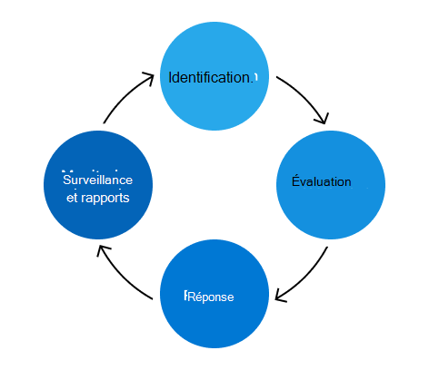

# Programme de gestion de risques de Microsoft 365Microsoft 365 Risk Management program

L’objectif du programme Microsoft 365 gestion des risques consiste à identifier, évaluer et gérer les risques Microsoft 365.The purpose of the Microsoft 365 Risk Management program is to identify, assess, and manage risks to Microsoft 365. Microsoft 365 la priorité est de respecter les obligations contractuelles et les accréditations, d’augmenter la confiance des clients et de maintenir notre avantage concurrentiel.Microsoft 365's priority is to meet contractual obligations and accreditations, increase customer trust, and maintain our competitive edge. Bien que le programme Microsoft 365 Gestion des risques Microsoft 365 fonctionne indépendamment, il s’aligne sur les stratégies, priorités et méthodologies du programme de gestion des risques de Enterprise (ERM) global.While the Microsoft 365 Risk Management program functions independently, it aligns with the overarching Enterprise Risk Management (ERM) program's policies, priorities, and methodologies. L’emploi du programme ERM permet une comparaison cohérente entre les unités d’entreprise et les groupes d’ingénierie, ce qui contribue à une approche plus cohérente de la gestion des risques au sein de l’entreprise.Working with the ERM program allows for consistent comparison across business units and engineering groups, contributing to a more cohesive approach to risk management across the enterprise.

L Microsoft 365 de confiance est responsable de la gestion du programme Microsoft 365 gestion des risques et de la conduite des activités prévues par le programme ERM.The Microsoft 365 Trust team is responsible for managing the Microsoft 365 Risk Management program and conducting the activities laid out by the ERM program. L’équipe responsable de la gestion de la gestion des risques se concentre sur l’intégration de l’infrastructure de gestion des risques avec les processus d’ingénierie, d’opérations de service et de conformité de Microsoft 365 existants pour rendre le programme de gestion des risques plus efficace et plus efficace.The Trust team focuses on integrating the risk management framework with existing Microsoft 365 engineering, service operations, and compliance process to make the Risk Management program more effective and efficient.

L’équipe d’autorisation gère également Microsoft 365 Controls Framework, un ensemble de contrôles rationalisés qui, lorsqu’ils sont correctement implémentés avec la prise en charge des activités de conformité, permettent aux équipes d’ingénierie de se conformer aux réglementations et certifications clés.The Trust team also maintains the Microsoft 365 Controls Framework, a set of rationalized controls that, when properly implemented with supporting compliance activities, allows engineering teams to comply with key regulations and certifications. Cette infrastructure est continuellement mise à jour en fonction des commentaires et des résultats dans le cadre du processus de gestion des risques.This framework is continuously updated based on feedback and findings as part of the risk management process.

Les activités de gestion des risques sont organisées en quatre phases : identification, évaluation, réponse, surveillance et rapports.Risk management activities fall into four phases: identification, assessment, response, and monitoring and reporting.

## IdentificationIdentification

Le processus de gestion des risques commence par l’identification de tous les risques possibles pour toutes les zones de contrôle clés, les menaces internes et externes et les vulnérabilités dans l Microsoft 365 de gestion.The risk management process starts with identifying all possible risks to all key control areas, internal and external threats, and vulnerabilities in the Microsoft 365 environment. Les informations guidant ce processus proviennent de plusieurs sources, notamment des entretiens, des analyses de vulnérabilité, des exercices de simulation d’attaque, des résultats d’audit et des activités de gestion des incidents.The information guiding this process comes from multiple sources including interviews, vulnerability scans, attack simulation exercises, audit findings, and incident management activities.

L’équipe de confiance interroge des experts techniques auprès de plusieurs équipes de service sur les risques précédemment identifiés et les risques potentiels potentiels qui peuvent être introduits au cours de l’expansion des services.The Trust team interviews subject matter experts (SMEs) from multiple service teams on previously identified risks and potential future risks that may be introduced as the services grow. En outre, les PME permettent de valider la précision et l’intégralité des risques identifiés à partir des autres sources de surveillance continue.Additionally, SMEs help to validate the accuracy and completeness of risks identified from the other continuous monitoring sources.

La phase d’identification est également le moment où les journaux de décision, les exceptions actives en matière de sécurité et de conformité, ainsi que le travail d’atténuation des évaluations des risques précédentes sont examinés.The identification phase is also when decision logs, active security and compliance exceptions, and mitigation work from previous risk assessments are reviewed.

## ÉvaluationAssessment

Chaque risque identifié est évalué à l’aide de trois mesures : impact, probabilité et insuffisance de contrôle.Each identified risk is assessed using three metrics: impact, likelihood, and control deficiency.

- L’impact fait référence aux dommages qui seraient causés au service, à l’entreprise ou à Microsoft si ce risque était pris en compte.Impact refers to the damage that would occur to the service, business, or Microsoft if that risk were to be realized. L’impact sur Microsoft peut inclure des dommages à la réputation, la perte de clients ou des implications juridiques/conformité.The impact to Microsoft may include damage to reputation, loss of customers, or legal/compliance implications.
- La probabilité définit la probabilité que le risque potentiel soit réalisé et est calculée en analysant la probabilité et la fréquence à laquelle elle se produira.Likelihood defines the probability of the potential risk being realized and is calculated by analyzing the probability and frequency with which it will occur.
- Les défaillances de contrôle mesurent l’efficacité des contrôles de prévention implémentés.Control deficiency measures the effectiveness of implemented mitigation controls.

Ces mesures sont utilisées pour calculer un score de risque qui représente la gravité de chaque risque, en fonction des stratégies de prévention existantes.These metrics are used to calculate a risk score that represents the severity of each risk, accounting for existing mitigation strategies. Les risques sont regroupés et présentés aux principales parties prenantes de chaque service afin de vérifier la précision et l’Microsoft 365 la posture des risques.Risks are aggregated and presented to key stakeholders from each service to verify the accuracy and completeness of Microsoft 365's risk posture.

## RéponseResponse

À l’aide de la liste vérifiée des risques à Microsoft 365, l’équipe de confiance affecte les risques au service affecté pour la réponse aux risques.Using the verified list of risks to Microsoft 365, the Trust team assigns risks to the affected service for risk response. Les recommandations définies permettent de déterminer la stratégie de réponse aux risques appropriée en fonction du score de risque et de l’efficacité du contrôle.Defined guidelines help determine the appropriate risk response strategy based on the risk score and control effectiveness. Les stratégies de réponse aux risques sont en quatre catégories :Risk response strategies fall into four categories:

- Acceptable : zones d’exposition à faible risque avec un niveau de contrôle faible.Tolerate: Areas of low-risk exposure with a low level of control.
- Fonctionnement : zones d’exposition à faible risque où les contrôles sont réputées adéquats.Operate: Areas of low-risk exposure where controls are deemed adequate.
- Contrôle : zones d’exposition à risque élevé où les contrôles sont réputés adéquats et doivent être surveillés à des fins d’efficacité.Monitor: Areas of high-risk exposure where controls are deemed adequate and should be monitored for effectiveness.
- Amélioration : zones d’exposition à risque élevé avec un faible niveau de contrôle qui sont les principales priorités en matière de gestion.Improve: Areas of high-risk exposure with a low level of control that are top priorities in addressing.

L’équipe de confiance coordonne les équipes de service pour développer des plans de gestion de chaque risque.The Trust team coordinates with service teams to develop plans for addressing each risk. Le niveau de gravité détermine le niveau approprié de révision et d’approbation pour chaque plan.The severity level determines the appropriate level of review and approval for each plan. Pour les risques nécessitant une action, les processus de bogue d’ingénierie existants sont utilisés pour le suivi, la gestion et la prise de décisions d’exception.For risks that require action, existing engineering bug processes are used for tracking, managing, and making exception decisions. L’utilisation d’un processus familier aux équipes d’ingénierie et d’exploitation rend la réponse aux risques plus efficace et plus efficace.Using a process familiar to the engineering and operation teams makes risk response more efficient and effective.

## Surveillance et rapportsMonitoring and reporting

Les risques identifiés dans le cadre de l’évaluation des risques sont surveillés et signalés aux parties prenantes attitrées..Risks identified as part of the risk assessment are monitored and reported to relevant stakeholders. Les stratégies de contrôle incluent la surveillance de la sécurité, les analyses de risque périodique, les tests de pénétration et l’analyse des vulnérabilités.Monitoring strategies include security monitoring, periodic risk reviews, penetration testing, and vulnerability scanning. Ces efforts de surveillance agissent en tant que sources de données pour la création de rapports sur les indicateurs de performances clés, la création de tableaux de bord et le développement de rapports formels, qui sont tous des facteurs de décision en matière de risques futurs.These monitoring efforts act as data sources for reporting on key performance indicators, creating dashboards, and developing formal reports, all of which inform future risk decisions.

Plusieurs fois par an, l’équipe de confiance rencontre les propriétaires de risque de chaque service pour passer en revue les scores de risque, évaluer l’efficacité de leurs plans d’action et mettre à jour les informations nécessaires.Multiple times a year, the Trust team meets with risk owners from each service to review risk scores, evaluate the effectiveness of their action plans, and make updates where needed. En outre, les activités d’évaluation des risques de Microsoft 365 contribuent aux évaluations des risques Enterprise du programme ERM, qui offrent une vue d’ensemble de la posture des risques de Microsoft pour la direction de Microsoft et le programme ERM.In addition, Microsoft 365's risk assessment activities contribute to the ERM program's Enterprise Risk Assessments, which provide a high-level overview of Microsoft's risk posture to Microsoft senior management and the ERM program.
