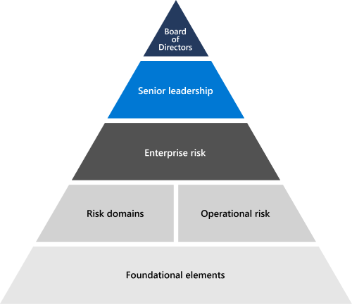

# Aperçu sur la gestion des risques

## Comment Microsoft évalue-t-il et gère-t-il les risques au sein de l’entreprise ?

La gestion des risques est le processus qui consiste à identifier, évaluer et répondre aux risques. La gestion des risques chez Microsoft est conçue pour anticiper les nouvelles menaces et assurer la sécurité continue de nos systèmes Cloud et des clients qui les utilisent.

Les activités de gestion des risques de Microsoft sont régies par le programme Enterprise gestion des risques (ERM). ERM permet le processus global de gestion des risques de l’entreprise et collabore avec la direction au sein de l’entreprise pour identifier et garantir la responsabilité des risques les plus importants de Microsoft. Il s’attache à anticiper, évaluer et signaler les risques pour informer la stratégie commerciale de Microsoft et stimuler l’atténuation et la responsabilité des risques.

Microsoft ERM coordonne les activités de gestion des risques au sein de l’entreprise afin de permettre aux unités d’entreprise de simplifier les évaluations des risques de façon cohérente et comparative. Cette coordination permet à Microsoft d’agréger et de signaler les informations sur les risques de manière consolidée pour la gestion. ERM offre aux entités de travail de Microsoft des méthodologies, outils et objectifs courants pour le processus de gestion des risques. Microsoft 365 et d’autres groupes d’ingénierie et unités d’entreprise utilisent ces outils pour effectuer des évaluations des risques individuelles dans le cadre de leurs propres programmes de gestion des risques sous l’aide d’ERM.

## Comment fonctionne Microsoft 365 ERM ?

Le programme Microsoft 365 gestion des risques d’entreprise suit les instructions ERM pour gérer les risques au sein Microsoft 365 services. Le programme se concentre sur l’alignement de l’infrastructure ERM avec les processus d’ingénierie, d’opérations de service et de conformité de Microsoft 365 existants, ce qui rend le programme de gestion des risques plus efficace et plus efficace. Microsoft 365 les activités de gestion des risques sont finalement resserr et informent le processus ERM.

Dans le cadre des activités d’évaluation des risques, le programme Microsoft 365 Gestion des risques analyse la conception et l’efficacité opérationnelle des contrôles implémentés dans le cadre de Microsoft 365 Controls Framework (Framework). L’infrastructure est un ensemble rationalisé de contrôles qui, lorsqu’ils sont correctement implémentés avec la prise en charge des activités de conformité, permettent aux équipes d’ingénierie de se conformer aux réglementations et certifications clés.

## Comment gérer Microsoft 365 et évaluer les risques dans ses services en ligne ?

Dans le cadre des activités d’évaluation des risques en cours, le programme de gestion des risques Microsoft 365 effectue des entretiens avec les équipes de service qui conçoivent, créent et exploitent des services Microsoft 365 pour identifier les risques actuels et les domaines de préoccupation. Ces activités, ainsi que l’analyse des données de surveillance continue, des audits et d’autres sources, sont utilisées pour développer des rapports d’évaluation des risques qui identifient les risques actuels et futurs possibles pour les objectifs professionnels à long terme. Les rapports d’évaluation des risques fournissent une vue d’ensemble de Microsoft 365 posture des risques en fonction de nos résultats et commentaires des équipes Microsoft 365 service. Ainsi que des rapports similaires provenant d’autres divisions, les rapports d’évaluation des risques de Microsoft 365 contribuent aux évaluations des risques de programmes d’ERM et les communiquent.

Microsoft 365 La confiance est un groupe responsable de la prise en charge des opérations d’assurance liées à la conformité des stratégies, aux exigences de sécurité et à la gestion des risques. Microsoft 365 Trust s’emploie à identifier les nouveaux risques dès leur apparition et contrôler les risques connus ainsi qu’y répondre. Les commentaires des équipes Microsoft 365 service et les données de surveillance continue des environnements Microsoft 365 de service informent ce processus. La réussite et l’échec des réponses aux risques sont suivies pour développer et informer l’analyse des probabilités et des effets des risques. Les réunions de révision régulière des risques avec les propriétaires de risques Microsoft 365 confiance pour mettre à jour et gérer les réponses aux risques.

## Réglementations externes associées & certifications

Les services en ligne de Microsoft sont régulièrement audités pour assurer la conformité avec les réglementations et certifications externes. Reportez-vous au tableau suivant pour la validation des contrôles liés à la gestion des risques.

| **Audits externes** | **Section** | **Date de rapport la plus récente** |
|:--------------------|:------------|:-----------------------|
| [FedRAMP (Office 365)](https://compliance.microsoft.com/compliancemanager) | CA-2 : Évaluations de sécurité   CA-5 : Plan d’action et jalons   RA-3 : évaluation des risques | 24 septembre 2020 |
| [ISO 27001/27002 (Office 365)](https://servicetrust.microsoft.com/ViewPage/MSComplianceGuideV3?command=Download&downloadType=Document&downloadId=8d625374-4f2d-49f8-9d37-a4281ba98222&tab=7027ead0-3d6b-11e9-b9e1-290b1eb4cdeb&docTab=7027ead0-3d6b-11e9-b9e1-290b1eb4cdeb_ISO_Reports)    [Déclaration d’applicabilité](https://servicetrust.microsoft.com/ViewPage/MSComplianceGuideV3?command=Download&downloadType=Document&downloadId=c0df4ce8-c77e-4183-84eb-c8688470d8b1&tab=7027ead0-3d6b-11e9-b9e1-290b1eb4cdeb&docTab=7027ead0-3d6b-11e9-b9e1-290b1eb4cdeb_ISO_Reports)   [Certification](https://servicetrust.microsoft.com/ViewPage/MSComplianceGuideV3?command=Download&downloadType=Document&downloadId=1e84a14a-2468-45ac-9412-5e53250d57ec&tab=7027ead0-3d6b-11e9-b9e1-290b1eb4cdeb&docTab=7027ead0-3d6b-11e9-b9e1-290b1eb4cdeb_ISO_Reports) | R.5 : Stratégies de sécurité des informations | 20 avril 2021 |
| [ISO 27017 (Office 365)](https://servicetrust.microsoft.com/ViewPage/MSComplianceGuideV3?command=Download&downloadType=Document&downloadId=8d625374-4f2d-49f8-9d37-a4281ba98222&tab=7027ead0-3d6b-11e9-b9e1-290b1eb4cdeb&docTab=7027ead0-3d6b-11e9-b9e1-290b1eb4cdeb_ISO_Reports)    [Déclaration d’applicabilité](https://servicetrust.microsoft.com/ViewPage/MSComplianceGuideV3?command=Download&downloadType=Document&downloadId=c0df4ce8-c77e-4183-84eb-c8688470d8b1&tab=7027ead0-3d6b-11e9-b9e1-290b1eb4cdeb&docTab=7027ead0-3d6b-11e9-b9e1-290b1eb4cdeb_ISO_Reports)   [Certification](https://servicetrust.microsoft.com/ViewPage/MSComplianceGuideV3?command=Download&downloadType=Document&downloadId=70de0999-5451-43a3-9ef4-761e8fbfb1a3&tab=7027ead0-3d6b-11e9-b9e1-290b1eb4cdeb&docTab=7027ead0-3d6b-11e9-b9e1-290b1eb4cdeb_ISO_Reports) | R.5 : Stratégies de sécurité des informations | 20 avril 2021 |
| [SOC 1 (Office 365)](https://servicetrust.microsoft.com/ViewPage/MSComplianceGuideV3?command=Download&downloadType=Document&downloadId=90df3f9c-3aaf-4dbf-99d0-ca9f2991721b&tab=7027ead0-3d6b-11e9-b9e1-290b1eb4cdeb&docTab=7027ead0-3d6b-11e9-b9e1-290b1eb4cdeb_SOC_%2F_SSAE_16_Reports) | CA-03 : Gestion des risques | 24 décembre 2020 |
| [SOC 2 (Office 365)](https://servicetrust.microsoft.com/ViewPage/MSComplianceGuideV3?command=Download&downloadType=Document&downloadId=a73c1738-7892-42b7-acd3-87b6371c53f6&tab=7027ead0-3d6b-11e9-b9e1-290b1eb4cdeb&docTab=7027ead0-3d6b-11e9-b9e1-290b1eb4cdeb_SOC_%2F_SSAE_16_Reports) | CA-02 : Responsabilités de l’équipe en matière de gouvernance, de risque et de conformité   CA-03 : Gestion des risques   CA-17 : stratégie de sécurité Microsoft   CA-24 : Évaluation interne des risques | 24 décembre 2020 |
