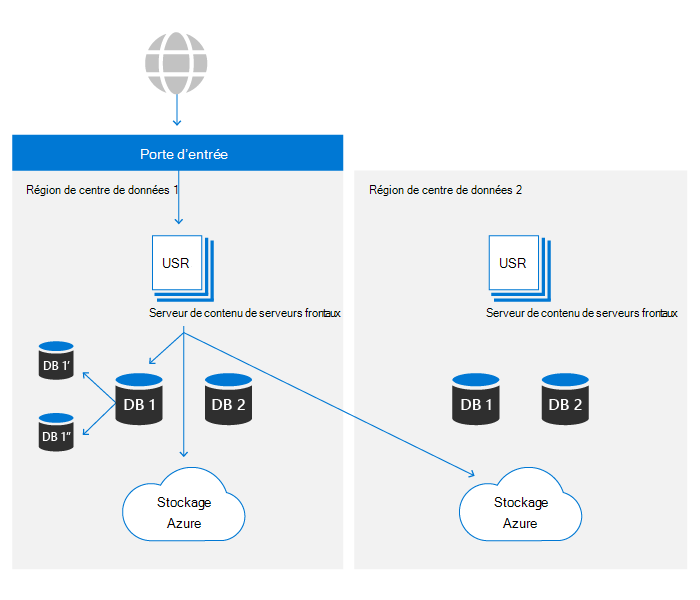
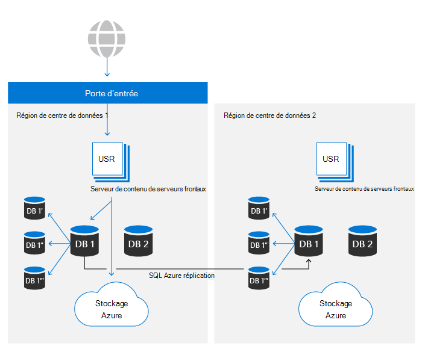

# Résilience des données SharePoint et OneDrive dans Microsoft 365

Dans Microsoft 365, OneDrive repose sur la plateforme de fichiers SharePoint. Dans cet article, seul SharePoint sera utilisé pour faire référence aux deux produits. Le contenu de cet article est pertinent pour Microsoft 365 et ne s’applique pas aux services grand public.

Il existe deux ressources principales qui font le stockage de contenu principal de SharePoint :

- **Métadonnées**: les métadonnées de chaque fichier sont stockées dans azure SQL database. Azure SQL offre un article complet sur la continuité d’activité que SharePoint utilise et dont les détails sont traités plus loin dans cet article.
- **Stockage d’objets blob**: le contenu utilisateur téléchargé dans SharePoint est stocké dans le stockage Azure. SharePoint a créé un plan de résilience personnalisé sur le stockage Azure pour garantir une duplication quasi en temps réel du contenu des utilisateurs et un système réellement actif/actif.

L’ensemble complet des contrôles pour garantir la résilience des données est expliqué dans d’autres sections.

## Résilience de stockage blob

SharePoint dispose d’une solution personnalisée pour le stockage des données client dans le stockage Azure. Chaque fichier est écrit simultanément dans une région de centre de données principale et une région secondaire. Si les écritures dans l’une ou l’autre région Azure échouent, l’enregistrer échoue. Une fois que le contenu est écrit dans le stockage Azure, les sommes de contrôle sont stockées séparément avec des métadonnées et sont utilisées pour s’assurer que l’écriture enregistrée est identique au fichier d’origine envoyé à SharePoint lors de toutes les futures lectures. Cette même technique est utilisée dans tous les flux de travail pour empêcher la propagation de toute altération qui doit se produire. Dans chaque région, azure Locally Redundant Storage (LRS) fournit un niveau élevé de fiabilité. Pour plus [d’informations, voir](/azure/storage/common/storage-redundancy-lrs) l’article sur la redondance du stockage Azure.

SharePoint utilise le stockage Append-Only de données. Ce processus garantit que les fichiers ne peuvent pas être modifiés ou endommagés après un premier sauvegarde, mais également à l’aide du traitement des versions dans le produit, toute version antérieure du contenu du fichier peut être récupérée.

Les environnements SharePoint dans l’un ou l’autre centre de données peuvent accéder aux conteneurs de stockage dans les deux régions Azure. Pour des raisons de performances, le conteneur de stockage dans le même centre de données local est toujours préféré, toutefois, les demandes de lecture qui ne voient pas les résultats dans un seuil souhaité auront le même contenu demandé à partir du centre de données distant pour s’assurer que les données sont toujours disponibles.

## Résilience des métadonnées

Les métadonnées SharePoint sont également essentielles pour accéder au contenu utilisateur, car elles stockent l’emplacement des clés d’accès au contenu stocké dans le stockage Azure et y accèdent. Ces bases de données sont stockées dans Azure SQL, qui dispose d’un plan de [continuité d’activité étendu.](/azure/sql-database/sql-database-business-continuity)

SharePoint utilise le modèle de réplication fourni par Azure SQL et a créé une technologie d’automatisation propriétaire pour déterminer si un transfert est nécessaire et lancer l’opération si nécessaire. En tant que tel, il se situe dans la catégorie « Failover de base de données manuelle » du point de vue d SQL Azure. Les mesures les plus récentes pour la récupération SQL base de données Azure sont disponibles [ici.](/azure/azure-sql/database/business-continuity-high-availability-disaster-recover-hadr-overview#recover-a-database-to-the-existing-server)

SharePoint utilise le système de sauvegarde d’Azure SQL pour activer les restaurations de point dans le temps (PITR) pendant 14 jours au plus. La section PITR est plus en savoir plus dans [une section ultérieure.](#deletion-backup-and-point-in-time-restore)

## Failover automatisé

SharePoint utilise un failover automatisé personnalisé pour minimiser l’impact sur l’expérience client lorsqu’un événement spécifique à un emplacement se produit. L’automatisation pilotée par la surveillance détectant une défaillance à composants multiples ou unique au-delà de certains seuils entraîne une redirection automatisée de l’activité de tous les utilisateurs hors de l’environnement problématique et vers un secondaire. Un failover entraîne l’utilisation complète des métadonnées et du stockage de calcul à partir du nouveau centre de données. Comme le stockage d’objets blob s’exécute toujours entièrement actif/actif, aucune modification n’est requise pour un failover. Le niveau de calcul préférera le conteneur d’objets blob le plus proche, mais utilisera les emplacements de stockage d’objets blob locaux et distants à tout moment pour garantir la disponibilité.

SharePoint utilise le service Azure Front Door pour fournir un routage interne au réseau Microsoft. Cette configuration autorise la redirection deover indépendamment du DNS et réduit l’effet de la mise en cache de l’ordinateur local. La plupart des opérations de failover sont transparentes pour les utilisateurs finaux. En cas de panne, les clients n’auront pas besoin d’apporter de modifications pour maintenir l’accès au service.

## Versioning and Files Restore

Pour les bibliothèques de documents nouvellement créées, SharePoint est configuré par défaut sur 500 versions sur chaque fichier et peut être configuré pour conserver d’autres versions si vous le souhaitez. L’interface utilisateur ne permet pas de définir une valeur de moins de 100 versions, mais il est possible de définir le système pour stocker moins de versions à l’aide d’API publiques. Pour des raisons de fiabilité, toute valeur inférieure à 100 n’est pas recommandée et peut entraîner une perte accidentelle de données par l’utilisateur.

Pour plus d’informations sur le versionsing, voir [Versioning dans SharePoint](/microsoft-365/community/versioning-basics-best-practices).

La restauration de fichiers permet de revenir « dans le temps » sur n’importe quelle bibliothèque de documents dans SharePoint à une seconde de temps au cours des 30 derniers jours. Ce processus peut être utilisé pour récupérer des ransomware, suppressions de masse, corruption ou tout autre événement. Cette fonctionnalité utilise des versions de fichiers afin que la réduction des versions par défaut puisse réduire l’efficacité de cette restauration.

La fonctionnalité de restauration de fichiers est documentée pour [OneDrive](https://support.office.com/article/restore-your-onedrive-fa231298-759d-41cf-bcd0-25ac53eb8a15) et [SharePoint.](https://support.office.com/article/Restore-a-document-library-317791c3-8bd0-4dfd-8254-3ca90883d39a)

## Suppression, sauvegarde et restauration de point dans le temps

Le contenu utilisateur supprimé de SharePoint passe par le flux de suppression suivant.

Les éléments supprimés sont conservés dans les corbeilles pendant une certaine période. Pour SharePoint, la durée de rétention est de 93 jours. Elle commence lorsque vous supprimez l’élément de son emplacement d’origine. Lorsque vous supprimez l’élément de la Corbeille du site, il est mis dans la [Corbeille de la collection de sites.](https://support.office.com/article/restore-deleted-items-from-the-site-collection-recycle-bin-5fa924ee-16d7-487b-9a0a-021b9062d14b) Il reste là pendant le reste des 93 jours, puis est définitivement supprimé. Pour plus d’informations sur l’utilisation de la Corbeille, voir les liens suivants :

- [Restaurer des éléments dans la Corbeille](https://support.office.com/article/Restore-items-in-the-Recycle-Bin-of-a-SharePoint-site-6df466b6-55f2-4898-8d6e-c0dff851a0be)
- [Restaurer les éléments supprimés de la Corbeille de la collection de sites.](https://support.office.com/article/Restore-deleted-items-from-the-site-collection-recycle-bin-5fa924ee-16d7-487b-9a0a-021b9062d14b)

Ce processus est le flux de suppression par défaut et ne prend pas en compte les stratégies ou étiquettes de rétention. Pour plus d’informations, [voir En savoir plus sur la rétention pour SharePoint et OneDrive.](/microsoft-365/compliance/retention-policies-sharepoint)

Une fois la pipeline de recyclage de 93 jours terminée, la suppression a lieu indépendamment des métadonnées et du stockage blob. Les métadonnées seront supprimées immédiatement de la base de données, ce qui rend le contenu illisible, sauf si les métadonnées sont restaurées à partir de la sauvegarde. SharePoint conserve 14 jours de sauvegardes de métadonnées. Ces sauvegardes sont prises localement en temps quasi réel, puis sont poussées vers le stockage dans des conteneurs de stockage Azure redondants, conformément à la [documentation](/azure/sql-database/sql-database-automated-backups) au moment de cette publication, avec un planning de 5 à 10 minutes.

Lors de la suppression de contenu de stockage blob, SharePoint utilise la fonctionnalité de suppression temporaire pour le stockage d’objets blob Azure afin de se protéger contre les suppressions accidentelles ou malveillantes. Grâce à cette fonctionnalité, nous avons un total de 14 jours pour restaurer le contenu avant sa suppression définitive.

>[!Note]
>Bien que les applications Microsoft envoient du contenu à la Corbeille pour le processus standard, SharePoint fournit des API qui permettent d’ignorer la Corbeille et de forcer une suppression immédiate. Examinez vos applications pour vous assurer que cette étape est effectuée uniquement lorsque cela est nécessaire pour des raisons de conformité.

## Vérifications de l’intégrité

SharePoint utilise différentes méthodes pour garantir l’intégrité des blobs et des métadonnées à toutes les étapes du cycle de vie des données :

- **Hachage de fichier** stocké dans les métadonnées : le hachage de l’intégralité du fichier est stocké avec les métadonnées de fichier pour garantir que l’intégrité des données au niveau du document est conservée pendant toutes les opérations
- **Hachage d’objet blob** stocké dans les métadonnées : chaque élément blob stocke un hachage du contenu chiffré pour se protéger contre l’altération dans le stockage Azure sous-jacent.
- **Travail d’intégrité** des données : tous les 14 jours, chaque site est analysé pour l’intégrité en répertoriant les éléments de la base de données et en les faisant correspondre avec les blobs répertoriés dans le stockage Azure. Le travail signale les références blob manquantes pour les blobs de stockage et peut les récupérer via la fonctionnalité de suppression possible du stockage [Azure](/azure/storage/blobs/soft-delete-blob-overview) si nécessaire.
