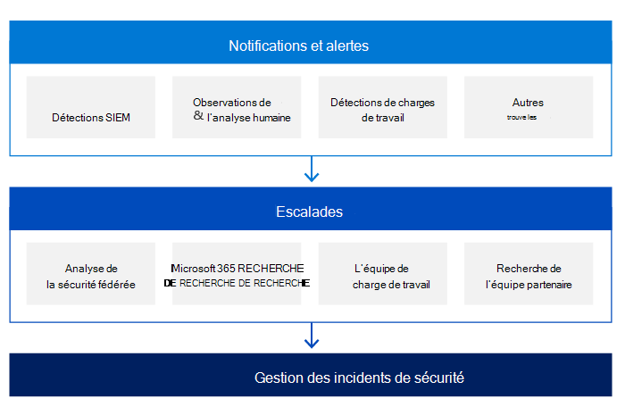

# Gestion des incidents de sécurité Microsoft : détection et analyse

Pour détecter les activités malveillantes, chacun des services en ligne de Microsoft enregistre de manière centralisée les événements de sécurité et d’autres données et effectue diverses techniques analytiques pour rechercher des activités anormales ou suspectes. Les fichiers journaux sont collectés à partir des serveurs de services en ligne microsoft et des périphériques d’infrastructure, et stockés dans des bases de données centralisées et consolidées.

Microsoft utilise une approche basée sur les risques pour détecter les activités malveillantes. Nous utilisons les données d’incident et la veille contre les menaces pour définir et hiérarchiser nos détections.

L’emploi d’une équipe de personnes expérimentées, compétents et qualifiées est l’un des piliers les plus importants de la réussite de la phase de détection et d’analyse. Microsoft emploie plusieurs équipes de service qui incluent des employés ayant des compétences sur tous les composants de la pile, y compris le réseau, les routeurs, les pare-feu, les équilibreurs de charge, les systèmes d’exploitation et les applications.

Les mécanismes de détection de la sécurité dans les services en ligne Microsoft incluent également des notifications et des alertes initiées par différentes sources. Les équipes de réponse aux incidents de sécurité des services en ligne Microsoft sont les principaux orchestrateurs du processus d’escalade des incidents de sécurité. Ces équipes reçoivent toutes les escalades et sont responsables de l’analyse et de la confirmation de la validité de l’incident de sécurité.

L’un des principaux piliers de la détection est la notification :

- Chaque équipe de service est responsable du journal de toute action ou événement à l’intérieur du service en fonction des exigences de l’équipe de sécurité du service en ligne. Tous les journaux créés par les différentes équipes de service sont traitées par une solution SIEM (Security Information and Event Management) avec des règles de sécurité et de détection prédéfinës. Ces règles évoluent en fonction des recommandations de l’équipe de sécurité, sur les informations acquises à partir des incidents de sécurité précédents, afin de déterminer s’il existe des activités suspectes ou malveillantes.
- Si un client détermine qu’un incident de sécurité est en cours, il peut ouvrir un dossier de support auprès de Microsoft, qui est affecté à l’équipe de communications Microsoft et transformé en escalade vers toutes les équipes appropriées.

Les équipes de service Azure, Dynamics 365 et Microsoft 365 utilisent également les renseignements obtenus dans l’analyse de tendance par le biais de la surveillance et de la journalisation de la sécurité pour détecter les attaques dans les systèmes d’information des services en ligne Microsoft qui peuvent indiquer une attaque ou un incident de sécurité. Les systèmes de services en ligne Microsoft regroupent la sortie de ces journaux dans l’environnement de production dans des serveurs de journalisation centralisée. À partir de ces serveurs de journalisation centralisée, les journaux sont examinés pour repérer les tendances dans l’environnement de production. Les données agrégées dans les serveurs centralisés sont transmises en toute sécurité dans un service de journalisation pour des requêtes avancées, la création de tableaux de bord et la détection d’activités anormales et malveillantes. Le service utilise également l’apprentissage automatique pour détecter les anomalies avec la sortie du journal.

Pendant la phase d’escalade et en fonction de la nature de l’incident de sécurité, les équipes de réponse à la sécurité peuvent impliquer un ou plusieurs experts techniques de différentes équipes chez Microsoft :

- Équipe sécurité et conformité des services en ligne
- Microsoft Threat Intelligence Center (MSTIC)
- Centre de réponse de sécurité Microsoft (MSRC)
- Affaires d’entreprise, externes et juridiques (CELA)
- Azure Security
- Microsoft 365'ingénierie, entre autres.

Avant qu’une escalade vers une équipe de réponse de sécurité ne se produise, l’équipe de service est chargée de déterminer et de définir le niveau de gravité de l’incident de sécurité en fonction de critères définis tels que :

- Confidentialité
- Impact
- Portée
- Nombre de locataires affectés
- Région
- Service
- Détails de l’incident
- Réglementations spécifiques du secteur ou du marché des clients.

La priorisation des incidents est déterminée à l’aide de facteurs distincts, y compris, mais sans s’y limiter, l’impact fonctionnel de l’incident, l’impact informationnel de l’incident et la récupération de l’incident.

Après avoir reçu une escalade concernant un incident de sécurité, l’équipe de sécurité organise une équipe virtuelle (équipe v) composée de membres de l’équipe de réponse de sécurité du service en ligne Microsoft, des équipes de service et de l’équipe de communication des incidents. L’équipe v doit ensuite confirmer la légitimité de l’incident de sécurité et éliminer les faux positifs. La précision des informations fournies par les indicateurs déterminés pendant la phase de préparation est essentielle. En analysant ces informations par catégorie d’attaque vectorielle, l’équipe v peut déterminer si l’incident de sécurité est une préoccupation légitime.

Au début de l’enquête, l’équipe de réponse aux incidents de sécurité enregistre toutes les informations sur l’incident conformément à nos stratégies de gestion des cas. Au fur et à mesure de la progression du cas, nous suivons les actions en cours et suivons les normes de gestion des preuves pour collecter, conserver et sécuriser ces données tout au long du cycle de vie de l’incident.

Voici quelques exemples de ces actions :

- Résumé, qui est une brève description de l’incident et de son impact potentiel
- La gravité et la priorité de l’incident, qui sont dérivées en évaluant l’impact potentiel
- Liste de tous les indicateurs identifiés qui ont conduit à la détection de l’incident
- Liste des incidents associés
- Liste de toutes les actions entreprises par l’équipe v
- Les preuves recueillies, qui seront également conservées pour l’analyse post-mortem et les enquêtes légales ultérieures
- Étapes et actions suivantes recommandées

Après la confirmation des incidents de sécurité, les principaux objectifs de l’équipe de réponse à la sécurité et de l’équipe de service appropriée sont de contenir l’attaque, de protéger les services en cas d’attaque et d’éviter un impact global plus important. En même temps, les équipes d’ingénierie appropriées travaillent pour déterminer la cause première et préparer le premier plan de récupération.

Dans la phase suivante, l’équipe de réponse à la sécurité identifie le(s) client(s) affecté(s) par l’incident de sécurité, le cas cas. L’étendue de l’effet peut prendre un certain temps pour déterminer, en fonction de la région, du centre de données, du service, de la batterie de serveurs, du serveur, etc. La liste des clients concernés est compilée par l’équipe de service et l’équipe de communication Microsoft correspondante, qui gèrent ensuite le processus de notification des clients dans le cadre des obligations contractuelles et de conformité.

## Articles connexes

- [Gestion des incidents de sécurité Microsoft](assurance-security-incident-management.md)
- [Gestion des incidents de sécurité Microsoft : préparation](assurance-sim-preparation.md)
- [Gestion des incidents de sécurité Microsoft : containment, éradication et récupération](assurance-sim-containment-eradication-recovery.md)
- [Gestion des incidents de sécurité Microsoft : activité post-incident](assurance-sim-post-incident-activity.md)
- [Comment enregistrer un ticket de support d’événement de sécurité](/azure/security/fundamentals/event-support-ticket)
- [Notification de violation Azure et Dynamics 365 dans le cadre du RGPD](/compliance/regulatory/gdpr-breach-azure-dynamics)
