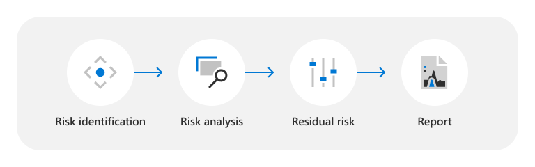

# Évaluation des menaces, de la vulnérabilité, et des risques liés au centre des données

Microsoft fournit plus de 200 services cloud à ses clients 24h/24, 7j/7, 365j/365. Des exemples sont des services dédiés aux entreprises tels que Microsoft Azure, Microsoft Office 365, Microsoft Dynamics et des services grand public tels que Bing, MSN, Outlook.com, Skype et Xbox Live. Ces services sont hébergés dans l’infrastructure cloud de Microsoft : les centres de données distribués globalement, les serveurs edge computing et les centres d’opérations de service, et l’un des plus grands réseaux globaux au monde ; avec un encombrement fibre étendu qui les connecte tous. Depuis l’ouverture de notre premier centre de données en 1989, Microsoft a investi des milliards de dollars dans notre infrastructure et se concentre sur la fourniture de services en ligne fiables, évolutifs et sécurisés tout en gérant efficacement les opérations et les coûts au fur et à mesure que les services se développent.

Les services de cloud computing Microsoft sont construits sur des principes de confiance et de sécurité et mettent avant tout l’accent sur la protection des données utilisateur dans le cloud à l’aide de technologies, de processus et de chiffrements de pointe. Les données client sont stockées dans les centres de données Microsoft répartis dans le monde entier et sont protégées par des couches de normes de sécurité à la fois physiques et logiques approfondies. Les centres de données Microsoft sont conçus et opèrent pour protéger les services et les données des dommages pouvant être causés par des catastrophes naturelles, des menaces environnementales ou des intrusions.

## Méthodologie d’évaluation des menaces, des vulnérabilités et des risques

Le programme TVRA (Threat, Vulnerability, and Risk Assessment) vous aide à comprendre comment Microsoft identifie et atténue l’impact des menaces physiques et environnementales sur les centres de données Microsoft. Microsoft s’engage à mettre continuellement à jour ses évaluations des risques et méthodologies pour améliorer les améliorations et à mesure que les conditions changent. Par conséquent, les analyses et conclusions tvra sont sujettes à modification et les rapports sont considérés comme des rapports dans le temps.

Microsoft facilite le processus d’EMVR en suivant ces étapes :

### Identification des risques

Les TVRAs considèrent un large éventail de scénarios de menaces résultant de risques naturels et humains (y compris accidentels). Les résultats varient en fonction de l’emplacement du centre de données, de la conception et de l’étendue des services, et d’autres facteurs. L’tvra sélectionne les scénarios de menace à mettre en surbrillance dans le document TVRA en fonction des besoins des clients, d’un pays, d’une ville et d’une évaluation au niveau du site indépendants de l’environnement de risque fourni par les informations sur les risques tiers et les tiers. Pour les régions dans lesquelles se situent plusieurs centres de données, les EMVR sont agrégées afin de garantir une vision globale des menaces physiques et environnementales, des vulnérabilités et des risques pour les sites en cours d’évaluation.

Les types de scénarios de menaces évalués pour les centres de données EMVR sont les suivants :

- **Menaces externes**: incidents résultant d’activités humaines intentionnelles ou accidentelles externes. Par exemple, les troubles civils, le terrorisme, les activités criminelles, les vols externes, les appareils explosifs improvisés, les attaques armées, les incendies criminels, les entrées non autorisées et les accidents d’avion.
- **Menaces internes**: incidents résultant d’activités humaines internes intentionnelles ou accidentelles. Par exemple, le vol interne et le sabotage.
- **Risques naturels :** processus naturel ou phénomène qui peut avoir un impact négatif sur les centres de données. Par exemple : tempêtes tropicales, cyclones, inondations, glissements de terrain, sécheresse, feux de forêt, séisme, activité volcanique et violents orages avec foudre, grêle, vents violents ou pluies abondantes.
- **Menaces environnementales**: conditions environnementales qui pourraient avoir un impact négatif sur les centres de données. Par exemple, le stress de l’eau, le stress de la chaleur et les épidémies.

### Analyse des risques

Les menaces sont évaluées en fonction d’une évaluation de leur risque inhérent ; le risque inhérent est calculé comme une fonction de l’impact inhérent d’une menace et de la probabilité inhérente de l’occurrence de la menace en l’absence d’action et de contrôles de gestion. Ces évaluations sont informées par les commentaires des experts techniques (SME) internes et utilisent des indices de risque externe.

### Risque d’err ment

Les risques restants sont déterminés en tant que mesures des niveaux de risque restants après prise en compte de l’efficacité du contrôle. Le contrôle de l’efficacité est évalué comme une mesure d’actions de gestion et de contrôles actuels conçus pour empêcher ou détecter les menaces, tout en évaluant la probabilité que les contrôles aient l’effet souhaité, tels que conçus et implémentés. Ces évaluations sont informées par une agrégation des commentaires des PME internes sur l’efficacité du contrôle pour les centres de centres de données mentionnés dans l’EMVR.

### Rapport

Une fois l’évaluation terminée, un rapport TVRA est généré pour l’approbation de la direction et pour prendre en charge nos efforts globaux liés à la gestion des risques.

## Ressources

- [Infrastructure globale Azure](https://www.microsoft.com/datacenters)
