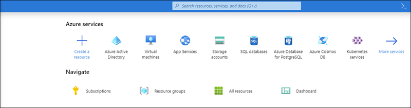
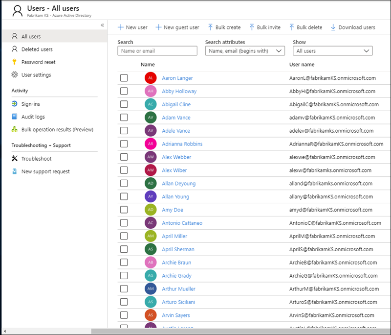
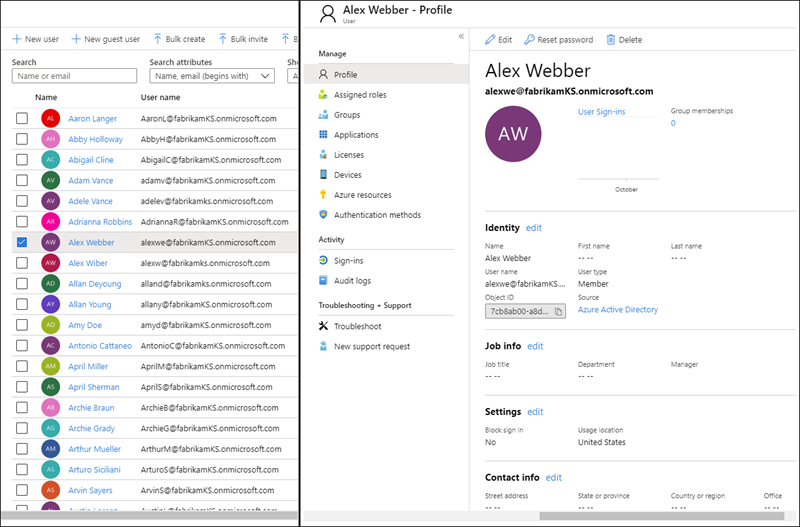
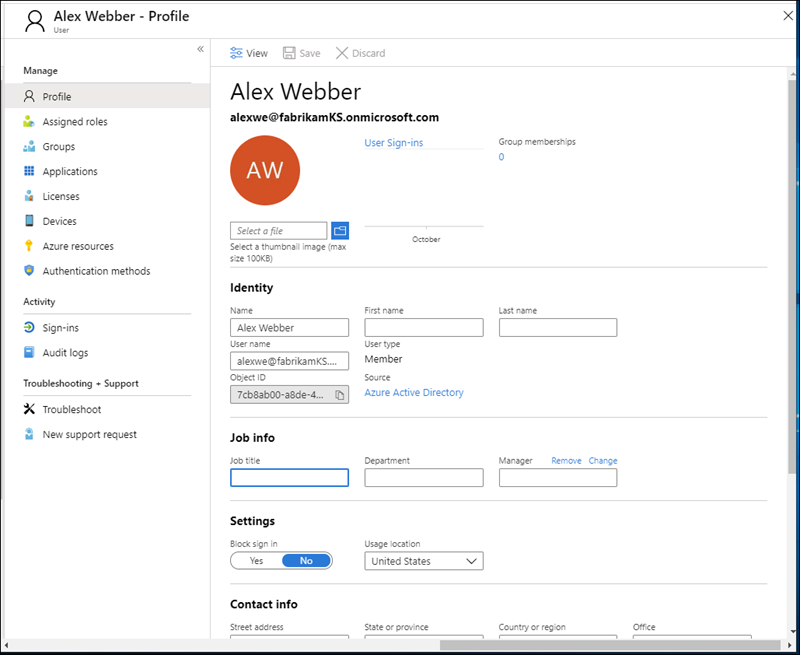
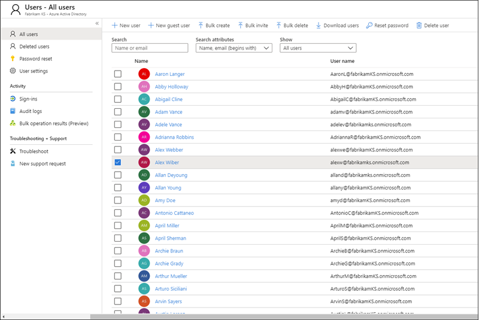
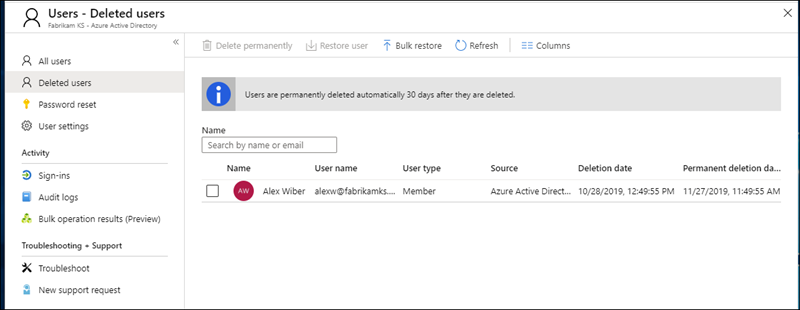
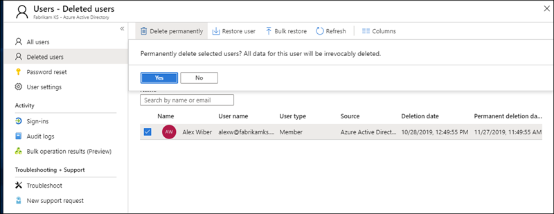
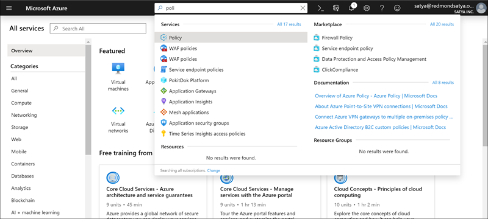
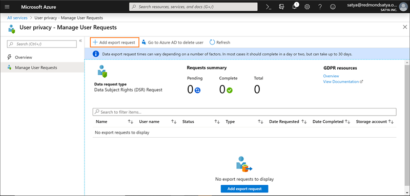
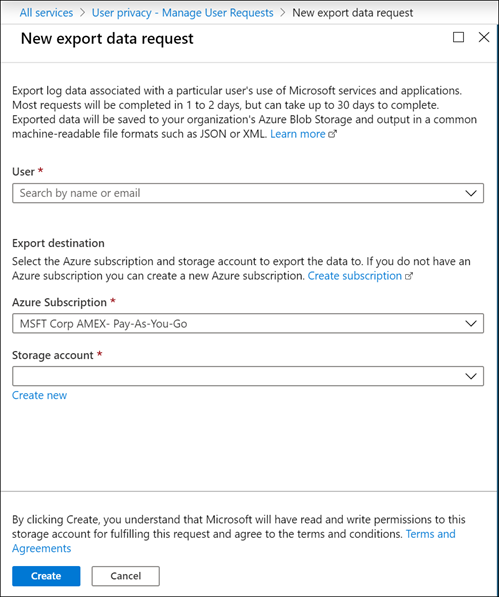

# Demandes des personnes concernées en lien avec des données Azure dans le cadre du RGPD et du CCPA

## Présentation des demandes des personnes concernées (DPC)

Le [Règlement général sur la protection des données (RGPD)](https://ec.europa.eu/justice/data-protection/reform/index_en.htm) de l’UE permet aux utilisateurs (désignés dans le règlement comme étant les *personnes concernées*) de gérer les données à caractère personnel collectées par un employeur ou tout autre type d’agence ou organisation (appelés *responsable du traitement des données* ou *responsable du traitement*). Les données à caractère personnel sont définies dans le RGPD de manière très générale comme étant les données associées à une personne physique identifiée ou identifiable. Le RGPD octroie aux personnes concernées des droits spécifiques sur leurs données à caractère personnel. Ces droits incluent l’obtention de copies des données à caractère personnel, la demande de corrections de ces dernières, la restriction de leur traitement, leur suppression ou leur réception dans un format électronique afin de les transférer à un autre responsable du traitement des données. Toute demande formelle adressée par une personne concernée à un responsable du traitement des données dans le but d’agir sur ses données à caractère personnel est appelée *demande de la personne concernée* ou DPC.

De même, le CCPA (California Consumer Privacy Act), prévoit des droits de confidentialité et des obligations pour les consommateurs de la Californie, y compris des droits similaires aux droits des personnes concernées du RGPD, tels que le droit de supprimer, d’accéder et de recevoir (portabilité) leurs informations personnelles. Le CCPA prévoit également des publications d’informations, des protections contre la discrimination des personnes faisant usage de leurs droits et la possibilité d’opter pour ou contre certains transferts de données classés en tant que « ventes ». Les ventes sont largement définies pour inclure le partage de données à des fins importantes. Pour plus d’informations sur le CCPA, voir le [California Consumer Privacy Act](offering-ccpa.md) et le [Forum aux questions California Consumer Privacy Act](ccpa-faq.md).

Ce guide explique comment utiliser les produits, les services et les outils administratifs de Microsoft pour aider nos clients responsables du traitement à trouver et à agir sur les données personnelles afin de répondre aux RSD. Plus précisément, il s'agit de savoir comment trouver, accéder et agir sur les données personnelles qui résident dans le cloud Microsoft. Voici un aperçu rapide des processus décrits dans ce guide :

- **Découvrir** : utilisez les outils de recherche et de détection pour rechercher plus facilement les données du client qui peuvent faire l’objet d’une demande DPC. Une fois que vous avez collecté les documents susceptibles de répondre à la demande, vous pouvez effectuer une ou plusieurs des actions DPC décrites ci-après. Vous pouvez également décider que la demande ne satisfait pas aux directives de votre organisation en termes de réponse à une demande DPC.
- **Accéder :** récupérez des données à caractère personnel qui résident dans le cloud Microsoft et, si nécessaire, effectuez-en une copie pour la personne concernée.
- **Rectifier :** modifiez ou mettez en œuvre d’autres actions demandées sur les données à caractère personnel, le cas échéant.
- **Limiter** : limiter le traitement des données personnelles en supprimant les licences de différents services Azure ou en désactivant les services souhaités lorsque c’est possible. Vous pouvez également supprimer les données du cloud Microsoft et les conserver localement ou à un autre emplacement.
- **Supprimer :** supprimez définitivement des données à caractère personnel qui résidaient dans le cloud Microsoft.
- **Exporter/Recevoir (Portabilité) :** fournit une copie électronique (dans un format lisible par un ordinateur) des données ou des informations personnelles à la personne concernée. Les informations à caractère personnel sous CCPA englobent toutes les informations relatives à une personne identifiée ou identifiable. Aucune distinction n’est faite entre les rôles privé, public et professionnel d’une personne. Le terme défini « informations personnelles » est à peu près aligné sur celui de « données personnelles » dans le RGPD. Toutefois, le CCPA inclut également les données relatives à la famille et au foyer. Pour plus d’informations sur le CCPA, voir le [California Consumer Privacy Act](offering-ccpa.md) et le [Forum aux questions California Consumer Privacy Act](ccpa-faq.md).

Chaque section de ce guide décrit les procédures techniques qu’une organisation étant une entité de contrôle des données peut suivre pour répondre à une DPC pour des données personnelles dans le cloud Microsoft.

## Terminologie

Vous trouverez ci-dessous des définitions de termes utilisés dans ce guide.

- **Responsable du traitement des données :** la personne physique ou morale, l’autorité publique, le service ou tout autre organisme qui, seul ou conjointement avec d’autres, détermine les finalités et les moyens du traitement des données à caractère personnel ; lorsque les finalités et les moyens du traitement sont déterminés par la législation de l’Union ou des États membres, le responsable du traitement peut être désigné, ou les critères spécifiques relatifs à sa nomination être définis, par la législation de l’Union ou des États membres.
- **Données personnelles et personne concernée par le traitement des données :** informations relatives à une personne physique identifiée ou identifiable (« la personne concernée par le traitement des données ») ; une personne physique identifiable est une personne qui peut être identifiée, directement ou indirectement, notamment par référence à un identificateur par exemple, un nom, un numéro d’identification, des données de localisation, un identificateur en ligne, ou un ou plusieurs facteurs spécifiques de l’identité physique, physiologique, génétique, mentale, économique, culturelle ou sociale de cette personne physique.
- **Sous-traitant de données :** la personne physique ou morale, l’autorité publique, le service ou tout autre organisme qui traite des données à caractère personnel pour le compte du responsable du traitement.
- **Données client :** toutes les données, y compris tous les fichiers texte, son, vidéo ou image et les logiciels qui ont été fournis à Microsoft par le client ou pour son compte dans le cadre du service d’entreprise. Les données client incluent à la fois les (1) informations d’identification personnelle des utilisateurs finaux (par exemple, les noms d’utilisateur et les informations de contact dans Azure Active Directory) et le Contenu Client chargé ou créé par un client dans des services spécifiques (par exemple, le contenu client dans un compte de stockage Azure, le contenu client d’une base de données Azure SQL ou l’image de la machine virtuelle d’un client dans des machines virtuelles Azure).
- **Journaux générés par le système :** journaux et données associées générés par Microsoft qui permettent à Microsoft de fournir des services d’entreprise aux utilisateurs. Les journaux générés par le système contiennent essentiellement des données pseudonymes, généralement un numéro généré par le système qui ne permet pas, en soi, d’identifier une personne individuelle, mais qui est utilisé pour fournir les services d’entreprise aux utilisateurs. Les journaux générés par le système peuvent également contenir des informations d’identification personnelle sur les utilisateurs finaux, telles qu’un nom d’utilisateur.

## Comment utiliser ce guide

Ce guide est composé de deux parties :

- **Partie 1 : Répondre aux demandes des personnes concernées pour des données client** : la première partie de ce guide explique comment rectifier, limiter, supprimer et exporter des données dans des applications dans lesquelles vous avez créé des données, et comment y accéder.  Cette section explique en détail comment exécuter des DPC par rapport à un contenu client et des informations d’identification personnelle d’utilisateurs finaux.
- **Partie 2 : répondre aux demandes de personnes concernées pour les journaux générés par le système** : lorsque vous utilisez les services d’entreprise de Microsoft, Microsoft génère des informations appelées Journaux générés par le système, pour fournir le service.  La deuxième partie de ce guide explique comment supprimer et exporter ces informations pour Azure, et comment y accéder.

## Présentation des DPC pour les comptes de service Microsoft et Azure Active Directory

Lorsqu’il est question des services fournis aux clients d’entreprise, l’exécution des DPC doit toujours être comprise dans le contexte d’un client Azure Active Directory (AAD) spécifique. Ces DPC sont notamment toujours exécutées dans un client AAD donné. Si un utilisateur participe à plusieurs clients, il est important de souligner qu’une DPC donnée est exécutée *uniquement* dans le contexte du client spécifique dans lequel la demande a été reçue. Il est essentiel de le comprendre, car cela signifie que l’exécution d’une DPC par un client d’entreprise n’aura **pas** d’impact sur les données d’un client d’entreprise adjacent.

Il en est de même pour les comptes de service Microsoft dans le contexte des services fournis à un client d’entreprise : l’exécution d’une DPC par rapport à un compte de service Microsoft *associé à un client AAD* **concernera uniquement** les données du client. Par ailleurs, il est important de comprendre les éléments suivants lors de la gestion de comptes de service Microsoft dans un client :

- Si l’utilisateur d’un compte de service Microsoft crée un abonnement Azure, l’abonnement sera géré comme s’il s’agissait d’un client AAD. Par conséquent, les DPC sont limitées au client, comme décrit ci-dessus.
- Si un abonnement Azure créé via un compte de service Microsoft est supprimé, **il n’affectera pas** le compte de service Microsoft réel. Encore une fois, comme noté précédemment, les DPC exécutées dans l’abonnement à Azure sont limitées à l’étendue du client lui-même.

Les DPC par rapport à un compte de service Microsoft lui-même, **en dehors d’un client donné**, sont exécutées via le tableau de bord de confidentialité du consommateur. Consultez le Guide des demandes des personnes concernées par le traitement des données de Windows pour plus d’informations.

## Partie 1 : Guide des DPC pour les données client

### Exécution des DPC par rapport aux données client

Microsoft permet de supprimer et d’exporter certaines données client, et d’y accéder, via le portail Azure et directement aussi via des interfaces de programmation d’applications (API) ou des interfaces utilisateur (UI) préexistantes pour des services spécifiques (également appelées *expériences intégrées au produit*). Vous trouverez des informations sur ces expériences intégrées au produit dans la documentation de référence des services respectifs.

>[!IMPORTANT]  
> Les services qui prennent en charge les DPC intégrées au produit requièrent l’utilisation directe de l’API ou de l’UI du service, décrivant les applications CRUD (créer, lire, mettre à jour, supprimer) applicables. Par conséquent, l’exécution des DPC dans un service donné doit être effectuée en plus de l’exécution d’une DPC dans le portail Azure afin d’effectuer une demande complète pour une personne concernée par le traitement des données. Consultez la documentation de référence des services spécifiques pour plus d’informations.

### Étape 1 : Découvrir

La première étape de la réponse à un RGPD consiste à trouver les données personnelles qui font l'objet de la demande. Cette première étape, qui consiste à trouver et à examiner les données personnelles en question, vous aidera à déterminer si la demande répond aux exigences de votre organisation en matière d'acceptation ou de refus de la demande. Par exemple, après avoir trouvé et examiné les données à caractère personnel en question, vous pouvez déterminer que la demande ne répond pas aux exigences de votre organisation parce que cela pourrait porter atteinte aux droits et libertés d'autrui.

Après avoir trouvé les données, vous pouvez alors effectuer l'action spécifique pour satisfaire la demande de la personne concernée.

[Azure Active Directory](https://azure.microsoft.com/services/active-directory/) est le service de gestion d'identité et d'annuaire multi-tenant basé sur le cloud de Microsoft. Vous pouvez localiser les informations identifiables des utilisateurs finaux, telles que les profils des clients et des employés et les informations sur le travail des utilisateurs qui contiennent des données personnelles dans votre environnement [Azure Active Directory (AAD)](https://azure.microsoft.com/services/active-directory/) en utilisant le [portail Azure](https://portal.azure.com/).

Ceci est particulièrement utile si vous souhaitez trouver ou modifier les données personnelles d'un utilisateur spécifique. Vous pouvez également ajouter ou modifier les informations relatives au profil et au travail de l'utilisateur. Vous devez vous connecter avec un compte qui est un administrateur global pour le répertoire.

#### Comment localiser ou afficher le profil utilisateur et les informations professionnelles ?

1. Connectez-vous au [portail Azure](https://portal.azure.com/) avec un compte Administrateur général pour l’annuaire.

2. Sélectionner **Azure Active Directory**.

     

3. Sélectionner **Utilisateurs**.

     

4. Dans le volet **Tous les utilisateurs**, sélectionnez un utilisateur dans la liste, puis, dans le volet de l’utilisateur choisi, sélectionnez **Profil** pour afficher les informations de profil utilisateur pouvant contenir des données à caractère personnel.

    

5. Si vous souhaitez ajouter ou modifier les informations de profil utilisateur, vous pouvez le faire en sélectionnant **Modifier** dans la barre de commandes puis **Enregistrer** après avoir effectué les modifications.

#### Interfaces propres au service

Microsoft permet de découvrir des données client directement via des interfaces de programmation d’applications (API) ou des interfaces utilisateur (UI) pré-existantes pour des services spécifiques. Vous trouverez des détails dans la documentation de référence des services respectifs, décrivant les opérations CRUD (créer, lire, mettre à jour, supprimer) applicables.

### Étape 2 : Accéder

Lorsque vous avez trouvé les données client contenant des données personnelles répondant potentiellement à une DPC, vous et votre organisation devez décider quelles données fournir à la personne concernée par le traitement des données. Vous pouvez les fournir avec une copie du document réel, une version correctement rédigée ou une capture d’écran des parties que vous considérez pouvoir partager. Pour chacune de ces réponses à une demande d’accès, vous devrez récupérer une copie du document ou de tout autre élément contenant les données pertinentes.

Lorsque vous fournissez une copie à la personne concernée, vous devrez peut-être supprimer ou modifier des informations personnelles sur d’autres personnes concernées et des informations confidentielles.

#### Azure Active Directory

Microsoft offre à la fois un portail et des expériences dans le produit fournissant à l'administrateur du locataire de l'entreprise cliente la capacité de gérer les demandes d'accès DSR. Les demandes d'accès DSR permettent d'accéder aux données personnelles de l'utilisateur, y compris : (a) des informations identifiables sur un utilisateur final et (b) des journaux générés par le système.

#### Interfaces propres au service

Microsoft permet de découvrir des données client directement via des interfaces de programmation d’applications (API) ou des interfaces utilisateur (UI) pré-existantes pour des services spécifiques. Vous trouverez des détails dans la documentation de référence des services respectifs, décrivant les opérations CRUD (créer, lire, mettre à jour, supprimer) applicables.

### Étape 3 : Rectifier

Si une personne concernée vous a demandé de rectifier les données personnelles qui se trouvent dans les données de votre organisation, vous et votre organisation devrez déterminer s'il est approprié d'honorer cette demande. La rectification des données peut inclure des actions telles que l'édition, la rédaction ou la suppression de données personnelles d'un document ou d'un autre type d'élément. La manière la plus rapide de procéder pour les données de Microsoft Support et FastTrack est indiquée ci-dessous.

#### Azure Active Directory

Les clients d’entreprise peuvent gérer les demandes de rectification corrélatives à une DPC, y compris les fonctionnalités d’édition limitées par la nature d’un service Microsoft donné. En tant que responsable du traitement des données, Microsoft ne permet pas de corriger les journaux générés par le système car il reflète les activités factuelles et constitue un enregistrement historique des événements au sein des services Microsoft. Par rapport à Azure Active Directory, des fonctionnalités d’édition limitées permettent de rectifier les informations d’identification personnelle concernant un utilisateur final, comme décrit plus loin ci-dessous.

##### Azure Active Directory : rectifier/corriger des données personnelles inexactes ou incomplètes

Vous pouvez corriger, mettre à jour ou supprimer des informations identifiables sur les utilisateurs finaux, telles que les profils d'utilisateur des clients et des employés et les informations de travail des utilisateurs qui contiennent des données personnelles, comme le nom, le titre de travail, l'adresse ou le numéro de téléphone d'un utilisateur, dans votre environnement [Azure Active Directory (AAD)](https://azure.microsoft.com/services/active-directory/) en utilisant le [portail Azure](https://portal.azure.com/) . Vous devez vous connecter avec un compte qui est un administrateur global pour l'annuaire.

###### Comment corriger ou mettre à jour les informations de profil utilisateur et les informations professionnelles dans Azure Active Directory ?

1. Connectez-vous au [portail Azure](https://portal.azure.com/) avec un compte Administrateur général pour l’annuaire.

2. Sélectionner **Azure Active Directory**.

    

3. Sélectionner **Utilisateurs**.

    

4. Dans le volet **Tous les utilisateurs**, sélectionnez un utilisateur dans la liste, puis, dans le volet de l’utilisateur sélectionné, sélectionnez **Profil** pour afficher les informations de profil utilisateur à corriger ou mettre à jour.

    

5. Corrigez ou mettez à jour les informations de profil utilisateur, y compris les informations sur le travail, en sélectionnant **Modifier** dans la barre de commandes puis  **Enregistrer** après avoir effectué les modifications.

    

#### Interfaces propres au service

Microsoft permet de découvrir des données client directement via des interfaces de programmation d’applications (API) ou des interfaces utilisateur (UI) pré-existantes pour des services spécifiques. Vous trouverez des détails dans la documentation de référence des services respectifs, décrivant les opérations CRUD (créer, lire, mettre à jour, supprimer) applicables.

### Étape 4 : Restreindre

Les personnes concernées peuvent vous demander de restreindre le traitement de leurs données personnelles. Nous fournissons à la fois le portail Azure et des interfaces de programmation d'applications (API) ou des interfaces utilisateur (IU) préexistantes. Ces expériences fournissent à l'administrateur du locataire du client d'entreprise la capacité de gérer ces RGPD par une combinaison d'exportation et de suppression de données. Un client peut (1) exporter une copie électronique des données personnelles de l'utilisateur, y compris (a) le ou les comptes, (b) les journaux générés par le système et (c) les journaux associés, puis (2) supprimer le compte et les données associées résidant dans les systèmes Microsoft.

### Étape 5 : Supprimer

Le « droit à l’effacement » moyennant la suppression des données personnelles des données client d’une organisation est une protection essentielle du RGPD. La suppression des données personnelles inclut la suppression de toutes les données personnelles et journaux générés par le système, à l’exception des informations du journal d’audit. Quand un utilisateur est **supprimé de façon douce** (voir les détails ci-dessous), le compte est désactivé pendant 30 jours. Si aucune autre action n’est prise pendant cette période de 30 jours, l’utilisateur **est définitivement supprimé** (voir les détails ci-dessous). Lors d'**une suppression définitive**, le compte d’utilisateur, les données personnelles et les journaux générés par le système sont supprimés dans un délai de 30 jours supplémentaires. Si un administrateur du client émet immédiatement **une suppression définitive**, le compte d’utilisateur, les données personnelles et les journaux générés par le système sont supprimés dans les 30 jours suivants.

> [!IMPORTANT]
> Vous devez être un administrateur client pour supprimer un utilisateur du client.

#### Supprimer un utilisateur et les données associées via le portail Azure

Lorsque que vous recevez une demande de suppression de la part d’une personne concernée par le traitement des données, vous pouvez utiliser le portail Azure pour supprimer un utilisateur et les informations personnelles associées ainsi que les journaux générés par le système.

La suppression de ces données implique également celle de l’utilisateur du client. Les utilisateurs sont initialement supprimés de façon réversible, ce qui signifie que le compte peut être récupéré par un administrateur client dans un délai de 30 jours après avoir été marqué pour une suppression réversible. Au bout de 30 jours, le compte est supprimé du client de façon automatique et définitive. Avant ces 30 jours, vous pouvez supprimer manuellement un utilisateur supprimé de façon réversible dans la corbeille.

Voici le processus de haut niveau permettant de supprimer des utilisateurs de votre client.

1. Accédez au portail Azure et localisez l’utilisateur.

2. Supprimez l'utilisateur. Lorsque vous supprimez initialement l'utilisateur, le compte de l'utilisateur est envoyé à la corbeille. **À ce stade, l'utilisateur est supprimé progressivement, ce qui signifie que le compte est désactivé, mais pas supprimé d 'Azure Active Directory.**

3. Accédez à la liste des utilisateurs récemment supprimés et supprimez définitivement l’utilisateur. **À ce stade, l’utilisateur est supprimé définitivement (suppression définitive), ce qui signifie que le compte a été vidé d’Azure Active Directory**

###### Pour supprimer un utilisateur d’un client Azure

1. Connectez-vous au [portail Azure](https://portal.azure.com/) avec un compte Administrateur général pour l’annuaire.

2. Sélectionner **Azure Active Directory**.

    

3. Sélectionner **Utilisateurs**.

    

4. Cochez la case en regard de l’utilisateur à supprimer, sélectionnez **Supprimer l’utilisateur**, puis **Oui** dans la zone vous demandant si vous souhaitez supprimer l’utilisateur.

    

5. Dans le  volet  **Tous les utilisateurs**, sélectionnez  **Utilisateurs supprimés**.

    

4. Sélectionnez de nouveau le même utilisateur, sélectionnez  **Supprimer définitivement** dans la barre de commandes, puis  **Oui** dans la zone vous demandant de confirmer la suppression définitive.

>[!IMPORTANT]  
>Sachez qu'en cliquant sur **Oui**, vous supprimez définitivement et irrévocablement l'utilisateur et toutes les données associées ainsi que les journaux générés par le système. Si vous le faites par erreur, vous devrez réinsérer manuellement l'utilisateur dans le locataire. Les données associées et les journaux générés par le système sont irrécupérables.

   

#### Interfaces propres au service

Microsoft permet de découvrir des données client directement via des interfaces de programmation d’applications (API) ou des interfaces utilisateur (UI) pré-existantes pour des services spécifiques. Vous trouverez des détails dans la documentation de référence des services respectifs, décrivant les opérations CRUD (créer, lire, mettre à jour, supprimer) applicables.

## Étape 6 : Exporter

Le «droit à la portabilité des données» permet à une personne concernée de demander une copie de ses données personnelles dans un format électronique (c'est-à-dire un «format structuré, couramment utilisé, lisible par machine et interopérable») qui peut être transmis à un autre contrôleur de données. Azure prend en charge cette fonction en permettant à votre organisation d'exporter les données dans le format JSON natif, vers le conteneur de stockage Azure spécifié.

>[!IMPORTANT]
>Pour exporter des données utilisateur à partir du client, vous devez être un administrateur client.

### Azure Active Directory

Pour des données client, Microsoft offre un portail et des expériences intégrées au produit permettant à l’administrateur client de l’entreprise cliente de gérer les demandes d’exportation d’informations identifiables sur un utilisateur final.

### Interfaces propres au service

Microsoft permet de découvrir des données client directement via des interfaces de programmation d’applications (API) ou des interfaces utilisateur (UI) pré-existantes pour des services spécifiques. Vous trouverez des détails dans la documentation de référence des services respectifs, décrivant les opérations CRUD (créer, lire, mettre à jour, supprimer) applicables.

## Partie 2 : Journaux générés par le système

Microsoft vous permet de supprimer et d’exporter certains journaux générés par le système, associés à l’utilisation d’Azure par un utilisateur, ainsi que d’y accéder.

>[!IMPORTANT]
> Il n’est pas possible de restreindre ni de rectifier les journaux générés par le système. Les journaux générés par le système forment des actions factuelles effectuées dans le cloud Microsoft et les données de diagnostic, et des modifications apportées à ces données compromettraient l’enregistrement historique des actions, augmentant ainsi les risques de fraude et de sécurité.

### Exécution de DPC par rapport aux journaux générés par le système

Microsoft offre la possibilité d'accéder à certains journaux générés par le système, de les supprimer et de les exporter par l'intermédiaire du portail Azure, ainsi que directement via des interfaces programmatiques ou des interfaces utilisateur pour des services spécifiques. Les détails sont décrits dans la documentation de référence des services respectifs.

>[!IMPORTANT]  
> Les services prenant en charge les demandes de recherche de données dans le produit nécessitent l'utilisation directe de l'interface de programmation d'application (API) ou de l'interface utilisateur (UI) du service. Par conséquent, l'exécution d'une demande de recherche de données dans le produit doit être **effectuée en plus de l'exécution d'une demande de recherche de données dans le portail Azure afin de compléter une demande complète pour une personne donnée. Veuillez vous référer à la documentation de référence des services spécifiques pour plus de détails.**

### Étape 1 : Accéder

L'administrateur du locataire est la seule personne de votre organisation qui peut accéder aux journaux générés par le système et associés à l'utilisation d 'Azure par un utilisateur particulier. Les données récupérées pour une demande d'accès seront fournies dans un format lisible par une machine et seront fournies dans des fichiers qui permettront à l'utilisateur de savoir à quels services les données sont associées. Comme indiqué ci-dessus, les données récupérées ne comprendront pas de données susceptibles de compromettre la sécurité du service.

#### Azure Active Directory

Microsoft offre à la fois un portail et des expériences dans le produit permettant à l'administrateur du locataire de l'entreprise cliente de gérer les demandes d'accès. Les demandes d'accès permettront d'accéder aux données personnelles de l'utilisateur, y compris : (a) des informations identifiables sur un utilisateur final et (b) des journaux générés par le service. Le processus est identique à celui décrit dans la section Azure Active Directory de la partie 1, étape 2 : Accès.

#### Interfaces propres au service

Microsoft permet de découvrir des données client directement via des interfaces de programmation d’applications (API) ou des interfaces utilisateur (UI) pré-existantes pour des services spécifiques. Vous trouverez des détails dans la documentation de référence des services respectifs, décrivant les opérations CRUD (créer, lire, mettre à jour, supprimer) applicables.

### Étape 2 : Supprimer

L’administrateur client est la seule personne au sein de votre organisation qui peut exécuter la demande de suppression d’une DPC pour un utilisateur particulier dans un client Azure.

#### Azure Active Directory

Microsoft propose à la fois un portail et des expériences intégrées au produit permettant à l'administrateur du locataire de l'entreprise cliente de gérer les demandes de suppression de RSD. Les demandes de suppression de RSD suivent la même procédure que celle décrite dans la section Supprimer un utilisateur et les données associées via le portail Azure de la partie 1, étape 5 : Supprimer.

#### Interfaces propres au service

Microsoft permet de découvrir des données client directement via des interfaces de programmation d’applications (API) ou des interfaces utilisateur (UI) pré-existantes pour des services spécifiques. Vous trouverez des détails dans la documentation de référence des services respectifs, décrivant les opérations CRUD (créer, lire, mettre à jour, supprimer) applicables.

### Étape 3 : Exporter

L'administrateur du locataire est la seule personne de votre organisation qui peut accéder aux journaux générés par le système et associés à l'utilisation d'Azure par un utilisateur particulier. Les données récupérées pour une demande d'exportation seront fournies dans un format lisible par une machine et seront fournies dans des fichiers qui permettront à l'utilisateur de savoir à quels services les données sont associées. Comme indiqué ci-dessus, les données récupérées ne comprendront pas de données susceptibles de compromettre la sécurité ou la stabilité du service.

#### Exporter les journaux générés par le système à l’aide du portail Azure

Une fois que vous recevez une demande d’exportation pour une personne concernée par le traitement des données, vous pouvez utiliser le portail Azure pour exporter les journaux générés par le système associés à un utilisateur donné.

Voici le processus de haut niveau permettant d’exporter des données à partir de votre client.

1. Accédez au portail Azure et créez une demande d’exportation pour le compte de l’utilisateur.
2. Exportez les données et envoyez le fichier à l’utilisateur.

###### Exporter les informations d’un utilisateur à partir d’un client Azure

1. Ouvrez le portail Azure, sélectionnez **Tous les services**, tapez *stratégie* dans le filtre, puis sélectionnez **Stratégie**.

     

2. Dans le volet **Stratégie**, sélectionnez **Confidentialité de l’utilisateur**, **Gérer les demandes utilisateur**, puis **Ajouter une demande d’exportation**.

    

3. Terminez la **demande d’exportation des données** :

    

- **Utilisateur.** Tapez l’adresse e-mail de l’utilisateur Azure Active Directory qui a demandé l’exportation.
- **Abonnement.** Sélectionnez le compte que vous utilisez pour générer le rapport sur l’utilisation des ressources et facturer les services. C’est également l’emplacement de votre compte de stockage Azure.
- **Compte de stockage** Sélectionnez l'emplacement de votre stockage Azure (Blob). Pour plus d'informations, consultez l'article [Introduction à Microsoft Azure Stockage](/azure/storage/common/storage-introduction#blob-storage) – Blob storage.
- **Conteneur.** Créez un nouveau conteneur (ou sélectionnez un conteneur existant) comme emplacement de stockage des données de confidentialité exportées de l'utilisateur.

4. Sélectionnez **Créer**.

La demande d'exportation passe en statut **En attente**. Vous pouvez consulter l'état du rapport sur la lame **Vie privée de l'utilisateur** – Aperçu.

>[!IMPORTANT]  
>Étant donné que les données personnelles peuvent provenir de plusieurs systèmes, il est possible que le processus d’exportation dure un mois.

#### Interfaces propres au service

Microsoft permet de découvrir des données client directement via des interfaces de programmation d’applications (API) ou des interfaces utilisateur (UI) pré-existantes pour des services spécifiques. Vous trouverez des détails dans la documentation de référence des services respectifs, décrivant les opérations CRUD (créer, lire, mettre à jour, supprimer) applicables.

### Notification des problèmes d’exportation ou de suppression

Si vous rencontrez des problèmes lors de l'exportation ou de la suppression de données à partir du portail Azure, rendez-vous sur la lame **Aide + Support** du portail Azure et soumettez un nouveau ticket sous **Gestion des abonnements > Demandes de confidentialité et de conformité pour les abonnements > Demandes relatives à la lame de confidentialité et au GDPR**.

## En savoir plus

- [Centre de gestion de la confidentialité Microsoft](https://www.microsoft.com/trust-center/privacy/gdpr-overview)
