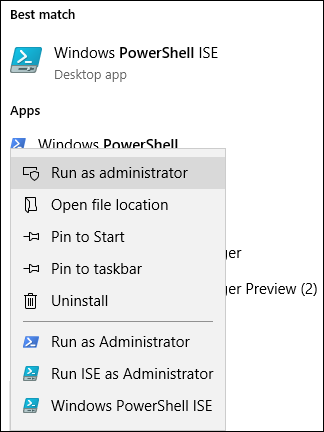
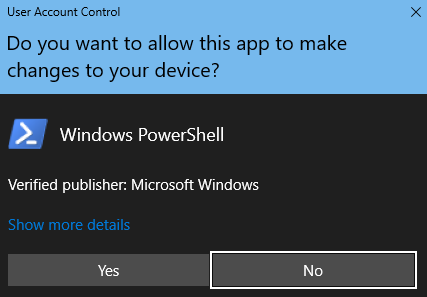
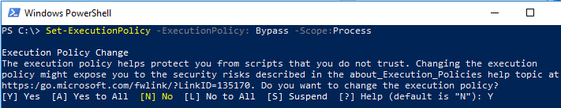

# <a name="fasttrack-migration-toolset-for-submitting-delete-request"></a><span data-ttu-id="f43ad-104">Ensemble d’outils de migration FastTrack pour envoyer une demande de suppression</span><span class="sxs-lookup"><span data-stu-id="f43ad-104">FastTrack Migration Toolset for Submitting Delete Request</span></span>

## <a name="toolset-purpose"></a><span data-ttu-id="f43ad-105">Objectif de l’ensemble d’outils</span><span class="sxs-lookup"><span data-stu-id="f43ad-105">Toolset purpose</span></span>

<span data-ttu-id="f43ad-p101">Si vous êtes un client actuellement engagé dans les migrations FastTrack, la suppression du compte d’utilisateur n’entraîne pas la suppression de la copie des données détenue par l’équipe Microsoft FastTrack, conservée dans le seul but d’exécuter la migration. Si, lors de la migration, vous souhaitez que l’équipe Microsoft FastTrack supprime également la copie des données, envoyez une demande via cet ensemble d’outils. Dans le cours normal des activités, Microsoft FastTrack supprimera toutes les copies de données une fois la migration terminée.</span><span class="sxs-lookup"><span data-stu-id="f43ad-p101">In the event that you are a customer currently engaged in FastTrack migrations, deleting the user account will not delete the data copy held by the Microsoft FastTrack team, which is held for the sole purpose of completing the migration. If during the migration you would like the Microsoft FastTrack team to also delete the data copy, submit a request via this tool set. In the ordinary course of business, Microsoft FastTrack will delete all data copies once the migration is complete.</span></span>

### <a name="supported-platforms"></a><span data-ttu-id="f43ad-109">Plateformes prises en charge</span><span class="sxs-lookup"><span data-stu-id="f43ad-109">Supported platforms</span></span>

<span data-ttu-id="f43ad-p102">Microsoft prend en charge la version initiale de cet ensemble d’outils dans la console PowerShell et la plateforme Windows. Les plateformes connues suivantes sont prises en charge par cet ensemble d’outils :</span><span class="sxs-lookup"><span data-stu-id="f43ad-p102">Microsoft supports the initial release of this  toolset in the Windows platform and PowerShell console. The following known platforms are supported by this toolset:</span></span>

<span data-ttu-id="f43ad-112">\***Tableau 1 : plateformes prises en charge par cet ensemble d’outils** _</span><span class="sxs-lookup"><span data-stu-id="f43ad-112">\***Table 1 — Platforms supported by this toolset** _</span></span>

<span data-ttu-id="f43ad-113">_\*\*\*</span><span class="sxs-lookup"><span data-stu-id="f43ad-113">_\*\*\*</span></span>

|<span data-ttu-id="f43ad-114">Version de PowerShell</span><span class="sxs-lookup"><span data-stu-id="f43ad-114">PowerShell version</span></span>|<span data-ttu-id="f43ad-115">Windows 7</span><span class="sxs-lookup"><span data-stu-id="f43ad-115">Windows 7</span></span>|<span data-ttu-id="f43ad-116">Windows 8</span><span class="sxs-lookup"><span data-stu-id="f43ad-116">Windows 8</span></span>|<span data-ttu-id="f43ad-117">Windows 10</span><span class="sxs-lookup"><span data-stu-id="f43ad-117">Windows 10</span></span>|<span data-ttu-id="f43ad-118">Windows Server 2012</span><span class="sxs-lookup"><span data-stu-id="f43ad-118">Windows Server 2012</span></span>|<span data-ttu-id="f43ad-119">Windows Server 2016</span><span class="sxs-lookup"><span data-stu-id="f43ad-119">Windows Server 2016</span></span>|
|:---:|:---:|:---:|:---:|:---:|:---:|
|<span data-ttu-id="f43ad-120">5.0</span><span class="sxs-lookup"><span data-stu-id="f43ad-120">5.0</span></span>|<span data-ttu-id="f43ad-121">Non pris en charge</span><span class="sxs-lookup"><span data-stu-id="f43ad-121">Not Supported</span></span>|<span data-ttu-id="f43ad-122">Pris en charge</span><span class="sxs-lookup"><span data-stu-id="f43ad-122">Supported</span></span>|<span data-ttu-id="f43ad-123">Pris en charge</span><span class="sxs-lookup"><span data-stu-id="f43ad-123">Supported</span></span>|<span data-ttu-id="f43ad-124">Pris en charge</span><span class="sxs-lookup"><span data-stu-id="f43ad-124">Supported</span></span>|<span data-ttu-id="f43ad-125">Pris en charge</span><span class="sxs-lookup"><span data-stu-id="f43ad-125">Supported</span></span>|
|<span data-ttu-id="f43ad-126">5.1</span><span class="sxs-lookup"><span data-stu-id="f43ad-126">5.1</span></span>|<span data-ttu-id="f43ad-127">Non pris en charge</span><span class="sxs-lookup"><span data-stu-id="f43ad-127">Not Supported</span></span>|<span data-ttu-id="f43ad-128">Pris en charge</span><span class="sxs-lookup"><span data-stu-id="f43ad-128">Supported</span></span>|<span data-ttu-id="f43ad-129">Pris en charge</span><span class="sxs-lookup"><span data-stu-id="f43ad-129">Supported</span></span>|<span data-ttu-id="f43ad-130">Pris en charge</span><span class="sxs-lookup"><span data-stu-id="f43ad-130">Supported</span></span>|<span data-ttu-id="f43ad-131">Pris en charge</span><span class="sxs-lookup"><span data-stu-id="f43ad-131">Supported</span></span>|
|

### <a name="obtaining-the-toolset"></a><span data-ttu-id="f43ad-132">Obtention de l’ensemble d’outils</span><span class="sxs-lookup"><span data-stu-id="f43ad-132">Obtaining the toolset</span></span>

<span data-ttu-id="f43ad-p103">Cet ensemble d’outils est disponible dans la galerie PowerShell sur l’application console PowerShell. Pour rechercher et charger ce module de cmdlet, ouvrez tout d’abord PowerShell en mode administrateur afin d’être autorisé à installer le module. Si vous n’avez jamais utilisé PowerShell, accédez à la barre des tâches Windows et saisissez « PowerShell » dans la zone de recherche. Faites un clic droit sur l’application console pour la sélectionner, choisissez **Exécuter en tant qu’administrateur**, puis cliquez sur **Oui** pour exécuter Windows PowerShell.</span><span class="sxs-lookup"><span data-stu-id="f43ad-p103">This toolset is available in the PowerShell Gallery on the PowerShell console application.  To locate and load this cmdlet module, first open PowerShell in administrator mode so it has the appropriate permissions to install the module. If you have not used PowerShell previously go to your Windows Task Bar and in the search box type 'PowerShell”. Select the console app using right-click and choose **Run as administrator**, then click **Yes** to run Windows PowerShell.</span></span>





<span data-ttu-id="f43ad-p104">À présent que la console est ouverte, vous devez définir des autorisations pour l’exécution des scripts. Saisissez la commande suivante pour autoriser l’exécution des scripts :</span><span class="sxs-lookup"><span data-stu-id="f43ad-p104">Now that the console is open, you need to set permissions for script execution. Type the following command to allow the scripts to run:</span></span>

```powershell
Set-ExecutionPolicy -ExecutionPolicy Bypass -Scope Process
```

<span data-ttu-id="f43ad-141">Vous serez invité à confirmer cette action, car l’administrateur peut modifier l’étendue à sa guise.</span><span class="sxs-lookup"><span data-stu-id="f43ad-141">You will be prompted to confirm this action, as the administrator can change the scope at their discretion.</span></span>

<span data-ttu-id="f43ad-142">\**_Définir la stratégie d’exécution_* _</span><span class="sxs-lookup"><span data-stu-id="f43ad-142">\**_Set Execution Policy_* _</span></span>



<span data-ttu-id="f43ad-144">Maintenant que la console est configurée pour autoriser le script, exécutez la commande suivante pour installer le module :</span><span class="sxs-lookup"><span data-stu-id="f43ad-144">Now that the console is set to allow the script, run this next command to install the module:</span></span>

```powershell
Install-Module -Name Microsoft.FastTrack -Repository PSGallery -WarningAction SilentlyContinue -Force
```

### <a name="prerequisites-for-module"></a><span data-ttu-id="f43ad-145">Conditions préalables pour le module</span><span class="sxs-lookup"><span data-stu-id="f43ad-145">Prerequisites for module</span></span>

<span data-ttu-id="f43ad-p105">Pour exécuter correctement ce module, vous devrez peut-être installer des modules dépendants si ce n’est pas déjà fait. Vous devrez peut-être redémarrer PowerShell.</span><span class="sxs-lookup"><span data-stu-id="f43ad-p105">To successfully execute this module, you may need to install dependent modules for use if they are not already installed. You may need to restart PowerShell.</span></span>

<span data-ttu-id="f43ad-p106">Pour envoyer une DSR, vous devez tout d’abord vous connecter à l’aide de vos identifiants Office 365. La saisie des identifiants corrects validera votre statut d’administrateur général et collectera des informations client.</span><span class="sxs-lookup"><span data-stu-id="f43ad-p106">In order to submit a DSR, you must first log in using your Office 365 credentials. Entering the proper credentials will validate your global administrator status and collect tenant information.</span></span>

```powershell
Login-FastTrackAccount -ApiKey <API Key provided by FastTrack MVM>
```

<span data-ttu-id="f43ad-150">Une fois que vous êtes connecté, les identifiants et la clé sont stockés pour être utilisés avec les modules FastTrack pendant le reste de la session PowerShell actuelle.</span><span class="sxs-lookup"><span data-stu-id="f43ad-150">Once successfully logged in, the credentials and key will be stored for use with FastTrack modules for the remainder of the current PowerShell session.</span></span>

<span data-ttu-id="f43ad-151">Si vous avez besoin de vous connecter à un environnement cloud autre que commercial, vous devrez ajouter _-Environment à la commande *Login* avec l’un des environnements valides suivants :</span><span class="sxs-lookup"><span data-stu-id="f43ad-151">If you need to connect to a cloud environment, other than commercial, _-Environment\* will need to be added to *Log in* command with one of the following valid environments:</span></span>

- <span data-ttu-id="f43ad-152">AzureCloud</span><span class="sxs-lookup"><span data-stu-id="f43ad-152">AzureCloud</span></span>
- <span data-ttu-id="f43ad-153">AzureChinaCloud</span><span class="sxs-lookup"><span data-stu-id="f43ad-153">AzureChinaCloud</span></span>
- <span data-ttu-id="f43ad-154">AzureGermanCloud</span><span class="sxs-lookup"><span data-stu-id="f43ad-154">AzureGermanCloud</span></span>
- <span data-ttu-id="f43ad-155">AzureUSGovernmentCloud</span><span class="sxs-lookup"><span data-stu-id="f43ad-155">AzureUSGovernmentCloud</span></span>

```powershell
Login-FastTrackAccount -ApiKey <API Key provided by FastTrack MVM> -Environment <cloud environment>
```

<span data-ttu-id="f43ad-156">Pour envoyer une demande DPC, exécutez la commande suivante :</span><span class="sxs-lookup"><span data-stu-id="f43ad-156">To submit a DSR request, run the following command:</span></span>

```powershell
Submit-FastTrackGdprDsrRequest -DsrRequestUserEmail SubjectUserEmail@mycompany.com
```

<span data-ttu-id="f43ad-p107">En cas de réussite, la cmdlet renverra un objet d’ID de transaction. Veuillez conserver l’ID de transaction.</span><span class="sxs-lookup"><span data-stu-id="f43ad-p107">On success, the cmdlet will return a Transaction ID object. Please retain the Transaction ID.</span></span>

#### <a name="checking-the-status-of-a-request-transaction"></a><span data-ttu-id="f43ad-159">Vérification de l’état de transaction d’une demande</span><span class="sxs-lookup"><span data-stu-id="f43ad-159">Checking the status of a request transaction</span></span>

<span data-ttu-id="f43ad-160">Exécutez la fonction suivante en utilisant l’ID de transaction précédemment obtenu :</span><span class="sxs-lookup"><span data-stu-id="f43ad-160">Run the following function using the previously obtained Transaction ID:</span></span>

```powershell
Get-FastTrackGdprDsrRequest -TransactionID "YourTransactionID"
```

#### <a name="transaction-status-codes"></a><span data-ttu-id="f43ad-161">Codes d’état de transaction</span><span class="sxs-lookup"><span data-stu-id="f43ad-161">Transaction Status Codes</span></span>

|<span data-ttu-id="f43ad-162">Transaction</span><span class="sxs-lookup"><span data-stu-id="f43ad-162">Transaction</span></span>|<span data-ttu-id="f43ad-163">Statut</span><span class="sxs-lookup"><span data-stu-id="f43ad-163">Status</span></span>|
|---|---|
|<span data-ttu-id="f43ad-164">**Créée**</span><span class="sxs-lookup"><span data-stu-id="f43ad-164">**Created**</span></span>|<span data-ttu-id="f43ad-165">Une demande a été créée.</span><span class="sxs-lookup"><span data-stu-id="f43ad-165">Request has been created.</span></span>|
|<span data-ttu-id="f43ad-166">**Échec**</span><span class="sxs-lookup"><span data-stu-id="f43ad-166">**Failed**</span></span>|<span data-ttu-id="f43ad-167">Échec de la création de la demande : renvoyez-la ou contactez le support technique.</span><span class="sxs-lookup"><span data-stu-id="f43ad-167">Request failed to create, please resubmit, or contact support.</span></span>|
|<span data-ttu-id="f43ad-168">**Terminée**</span><span class="sxs-lookup"><span data-stu-id="f43ad-168">**Completed**</span></span>|<span data-ttu-id="f43ad-169">Demande terminée et purgée.</span><span class="sxs-lookup"><span data-stu-id="f43ad-169">Request has been completed and sanitized.</span></span>|
|

<!-- original version: **Created**  Request has been created<br/>**Failed** Request failed to create, please resubmit, or contact support<br/>**Completed** Request has been completed and sanitized -->

## <a name="learn-more"></a><span data-ttu-id="f43ad-170">En savoir plus</span><span class="sxs-lookup"><span data-stu-id="f43ad-170">Learn more</span></span>

[<span data-ttu-id="f43ad-171">Centre de gestion de la confidentialité Microsoft</span><span class="sxs-lookup"><span data-stu-id="f43ad-171">Microsoft Trust Center</span></span>](https://www.microsoft.com/trust-center/privacy/gdpr-overview)
