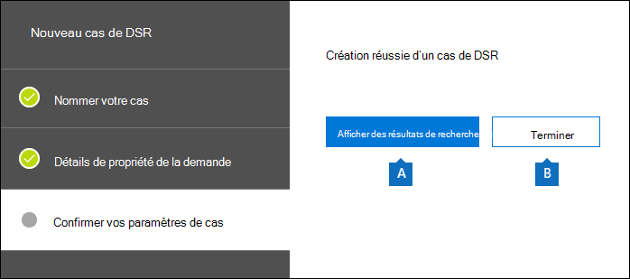

# <a name="manage-gdpr-data-subject-requests-with-the-dsr-case-tool-in-the-security--compliance-center"></a>Gérer les demandes des personnes soumises au R GDPR à l’aide de l’outil de cas de DSR dans le Centre de sécurité & conformité

Le Règlement général sur la protection des données (R GDPR) de l’UE a pour but de protéger et d’activer les droits de confidentialité des individus au sein de l’Union européenne (UE). Le R GDPR donne aux personnes de l’Union européenne (appelées personnes qui sont des personnes qui traitent des données) le droit d’accéder, de récupérer, de corriger, d’effacer et de restreindre le traitement de leurs données personnelles. Dans le cadre du R GDPR, les données personnelles désignent toutes les informations relatives à une personne naturelle identifiée ou identifiable. Une demande formelle d’une personne à son organisation d’agir sur ses données personnelles s’appelle une demande de personne objet de données ou DSR. Pour plus d’informations sur la réponse aux DSR pour les données dans Office 365, consultez le Guide des demandes des personnes soumises aux données [Office 365.](https://go.microsoft.com/fwlink/?linkid=871169 )
  
Pour gérer les enquêtes en réponse à une DSR envoyée par une personne de votre organisation, vous pouvez utiliser l’outil de cas de DSR dans le Centre de sécurité & conformité pour rechercher le contenu stocké dans :
  
- Toute boîte aux lettres utilisateur de votre organisation. Cela inclut les conversations Skype Entreprise et les conversations un-à-un dans Microsoft Teams
    
- Toutes les boîtes aux lettres associées à un groupe Microsoft 365 et toutes les boîtes aux lettres d’équipe dans Microsoft Teams
    
- Tous les sites SharePoint Online et les comptes OneDrive Entreprise dans votre organisation
    
- Tous les sites Teams et les sites de groupe Microsoft 365 de votre organisation
    
- Tous les dossiers publics dans Exchange Online
    
À l’aide de l’outil de cas de DSR, vous pouvez :
  
- Créer un dossier distinct pour chaque examen de DPC.
    
- Contrôler qui a accès au cas de DSR en ajoutant des personnes en tant que membres du cas ; seuls les membres peuvent accéder au cas et peuvent uniquement voir leurs cas dans la liste des cas dans la page Cas de **DSR** dans le Centre de sécurité & conformité. En outre, vous pouvez attribuer différentes autorisations à différents membres du même cas. Par exemple, vous pouvez autoriser certains membres à afficher uniquement les résultats de recherche et de cas, et permettre à d’autres membres de créer des recherches et d’exporter des résultats de recherche. 
    
- Utilisez la recherche intégrée pour rechercher tout le contenu créé ou téléchargé par une objet de données spécifique.
    
- Modifiez éventuellement la requête de recherche intégrée et réexécutez la recherche pour affiner les résultats de la recherche.
    
- Ajoutez d’autres recherches de contenu associées au cas de DSR. Cela inclut la création de recherches qui retournent des éléments partiellement indexés et des journaux générés par le système à partir du service d’itinérance Office.
    
- Exporter des données en réponse à une demande d’accès ou d’exportation de DSR.
    
- Supprimez les cas lorsque le processus d’investigation du DSR est terminé. Cette opération supprime toutes les recherches et les tâches d’exportation associées au cas.
    
Voici le processus de haut niveau permettant d’utiliser l’outil de cas de DSR pour gérer les examens de DSR :
  
[Step 1: Assign eDiscovery permissions to potential case members](#step-1-assign-ediscovery-permissions-to-potential-case-members)

[Étape 2 : Créer un cas de DSR et ajouter des membres](#step-2-create-a-dsr-case-and-add-members)

[Étape 3 : Exécuter la requête de recherche](#step-3-run-the-search-query)

[Étape 4 : Exporter les données](#step-4-export-the-data)

[(Facultatif) Étape 5 : Réviser la requête de recherche intégrée](#optional-step-5-revise-the-built-in-search-query)

[Plus d’informations sur l’utilisation de l’outil de cas de DSR](#more-information-about-using-the-dsr-case-tool)
  
> [!IMPORTANT]
> Nos outils peuvent aider les administrateurs à effectuer des demandes d’accès ou d’exportation de DSR en leur permettant d’utiliser les fonctionnalités intégrées de recherche et d’exportation disponibles dans l’outil de cas de DSR. L’outil permet de faciliter une méthode efficace pour exporter des données pertinentes pour une demande de DSR envoyée par une objet de données. Toutefois, il est important de noter que les résultats de la recherche peuvent varier en fonction de la sujet des données ou des actions de l’administrateur qui peuvent avoir un impact sur le fait qu’un élément soit considéré comme « données personnelles » à des fins d’exportation. Par exemple, si la personne objet de données était la dernière personne à modifier un fichier qu’elle n’a pas créé, il se peut que le fichier ne soit pas renvoyé dans les résultats de la recherche. De même, un administrateur peut exporter des données sans inclure les éléments partiellement indexés ou toutes les versions des documents SharePoint. Par conséquent, les outils fournis peuvent faciliter l’accès et l’exportation des demandes de données . toutefois, les résultats sont soumis à des scénarios d’utilisation spécifiques de l’administrateur et de la sujet de données. 
  
## <a name="step-1-assign-ediscovery-permissions-to-potential-case-members"></a>Étape 1 : attribuer des autorisations de découverte électronique aux membres potentiels de cas

Par défaut, un administrateur général peut accéder à l’outil de cas de DSR dans le Centre de sécurité & conformité. Par conception, d’autres utilisateurs tels qu’un responsable de la protection des données, un responsable des ressources humaines ou d’autres personnes impliquées dans des examens de DSR n’ont pas accès à l’outil de cas de DSR et doivent se voir attribuer les autorisations appropriées pour accéder à l’outil. Le moyen le plus simple de le faire est d’aller sur la page Autorisations dans le Centre de sécurité & conformité et d’ajouter des utilisateurs au groupe de **rôles** Gestionnaire eDiscovery. Vous devez également attribuer ces autorisations afin de pouvoir les ajouter en tant que membres du cas de DSR que vous créez à l’étape 2. 
  
Pour obtenir des instructions détaillées, voir Attribuer des [autorisations eDiscovery](/microsoft-365/compliance/assign-ediscovery-permissions)dans le Centre de sécurité et conformité Office 365 &.
  
> [!NOTE]
> Par défaut, un administrateur général (ou d’autres membres du groupe de rôles Gestion de l’organisation dans le Centre de sécurité & conformité ne sont pas autorisés à exporter les résultats de recherche de contenu (voir l’étape 4 de cet article). Pour résoudre ce problème, un administrateur peut s’ajouter en tant que membre du groupe de rôles Gestionnaire eDiscovery. 
  
## <a name="step-2-create-a-dsr-case-and-add-members"></a>Étape 2 : Créer un cas de DSR et ajouter des membres

L’étape suivante consiste à créer un cas de DSR. Lorsque vous créez un cas, vous pouvez choisir de démarrer la recherche intégrée ou vous pouvez créer le cas sans démarrer la recherche. La procédure suivante vous demande de créer le cas sans démarrer la recherche, puis de vous montrer comment ajouter des membres au cas.
  
1. Go to [https://protection.office.com](https://protection.office.com) and sign in using your work or school account. 
    
2. Dans le Centre de sécurité &  conformité, cliquez sur Demandes des personnes soumises aux données de confidentialité des données, puis cliquez sur Icône Ajouter un nouveau \> cas  **DSR.**
    
3. Dans la page du nouveau **dossier de DSR,** nommez le cas, tapez une description facultative, puis cliquez sur **Suivant**. Le nom du cas doit être unique dans toute votre organisation.
    
    > [!TIP]
    > Envisagez d’ajouter le nom de la personne qui a envoyé la demande de DSR que vous examinez dans le nom et/ou la description du nouveau cas. Notez que seuls les membres de ce cas (et les administrateurs eDiscovery) seront en mesure de voir le cas dans la liste des cas sur la page Demandes de la sujet **des** données. 
  
4. Dans la page **Détails** de la demande, sous Objet de données (personne ayant déposé cette **demande),** sélectionnez la personne pour qui vous souhaitez rechercher et exporter des données, puis cliquez sur **Suivant**.
    
5. Dans la page **Confirmer les paramètres de votre cas,** vous pouvez modifier le nom et la description du cas, puis sélectionner une autre objet de données. Dans le cas contraire, cliquez **sur Enregistrer**.
    
    Une page qui confirme que le nouveau cas de DSR a été créé s’affiche.
    
    
  
    À ce stade, vous pouvez faire l’une des deux choses :
    
    a. Le fait de cliquer **sur Afficher les résultats de la recherche** démarre la recherche. Il s’agit de la sélection par défaut. La recherche intégrée qui est exécuté lorsque vous sélectionnez cette option et les résultats renvoyés sont abordés à l’étape 3.
    
    b. Cliquer sur **Terminer** ferme le nouveau cas de DSR sans démarrer la recherche intégrée. Lorsque vous sélectionnez cette option, le nouveau cas de DSR s’affiche dans la page Demandes de **la sujet des données.**
    
6. Cliquez **sur** Terminer pour pouvoir vous rendre dans le nouveau cas de DSR et y ajouter des membres. 
    
7. Dans la page **Demandes de la** sujet des données, cliquez sur le nom du cas de DSR que vous avez créé. 
    
8. Dans la page **Gérer ce cas** volant, sous Gérer les **membres,** cliquez sur **Ajouter**. 
    
    Sous **Utilisateurs,** une liste des personnes à qui sont attribuées les autorisations eDiscovery appropriées s’affiche. Les personnes à qui vous avez attribué des autorisations eDiscovery à l’étape 1 seront affichées dans cette liste. 
    
9. Sélectionnez les personnes à ajouter en tant que membres du cas de DSR, cliquez sur **Ajouter,** puis enregistrez vos modifications.
    
    Vous pouvez également ajouter des groupes de rôles en tant que membres du cas de DSR en cliquant sur **Ajouter** sous Gérer les groupes **de rôles.** 
    
## <a name="step-3-run-the-search-query"></a>Étape 3 : Exécuter la requête de recherche

Après avoir créé un cas de DSR et ajouté des membres, l’étape suivante consiste à exécuter la recherche intégrée associée au cas. Cette requête de recherche par défaut permet d’effectuer les opérations suivantes :
  
- Recherche dans toutes les boîtes aux lettres de votre organisation tous les éléments de courrier envoyés ou reçus par la sujet des données. Pour ce faire, utilisez la propriété de messagerie  *Participants,*  qui recherche la personne à l’adresse de données dans tous les champs de personnes d’un message électronique. Cette propriété renvoie les éléments dans lesquels la sujet de données se trouve dans les champs **De**, **À,** **Cc** et **Cci.** Les dossiers publics dans Exchange Online sont également recherchés pour les messages envoyés ou reçus par la sujet des données. 
    
- Recherche dans tous les sites de votre organisation des documents et des éléments créés ou téléchargés par la sujet de données. Pour ce faire, utilisez les propriétés de site suivantes :
    
  - La  *propriété Author*  renvoie les éléments où la sujet de données est répertorié dans le champ auteur dans les documents Office. Cette valeur persiste, même si le document est copié et téléchargé par une autre personne. 
    
  - La  *propriété CreatedBy*  renvoie les éléments qui ont été créés ou téléchargés par la sujet de données. 
    
Voici à quoi ressemble la requête de mot clé pour la recherche intégrée qui est automatiquement créée lorsque vous créez un cas de DSR.
  
```powershell
participants:"<email address>" OR author:"<display name>" OR createdby:"<display name>"
```

Par exemple, si le nom de la sujet de données est Ina Leonte, la requête de mot clé se ressemblerait à ceci :
  
```powershell
participants:"ina@contoso.com" OR author:"Ina Leonte" OR createdby:"Ina Leonte"
```

 **Pour exécuter la recherche intégrée pour un cas de DSR :**
  
1. Dans le Centre de sécurité  & conformité, cliquez sur Demandes des personnes responsables de la confidentialité des données, puis cliquez sur Ouvrir en face du cas de DSR que vous avez créé à l’étape \> 2.  
    
    Cliquez sur **l’onglet** Recherche en haut de la page, puis cochez la case en regard de la recherche intégrée qui a été créée lors de la création du cas de DSR. La recherche a le même nom que le cas de DSR. 
    
2. Dans la page de volant de recherche, cliquez **sur Ouvrir la requête.**
    
    Lorsque vous ouvrez la requête, la recherche est lancée et se termine dans quelques instants. 
    
3. Lorsque la recherche est terminée, cliquez sur Aperçu **des résultats** pour afficher un aperçu des résultats de la recherche. Pour plus d’informations, voir [aperçu des résultats de la recherche.](/microsoft-365/compliance/content-search#preview-search-results)
    
    > [!TIP]
    > Vous pouvez également afficher les statistiques de requête de recherche pour afficher le nombre de boîtes aux lettres et d’éléments de site renvoyés par la recherche, ainsi que les principaux emplacements de contenu qui contiennent des éléments qui correspondent à la requête de recherche. Pour plus d’informations, voir [Afficher des informations et des statistiques sur une recherche.](/microsoft-365/compliance/content-search#view-information-and-statistics-about-a-search) 
  
Vous pouvez modifier la requête de recherche intégrée, modifier les emplacements de contenu recherchés, puis réexécuter la recherche. Pour plus [d’informations,](#optional-step-5-revise-the-built-in-search-query) voir l’étape 5. 
  
## <a name="step-4-export-the-data"></a>Étape 4 : Exporter les données

Après avoir exécuté la recherche intégrée, vous pouvez exporter les résultats de la recherche. Vous pouvez également réviser la requête pour réduire le nombre de résultats de recherche avant d’exporter les données. Pour plus d’informations sur l’a affiner les résultats de la recherche, consultez l’étape 5.
  
Lorsque vous exportez des résultats de recherche, les éléments de boîte aux lettres peuvent être téléchargés dans des fichiers PST ou sous la mesure de messages individuels. Lorsque vous exportez du contenu à partir de comptes SharePoint et OneDrive, des copies de documents Office natifs et d’autres documents sont exportées. Un fichier de résultats qui contient des informations sur chaque élément exporté est inclus dans les résultats de la recherche. Pour plus d’informations sur l’exportation, voir Exporter les résultats [de la recherche de contenu.](/microsoft-365/compliance/export-search-results)
  
> [!NOTE]
> Par défaut, un administrateur général (ou d’autres membres du groupe de rôles Gestion de l’organisation dans le Centre de sécurité & conformité) ne peut pas exporter les résultats de recherche de contenu. Pour résoudre ce problème, un administrateur peut s’ajouter en tant que membre du groupe de rôles Gestionnaire eDiscovery. 
  
L’ordinateur que vous utilisez pour exporter des données doit respecter la exigences système suivante :
  
- Versions 32 bits ou 64 bits de Windows 7 et versions ultérieures
    
- Microsoft .NET Framework 4.7
    
- un navigateur pris en charge :
    
  - Microsoft Edge
    
    Ou
    
  - Microsoft Internet Explorer 10 et versions ultérieures
    
    > [!NOTE]
    > Microsoft ne fabrique pas d’extensions ou d’extensions tierces pour ClickOnce applications. L’exportation de données à l’aide d’un navigateur non pris en charge avec des extensions ou extensions tierces n’est pas prise en charge. 
  
 **Pour exporter des données à partir de la recherche intégrée dans un cas de DSR :**
  
1. Dans le Centre de sécurité &  conformité, cliquez sur Demandes des personnes à l’objet des données de confidentialité des données, puis cliquez sur Ouvrir en face du cas de DSR à partir de qui vous souhaitez exporter des \> données.  
    
2. Cliquez sur **l’onglet** Recherche en haut de la page, puis cochez la case en regard de la recherche intégrée qui a été créée lors de la création du cas de DSR. Vous pouvez également cliquer sur une autre recherche pour exporter des données à partir de cette recherche. 
    
3. Dans la page volante de recherche, cliquez sur Exporter les résultats de la recherche icône Plus, puis sélectionnez Exporter les résultats  liste.  
    
4. Dans la page **Exporter les résultats,** sélectionnez les options recommandées suivantes pour les demandes d’exportation de DSR. 
    
    
  
    a. Sous **Options** de sortie, sélectionnez la première option ( Tous les éléments, à l’exclusion de ceux qui ont un format non reconnu, sont chiffrés ou n’ont pas été indexés pour **d’autres raisons)** pour exporter uniquement les éléments indexés. La raison pour laquelle vous ne souhaitez pas exporter des éléments partiellement indexés à partir de la recherche intégrée est que les éléments partiellement indexés d’autres utilisateurs seront également exportés. Pour exporter uniquement les éléments partiellement indexés pour la sujet de données, nous vous recommandons de créer une recherche distincte. Pour plus d’informations, voir Exportation d’éléments partiellement [indexés](#exporting-partially-indexed-items) dans la section « Plus d’informations sur l’utilisation de l’outil de cas de DSR ».
    
    b. Sous **Exporter le contenu Exchange en tant** que , sélectionnez la troisième option, un fichier PST contenant tous les messages dans un dossier **unique.** Étant donné que certains résultats peuvent être pour des éléments qui proviennent de la boîte aux lettres d’un autre utilisateur, cette option répertorie simplement l’élément dans un dossier unique sans indiquer la boîte aux lettres réelle et est la meilleure option à utiliser lorsque vous dupliquer les résultats comme recommandé dans l’élément suivant. Cette option permet également aux éléments de révision de la personne objet de données dans l’ordre chronologique (les éléments sont triés par date d’envoi) sans avoir à naviguer dans la structure de dossiers de boîte aux lettres d’origine pour chaque élément.
    
    c. Sélectionnez **l’option Activer la déplication** pour exclure les messages électroniques en double. Nous vous recommandons cette option, car la recherche intégrée recherche toutes les boîtes aux lettres de votre organisation. Par conséquent, si plusieurs copies d’un même message sont trouvées dans les boîtes aux lettres dans les recherches, cette option signifie qu’une seule copie d’un message sera exportée. Cette option, qui permet d’exporter des messages dans un seul fichier PST dans un dossier unique, offre la meilleure expérience utilisateur pour les demandes d’exportation de DSR. Le rapport Results.csv'exportation répertorie tous les emplacements où des messages en double ont été trouvés.
    
    Si vous le souhaitez, vous pouvez sélectionner l’option Inclure des versions pour les **documents SharePoint** pour exporter toutes les versions des documents SharePoint et OneDrive. Pour ce faire, le versionsing doit être désactivée pour les bibliothèques de documents. Cette option permet de s’assurer que toutes les données pertinentes sont exportées.
    
5. Après avoir choisi les paramètres d’exportation, cliquez sur **Exporter.**
    
    Les résultats de la recherche sont préparés pour le téléchargement, ce qui signifie qu’ils sont téléchargés vers l’espace de stockage Azure de votre organisation dans le cloud Microsoft. Les étapes suivantes vous montrent comment télécharger ces données sur votre ordinateur local.
    
6. Cliquez sur **l’onglet** Exporter pour afficher la tâche d’exportation que vous avez créée. Les travaux d’exportation ont le même nom que la recherche correspondante avec _Export **à** la fin du nom de recherche. 
    
7. Cliquez sur la tâche d’exportation que vous avez créée pour afficher la page de présentation de l’exportation. Cette page affiche des informations sur la recherche, telles que la taille et le nombre total d’éléments à exporter, ainsi que le pourcentage des éléments qui ont été transférés vers une zone de stockage Azure. Cliquez sur **Actualiser** pour mettre à jour les informations d’état de chargement. 
    
8. Sous **Clé d’exportation**, cliquez sur **Copier dans le Presse-papiers**. Vous utilisez cette clé à l’étape 11 pour télécharger les résultats de la recherche.
    
9. Cliquez sur  **résultats** en haut de la page volante d’exportation. 
    
10. Dans la fenêtre pop-up en bas de la page, cliquez sur **Ouvrir** pour ouvrir l’outil d’exportation **eDiscovery.** **L’outil d’exportation eDiscovery** sera installé la première fois que vous téléchargerez les résultats de recherche. 
    
11. Dans **l’outil d’exportation eDiscovery,** collez la clé d’exportation que vous avez copiée à l’étape 8 dans la zone appropriée.
    
12. Cliquez sur **Parcourir** pour spécifier l’emplacement de téléchargement du fichier des résultats de recherche. 
    
    > [!NOTE]
    > En raison de l’activité élevée du disque (lectures et écritures), vous devez télécharger les résultats de la recherche sur un lecteur de disque local . ne les téléchargez pas sur un lecteur réseau mappé ou un autre emplacement réseau. 
  
13. Cliquez sur **Démarrer** pour télécharger les résultats de recherche sur votre ordinateur. 
    
    L’**outil d’exportation de découverte électronique** affiche l’état du processus d’exportation, ainsi qu’une estimation du nombre (et de la taille) d’éléments qui doivent encore être téléchargés. Une fois le processus d’exportation terminé, vous pouvez accéder aux fichiers à l’emplacement où ils ont été téléchargés. Pour plus d’informations sur les rapports inclus lorsque vous téléchargez les résultats de recherche de contenu, voir la [section](/microsoft-365/compliance/export-search-results#more-information) Plus d’informations dans « Exporter les résultats de recherche de contenu ». 
    
Une fois les données exportées, les résultats de la recherche et les rapports d’exportation se trouvent dans un dossier qui a le même nom que le cas de DSR. Les fichiers PST qui contiennent des éléments de boîte aux lettres se trouvent dans un sous-dossier nommé **Exchange**. Les documents et autres éléments de sites se trouvent dans un sous-dossier nommé **SharePoint.** 
  
## <a name="optional-step-5-revise-the-built-in-search-query"></a>(Facultatif) Étape 5 : Réviser la requête de recherche intégrée

Après avoir exécuté la recherche intégrée, vous pouvez la réviser pour restreindre l’étendue afin de renvoyer moins de résultats de recherche. Pour ce faire, ajoutez des conditions à la requête. Une condition est connectée logiquement à la requête de mot clé par **l’opérateur AND.** Cela signifie que pour être renvoyés dans les résultats de la recherche, les éléments doivent satisfaire la requête de mot clé et toutes les conditions que vous ajoutez. C’est ainsi que les conditions contribuent à affiner les résultats. Si vous ajoutez au moins deux conditions uniques à une requête de recherche (conditions qui spécifient des propriétés différentes), ces conditions sont connectées logiquement par **l’opérateur AND.** Cela signifie que seuls les éléments qui répondent à toutes les conditions (en plus de la requête de mot clé) sont renvoyés. Si vous ajoutez plusieurs valeurs (séparées par des virgules ou des points-virgules) à une condition unique, ces valeurs sont connectées par **l’opérateur OR.** Les éléments renvoyés sont ceux qui contiennent l’une des valeurs spécifiées pour la propriété dans la condition. 
  
Voici quelques exemples de conditions que vous pouvez ajouter à la requête de recherche intégrée d’un cas de DSR. Le nom de la propriété réelle utilisée dans une requête de recherche s’affiche entre parenthèses.
  
- **Type de fichier ( `filetype` )** : spécifie l’extension d’un document ou d’un fichier. Utilisez cette condition pour rechercher des documents et des fichiers créés par des applications Office spécifiques, telles que Word, Excel et OneNote. 
    
- **Type de message ( `kind` )** : spécifie le type d’élément de courrier à rechercher. Par exemple, vous pouvez utiliser la syntaxe pour renvoyer uniquement les messages électroniques et les conversations Skype Entreprise ou les  `kind:email OR kind:im` conversations un-à-un dans Microsoft Teams. 
    
- **Balise de conformité ( `compliancetag` )** : spécifie une étiquette affectée à un message électronique ou à un document. Cette condition renvoie les éléments classés avec une étiquette spécifique. Les étiquettes sont utilisées pour classer les e-mails et les documents pour la gouvernance des données et appliquer des règles de rétention basées sur la classification définie par l’étiquette. Il s’agit d’une condition utile pour les examens de DSR, car votre organisation peut utiliser des étiquettes pour classer le contenu lié à la confidentialité des données ou qui contient des données personnelles ou des informations sensibles. Pour la valeur de cette condition, utilisez le nom complet de l’étiquette ou la première partie du nom de l’étiquette avec un caractère générique. Pour plus d’informations, voir En savoir plus sur les stratégies de rétention et les étiquettes de [rétention dans Office 365.](/microsoft-365/compliance/retention)
    
Pour obtenir la liste et la description de toutes les conditions disponibles dans l’outil de cas de DSR, voir [conditions](/microsoft-365/compliance/keyword-queries-and-search-conditions#search-conditions) de recherche dans l’article « Requêtes par mot clé et conditions de recherche pour la recherche de contenu ». 
  
### <a name="changing-the-content-locations-that-are-searched"></a>Modification des emplacements de contenu recherchés

Outre la révision de la recherche intégrée pour un cas de DSR, vous pouvez également modifier les emplacements de contenu recherchés. Comme indiqué précédemment, la recherche intégrée recherche chaque boîte aux lettres et chaque site de l’organisation, ainsi que tous les dossiers publics Exchange Online. Par exemple, vous pouvez affiner la recherche pour rechercher uniquement la boîte aux lettres et le compte OneDrive de la personne qui en est à l’objet de données, ainsi que les sites SharePoint sélectionnés. Si vous choisissez de rechercher des sites spécifiques, vous devez ajouter chaque site que vous souhaitez rechercher.
  
Pour modifier les emplacements de contenu à rechercher :
  
1. Ouvrez la recherche intégrée dont vous souhaitez modifier les emplacements de contenu.
    
2. Dans la requête de recherche, sous **Emplacements,** cliquez sur **Modifier** en dessous de **l’option Emplacements spécifiques.** 
    
    
  
    La page **de présentation** Modifier les emplacements s’affiche. Voici une description des emplacements de contenu dans la recherche intégrée et des informations sur la modification des emplacements recherchés. 
    
    
  
    a. Le basculement sous **Sélectionner** tout dans la section Boîte aux lettres en haut de la page volante est sélectionné, ce qui indique que toutes les boîtes aux lettres font l’objet d’une recherche. Pour restreindre l’étendue de la recherche, cliquez sur le bouton bascule pour la désélectionner, puis cliquez sur Choisir des **utilisateurs,** des groupes ou des équipes et choisissez des boîtes aux lettres spécifiques à rechercher.
    
    b. Le basculement sous **Sélectionner** tout dans la section Sites au milieu de la page volante est sélectionné, ce qui indique que tous les sites font l’objet d’une recherche. Pour restreindre la recherche aux sites sélectionnés, vous désélectionneriez le bouton bascule, puis cliquez sur **Choisir des sites.** Vous devez ajouter chaque site spécifique que vous souhaitez rechercher, y compris le compte OneDrive de la personne objet de données.
    
    c. Le basculement dans la section Dossiers publics Exchange est sélectionné, ce qui signifie que tous les dossiers publics Exchange sont recherchés. Vous pouvez uniquement rechercher tous les dossiers publics Exchange ou aucun d’entre eux. Vous ne pouvez pas choisir des recherches spécifiques.
    
3. Si vous modifiez les emplacements de contenu dans la recherche intégrée, cliquez sur **Enregistrer &amp; pour** redémarrer la recherche. 

> [!NOTE]
> Lorsque vous recherchez tous les emplacements de boîtes aux lettres ou uniquement des boîtes aux lettres spécifiques, les données d’autres applications Office 365 enregistrées dans les boîtes aux lettres utilisateur sont incluses lorsque vous exportez les résultats de la recherche. Ces données ne sont pas incluses dans les résultats de recherche estimés et ne sont pas disponibles pour en aperçu. Toutefois, il est inclus lorsque vous exportez et téléchargez les résultats de la recherche. Pour plus d’informations sur les applications qui stockent des données dans la boîte aux lettres d’un utilisateur, voir Contenu stocké dans les boîtes aux lettres [Exchange Online.](/microsoft-365/compliance/what-is-stored-in-exo-mailbox)
  
## <a name="more-information-about-using-the-dsr-case-tool"></a>Plus d’informations sur l’utilisation de l’outil de cas de DSR

Les sections suivantes contiennent plus d’informations sur l’utilisation de l’outil de cas de DSR pour répondre aux demandes d’exportation de DSR.
  
[Exportation de données à partir du service d’itinérance Office](#exporting-data-from-the-office-roaming-service)

[Exportation d’éléments partiellement indexés](#exporting-partially-indexed-items)

[Recherche et exportation de données à partir de Microsoft Teams et des groupes Microsoft 365](#searching-and-exporting-data-from-microsoft-teams-and-microsoft-365-groups)

[Recherche de dossiers publics Exchange](#searching-exchange-public-folders)
  
### <a name="exporting-data-from-the-office-roaming-service"></a>Exportation de données à partir du service d’itinérance Office

Vous pouvez utiliser l’outil de cas de DSR pour rechercher et exporter les données d’utilisation générées par le service d’itinérance Office. L’itinérance est un service qui stocke les paramètres liés à Office, tels que le thème Office, le dictionnaire personnalisé, les paramètres de langue, le mode développeur et la correction automatique. 
    
Les données du service d’itinérance Office sont stockées dans la boîte aux lettres d’une objet de données dans un dossier masqué situé dans une sous-arbre de messages non interpersonnels (non IPM) de boîtes aux lettres Exchange Online. Cela signifie que les données sont masquées dans l’affichage de l’utilisateur lorsqu’il utilise Outlook ou d’autres clients de messagerie pour accéder à sa boîte aux lettres. Pour plus d’informations sur les dossiers masqués, voir [MapI Hidden Folders](https://go.microsoft.com/fwlink/?linkid=872758).
  
Vous pouvez créer une recherche de contenu distincte (et l’associer à un cas de DSR) qui renvoie les données d’utilisation du service d’itinérance Office dans la boîte aux lettres de la sujet de données. Ces données ne sont pas incluses dans les statistiques de recherche et ne sont pas disponibles en prévisualisation. Toutefois, vous pouvez l’exporter, puis le donner à la sujet des données en réponse à une demande d’exportation de DSR.
  
Lorsque vous exportez des données à partir du service d’itinérance Office, les données sont enregistrées dans un dossier distinct situé dans le dossier **ApplicationDataRoot,** qui se trouve sous un dossier qui est le nom de l’adresse e-mail de la sujet de données. Ces données sont exportées en tant que fichiers JSON, qui sont des fichiers texte lisibles par l’utilisateur, semblables aux fichiers XML ou TXT, joints aux messages électroniques. Actuellement, ce dossier est nommé avec l’identificateur global unique (GUID) : **1caee58f-eb14-4a6b-9339-1fe2ddf6692b**. Dans les futures versions de l’outil de cas de DSR, le GUID sera remplacé par le nom de l’application réelle. 

   
 **Pour rechercher et exporter des données du service d’itinérance Office :**
  
1. Dans le Centre de sécurité  & conformité, cliquez sur Demandes des personnes à l’objet des données relatives à la confidentialité des données, puis cliquez sur Ouvrir en face du cas de DSR pour la personne à qui vous souhaitez exporter les données \> d’utilisation.  
    
2. Cliquez sur **l’onglet** Recherche en haut de la page, puis cliquez sur Ajouter  **l’icône.**
    
3. Cliquez **sur Annuler** sur la page Nom de **votre** recherche. 
    
4. Sous **Requête de recherche,** dans la condition **Type,** cochez la case en regard du **service d’itinérance Office.** 
    
    
  
    La condition **Type** (qui est des classes de message électronique) doit être le seul élément dans la requête de recherche. Vous pouvez supprimer la zone **Mots clés** ou la laisser vide. 
    
5. Sous **Emplacements,** assurez-vous que des emplacements **spécifiques** sont sélectionnés, puis cliquez sur **Modifier.**
    
6. Dans la partie supérieure de la page **volant** Modifier les emplacements (section Boîte aux lettres), cliquez sur Choisir des utilisateurs, des groupes ou **des équipes.**
    
7. Dans la page **Modifier les** emplacements, cliquez sur Choisir des **utilisateurs,** des groupes ou des équipes, choisissez la boîte aux lettres de la sujet de données, puis enregistrez votre sélection. 
    
8. Cliquez **sur Enregistrer & exécuter,** puis nommez la recherche et enregistrez-la.
    
    La recherche démarre.
    
 **Pour exporter les données du service d’itinérance Office :**
  
1. Lorsque la recherche que vous avez créée à  l’étape précédente est terminée, cliquez sur l’onglet Recherche en haut de la page, puis cochez la case en regard de la recherche. Vous de devez peut-être cliquer  **Actualiser pour** afficher la recherche. 
    
2. Dans la page volante de recherche, cliquez sur Exporter les résultats de la recherche icône Plus, puis sélectionnez Exporter les résultats dans la  liste liste.  
    
3. Dans la page **Exporter les résultats,** sélectionnez les options recommandées pour exporter les données d’utilisation. 
    
    
  
    a. Sous **Options** de sortie, sélectionnez la première option ( Tous les éléments, à l’exclusion de ceux qui ont un format non reconnu, sont chiffrés ou n’ont pas été indexés pour **d’autres raisons)** pour exporter uniquement les éléments indexés.
    
    b. Sous **Exporter le contenu Exchange sous**, sélectionnez la deuxième option, un fichier **PST contenant tous les messages.**
    
    c. Laissez les options d’exportation restantes non sélectionnés.
    
4. Après avoir choisi les paramètres d’exportation, cliquez sur **Exporter.**
    
    Les résultats de la recherche sont préparés pour le téléchargement, ce qui signifie qu’ils sont téléchargés vers l’espace de stockage Azure de votre organisation dans le cloud Microsoft. Les étapes suivantes vous montrent comment télécharger ces données sur votre ordinateur local.
    
5. Cliquez sur **l’onglet** Exporter pour afficher la tâche d’exportation que vous avez créée. Les travaux d’exportation ont le  même nom que la recherche correspondante avec _Export à la fin du nom de recherche. 
    
6. Cliquez sur le travail d’exportation que vous avez créé pour afficher la page de présentation de l’exportation. 
    
7. Sous **Clé d’exportation**, cliquez sur **Copier dans le Presse-papiers**. Vous utilisez cette clé à l’étape 10 pour télécharger les résultats de la recherche.
    
8. Cliquez sur  **résultats** en haut de la page volante d’exportation. 
    
9. Dans la fenêtre pop-up en bas de la page, cliquez sur **Ouvrir** pour ouvrir l’outil d’exportation **eDiscovery.** **L’outil d’exportation eDiscovery** sera installé la première fois que vous téléchargerez les résultats de recherche. 
    
10. Dans l’**outil d’exportation de découverte électronique**, collez la clé d’exportation que vous avez copiée à l’étape 7 dans la zone appropriée.
    
11. Cliquez sur **Parcourir** pour spécifier l’emplacement de téléchargement du fichier des résultats de recherche. 
    
    > [!NOTE]
    > En raison de la quantité élevée d’activité de disque (lectures et écritures), vous devez télécharger les résultats de la recherche sur un lecteur de disque local . ne les téléchargez pas sur un lecteur réseau mappé ou un autre emplacement réseau. 
  
12. Cliquez sur **Démarrer** pour télécharger les résultats de recherche sur votre ordinateur. 
    
    L’**outil d’exportation de découverte électronique** affiche l’état du processus d’exportation, ainsi qu’une estimation du nombre (et de la taille) d’éléments qui doivent encore être téléchargés. Une fois le processus d’exportation terminé, vous pouvez ouvrir le fichier PST Exchange dans Outlook, puis accéder au dossier **ApplicationDataRoot** pour accéder au sous-dossier du service d’itinérance. 
    
    Comme indiqué précédemment, les fichiers JSON qui contiennent des données d’utilisation sont joints aux messages. Pour afficher un fichier JSON, cliquez sur un message, puis ouvrez le fichier JSON joint. 
  
### <a name="exporting-partially-indexed-items"></a>Exportation d’éléments partiellement indexés

Nous vous recommandons de ne pas exporter les éléments partiellement indexés (également appelés éléments non indexés) à partir de la recherche intégrée créée lorsque vous créez un cas de DSR. En effet, les résultats de la recherche incluront probablement des éléments partiellement indexés pour d’autres utilisateurs de votre organisation, et pas seulement des éléments partiellement indexés pour la sujet de données). Au lieu de cela, nous vous recommandons de créer une recherche de contenu distincte associée au cas de DSR qui est conçue pour exporter uniquement les éléments partiellement indexés liés à la sujet de données. 
  
Voici un processus de haut niveau pour exporter des éléments partiellement indexés. Après l’exportation, vous pouvez les examiner pour déterminer si un élément répond à une demande d’accès ou d’exportation de DSR.
  
1. Ouvrez le cas de DSR et créez une recherche sur la page **De** recherche. 
    
2. Utilisez les critères suivants pour configurer la requête de recherche et les emplacements de contenu à rechercher :
    
    - Utilisez une requête de mot clé vide/vide. Cette opération renvoie tous les éléments des emplacements de contenu qui font l’objet d’une recherche.
    
    - Recherchez uniquement la boîte aux lettres Exchange Online de la personne objet de données et son compte OneDrive.
    
3. Une fois la recherche terminée, vous pouvez exporter et télécharger les résultats de la recherche (comme décrit à [l’étape 4).](#step-4-export-the-data) Utilisez les paramètres suivants pour exporter des éléments partiellement indexés. 
    
    - Sous **Options** de sortie, sélectionnez la troisième option ( Seuls les éléments qui ont un format non reconnu, sont chiffrés ou n’ont pas été indexés pour **d’autres** raisons) pour exporter uniquement des éléments partiellement indexés.
    
    - Sous **Exporter le contenu Exchange en tant** que , vous pouvez sélectionner n’importe quelle option en fonction de vos préférences. 
    
    - La sélection de **l’option** Inclure des versions pour les documents SharePoint exporte les versions des documents si une version est partiellement indexée. 
    
Pour plus d’informations sur les éléments partiellement indexés, voir : 
  
- [Éléments partiellement indexés dans la recherche de contenu dans Office 365](/microsoft-365/compliance/partially-indexed-items-in-content-search)

- [Exportation d’éléments partiellement indexés](/microsoft-365/compliance/export-search-results#exporting-partially-indexed-items)

### <a name="searching-and-exporting-data-from-microsoft-teams-and-microsoft-365-groups"></a>Recherche et exportation de données à partir de Microsoft Teams et des groupes Microsoft 365

Les conversations qui font partie de la liste de conversations dans Microsoft Teams (appelées conversations d’équipe ou conversations un-à-un) sont stockées dans la boîte aux lettres Exchange Online des utilisateurs qui participent aux conversations. En outre, les fichiers qu’une personne partage dans une conversation un-à-un sont stockés dans le compte OneDrive de la personne qui partage le fichier. Étant donné que la recherche intégrée recherche toutes les boîtes aux lettres et les comptes OneDrive de l’organisation, les conversations d’équipe et les documents partagés dans une session de conversation (que la personne à l’origine des données a créées ou téléchargées) sont renvoyés par la recherche intégrée dans un cas de DSR.
  
Par ailleurs, les conversations qui font partie d’un canal Teams (également appelés messages de canal) sont stockées dans la boîte aux lettres associée à une équipe. Ces types de conversations que la sujet des données a participé sont également renvoyés par la recherche intégrée, car toutes les boîtes aux lettres associées à Teams font l’objet d’une recherche. En outre, les fichiers partagés par une objet de données dans un canal Teams sont stockés sur le site SharePoint de l’équipe. Les fichiers créés ou chargés par la sujet des données sont renvoyés par la recherche intégrée dans un cas de DSR, car les sites associés à Teams sont inclus dans la recherche.
  
De même, les boîtes aux lettres et les sites SharePoint qui correspondent à un groupe Microsoft 365 sont également inclus dans la recherche intégrée. Cela signifie que les messages électroniques envoyés ou reçus par la sujet des données et les fichiers créés ou téléchargés par la sujet de données sont renvoyés. 
  
Pour plus d’informations sur l’utilisation de la recherche de contenu pour rechercher des éléments dans Microsoft Teams et les groupes Microsoft 365 ou pour voir comment obtenir une liste de membres, voir la section « Recherche dans Microsoft Teams et les groupes Microsoft 365 » dans la recherche de contenu [dans Microsoft 365.](/microsoft-365/compliance/content-search#searching-microsoft-teams-and-microsoft-365-groups) 
  
### <a name="searching-exchange-public-folders"></a>Recherche de dossiers publics Exchange

La recherche intégrée dans un cas de DSR ne retournera que les messages électroniques envoyés par la personne à l’adresse de données à un dossier public à messagerie ou les messages envoyés à un dossier public par une autre personne et qui ont également copié la personne à l’étude. Elle ne retourne pas les messages que la personne à l’objet de données a publiés dans un dossier public. Pour rechercher les éléments publiés par la personne à l’étude dans un dossier public, vous pouvez créer une recherche de contenu distincte qui recherche tout élément publié dans un dossier public par la personne à l’étude.
  
Voici un processus de haut niveau pour rechercher les éléments que la sujet des données a publiés dans un dossier public. 
  
1. Ouvrez le cas de DSR et créez une recherche sur la page **De** recherche. 
    
2. Utilisez les critères suivants pour configurer la requête de recherche et les emplacements de contenu à rechercher :
    
  - Dans la **zone Mots clés,** utilisez la requête de recherche suivante : 
    
    ```powershell
    itemclass:ipm.post AND "<email address of the data subject>"
    ```

  - Rechercher tous les dossiers publics Exchange
    
  - Une fois la recherche terminée, vous pouvez exporter et télécharger les résultats de la recherche (comme décrit à [l’étape 4).](#step-4-export-the-data) Utilisez les paramètres suivants pour exporter des éléments partiellement indexés. 
