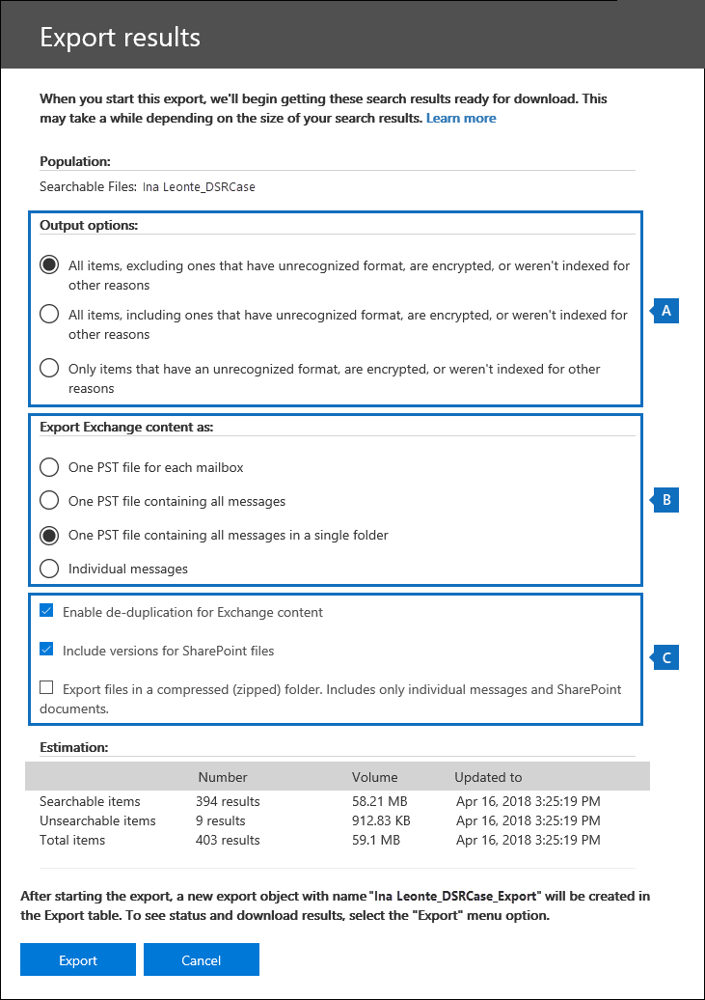
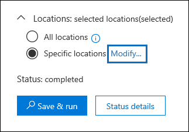
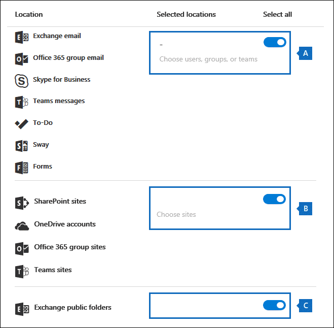
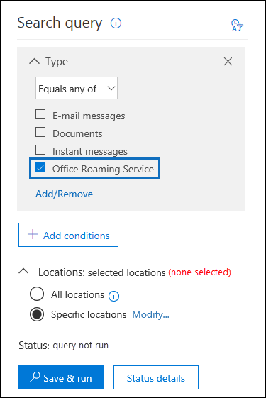

# <a name="manage-gdpr-data-subject-requests-with-the-dsr-case-tool-in-the-security--compliance-center"></a>Gérer les Demandes des personnes associées aux données RGPD à l’aide de l’outil de dossier de DPC dans le Centre de sécurité et conformité.

Le règlement général de protection des données (RGPD) de l’UE vise à protéger et à faire respecter les droits liés à la protection des données personnelles des utilisateurs dans l’Union Européenne (UE). Le RGPD donne aux utilisateurs de l’Union européenne (également appelés sujets de données) le droit d’accéder, de récupérer, de corriger, d’effacer et de restreindre le traitement de leurs données personnelles. Sous le RGPD, les données personnelles signifient toutes les informations relatives à une personne identifiée ou identifiable. Une demande officielle d’une personne à son organisation d’effectuer une action sur ses données personnelles est appelée Demande de droits de la personne concernée ou DPC. Pour plus d’informations sur la réponse aux demandes de DPC dans Office 365, voir [Guide de demande de la personne concernée Office 365](https://go.microsoft.com/fwlink/?linkid=871169 ).
  
Pour gérer les enquêtes en réponse à une DPC envoyée par un membre de votre organisation, vous pouvez utiliser l’outil Cas de rapport DPC dans le Centre de sécurité et conformité pour rechercher le contenu stocké dans :
  
- Toute boîte aux lettres d’utilisateur dans votre organisation. Cela inclut les conversations Skype Entreprise et les conversations un-à-un dans Microsoft Teams
    
- Toutes les boîtes aux lettres associées à un groupe Microsoft 365 et toutes les boîtes aux lettres d’équipe dans Microsoft Teams
    
- Tous les sites SharePoint Online et les comptes OneDrive Entreprise dans votre organisation
    
- Tous les sites Microsoft Teams et les sites de groupes Microsoft 365 dans votre organisation
    
- Tous les dossiers publics dans Exchange Online
    
L’outil de cas DPC vous permet de :
  
- Créer un dossier distinct pour chaque examen de DPC.
    
- Contrôler les personnes autorisées à accéder au cas DPC en ajoutant des personnes en tant que membres du cas ; seuls les membres peuvent accéder au cas et ne peuvent voir que leur cas dans la liste des cas sur la page de **cas DPC** dans le Centre de Conformité & Sécurité. De plus, vous pouvez attribuer des autorisations différentes aux différents membres du même cas. Par exemple, vous pouvez autoriser certains membres à afficher uniquement le cas et les résultats d’une recherche de contenu, et permettre à d’autres membres de créer des recherches et d’exporter des résultats de recherche. 
    
- Utilisez la recherche intégrée pour rechercher tout le contenu créé ou téléchargé à un sujet de données spécifique.
    
- Facultativement, réviser la requête de recherche intégrée, puis relancer la recherche pour limiter les résultats de recherche.
    
- Ajoutez d’autres recherches de contenu associées au cas DPC. Cela inclut la création de recherches qui retournent des éléments partiellement indexés et des journaux générés par le système à partir du Service d’itinérance Office.
    
- Exporter des données en réponse à une demande d’accès ou d’exportation de DPC.
    
- Supprimer des dossiers une fois le processus d’examen des DPC terminé. Cette action permet de supprimer toutes les recherches de contenu et d’exporter des tâches associées au cas.
    
Voici le processus haut-niveau d’utilisation de l’outil Cas DPC pour gérer les enquêtes DPC :
  
[Étape 1 : attribuer des autorisations de découverte électronique aux membres de cas potentiels](#step-1-assign-ediscovery-permissions-to-potential-case-members)

[Étape 2 : créer un cas DPC et ajouter des membres](#step-2-create-a-dsr-case-and-add-members)

[Étape 3 : exécuter la demande de recherche](#step-3-run-the-search-query)

[Étape 4 : exporter les données](#step-4-export-the-data)

[(Facultatif) Étape 5 : réviser la requête de recherche intégrée](#optional-step-5-revise-the-built-in-search-query)

[Informations supplémentaires sur l’utilisation de l’outil Cas DPC](#more-information-about-using-the-dsr-case-tool)
  
> [!IMPORTANT]
> Nos outils peuvent aider les administrateurs à effectuer des demandes d’accès DPC ou d’exporter les demandes en les autorisant à utiliser les fonctionnalités intégrées de recherche et d’exportation présentes dans l’outil Cas DPC. L’outil facilite la méthode d’exportation des données pertinentes pour une demande de rapport DPC soumise par un sujet de données. Toutefois, il est important de noter que les résultats de la recherche peuvent varier en fonction du sujet des données ou des actions de l’administrateur qui peuvent avoir une incidence sur le fait qu’un élément soit ou non considéré comme étant des « données personnelles » à des fins d’exportation. Par exemple, si le sujet des données était la dernière personne à modifier un fichier qu’elle n’a pas créé, il se peut que le fichier ne soit pas renvoyé dans les résultats de recherche. De même, un administrateur peut exporter des données sans inclure les éléments partiellement indexés ou toutes les versions des documents SharePoint. Par conséquent, les outils fournis peuvent faciliter l’accès et l’exportation des demandes de données. Toutefois, les résultats sont soumis à des scénarios d’utilisation spécifiques d’administrateurs et de sujets de données. 
  
## <a name="step-1-assign-ediscovery-permissions-to-potential-case-members"></a>Étape 1 : attribuer des autorisations de découverte électronique aux membres potentiels de cas

Par défaut, un administrateur général peut accéder à l’outil Cas DPC dans le Centre de sécurité et de conformité. Par design, les autres utilisateurs tels qu’un agent de la confidentialité des données, un responsable des ressources humaines ou d’autres personnes impliquées dans des enquêtes DPC n’ont pas accès à l’outil cas DPC et doivent se voir attribuer les autorisations appropriées pour accéder à l’outil. Pour ce faire, le plus simple consiste à se rendre sur la page **Autorisations** du Centre de sécurité et conformité et à ajouter des utilisateurs au groupe de rôles Gestionnaire découverte électronique. Vous devez également attribuer ces autorisations pour pouvoir les ajouter en tant que membres du cas DPC que vous avez créé à l’Étape 2. 
  
Pour obtenir des instructions détaillées, voir [Attribuer des autorisations de Découverte électronique dans le Centre de sécurité et conformité Office 365](/microsoft-365/compliance/assign-ediscovery-permissions).
  
> [!NOTE]
> Par défaut, un administrateur général (ou d’autres membres du groupe de rôles Gestion de l’organisation dans le Centre de sécurité et conformité) n’ont pas les autorisations nécessaires pour exporter des résultats de recherche de contenu (voir l’Étape 4 de cet article). Pour résoudre ce problème, un administrateur peut s’ajouter lui-même en tant que membre du groupe de rôles Gestionnaire de Découverte électronique. 
  
## <a name="step-2-create-a-dsr-case-and-add-members"></a>Étape 2 : créer un cas DPC et ajouter des membres

L'étape suivante consiste à créer un cas DPC. Lorsque vous créez un cas, vous pouvez choisir de lancer la recherche intégrée ou créer un cas sans lancer la recherche. La procédure suivante vous demande de créer le cas sans lancer la recherche, puis vous montre comment ajouter des membres au cas.
  
1. Allez sur [https://protection.office.com](https://protection.office.com) et connectez-vous à l’aide de votre compte professionnel ou scolaire. 
    
2. Dans le Centre de sécurité et conformité, cliquez sur **Confidentialité des données** \> **Demandes de sujet de données**, puis sur  **Nouveau cas DPC** .
    
3. Dans la page volante **Nouveau cas DPC**, donnez un nom au cas, tapez une description facultative, puis cliquez **Suivant**. Le nom du cas doit être unique dans toute votre organisation.
    
    > [!TIP]
    > Songez à ajouter le nom de la personne qui a envoyé la demande DPC que vous êtes en train d’examiner dans le nom et/ou la description du nouveau cas. Notez que seuls les membres de ce cas (et les administrateurs eDiscovery) pourront voir le cas dans la liste des cas sur la page **Demandes d’objet de données** . 
  
4. Sur la page **Détails de la demande**, sous **Sujet de données (la personne ayant classé cette demande)**, sélectionnez la personne pour qui vous voulez rechercher et exporter des données, puis cliquez sur **Suivant**.
    
5. Dans la page **Confirmer vos paramètres de cas** , vous pouvez modifier le nom et la description du cas, puis sélectionner un autre sujet de données. Sinon, cliquez sur **Enregistrer**.
    
    Une page s’affiche pour confirmer que le nouveau cas DPC a été créé.
    
    
  
    À ce stade, vous avez le choix entre les options suivantes :
    
    a. Cliquer sur **Afficher les résultats de la recherche** démarre la recherche. Il s'agit de la sélection par défaut. La recherche intégrée exécutée lorsque vous sélectionnez cette option et les résultats retournés sont abordés à l’Étape 3.
    
    b. Cliquer sur **Terminer** ferme le nouveau cas DPC sans démarrer la recherche intégrée. Lorsque vous sélectionnez cette option, le nouveau cas DPC s’affiche sur la page **Demandes des personnes concernées**.
    
6. Cliquez sur **Terminer** afin de pouvoir accéder au nouveau cas DPC et y ajouter des membres. 
    
7. Dans la page **Demandes de personnes concernées** , cliquez sur le nom du cas DPC que vous avez créé. 
    
8. Dans la page de menu volant **Gérer ce cas** , sous **Gérer les membres**, cliquez sur **Ajouter**. 
    
    Sous **Utilisateurs**, une liste des personnes qui se voient attribuer les autorisations eDiscovery appropriées s’affiche. Les personnes auxquelles vous avez attribué des autorisations eDiscovery à l’Étape 1 s’affichent dans cette liste. 
    
9. Sélectionnez les personnes à ajouter en tant que membres du cas DPC, cliquez sur **Ajouter**, puis enregistrez vos modifications.
    
    Vous pouvez également choisir d’ajouter un groupe de rôles au cas DPC en cliquant sur **Ajouter** sous **Gérer les groupes de rôles**. 
    
## <a name="step-3-run-the-search-query"></a>Étape 3 : exécuter la demande de recherche

Après avoir créé un cas DPC et ajouté des membres, l’étape suivante consiste à exécuter la recherche intégrée associée au cas. Cette requête de recherche par défaut effectue les opérations suivantes :
  
- Recherche dans toutes les boîtes aux lettres de votre organisation tous les éléments de courrier qui ont été envoyés ou reçus par la personne concernée. Pour ce faire, utilisez la propriété d’e-mail *Participants*, qui recherche la personne concernée dans tous les champs des personnes dans un message électronique. Cette propriété retourne les éléments dans lesquels la personne concernée se trouve dans les champs **De**, **À**, **CC** et **Cci** . Les dossiers publics dans Exchange Online sont également recherchés pour les messages envoyés ou reçus par la personne concernée. 
    
- Recherche dans tous les sites de votre organisation les documents et les éléments créés ou chargés par la personne concernée. Pour ce faire, utilisez les propriétés de site suivantes :
    
  - La propriété  *Auteur*  retourne les éléments où la personne concernée est répertoriée dans le champ Auteur dans les documents Office. Cette valeur persiste, même si le document est copié et chargé par une autre personne. 
    
  - La propriété  *CrééPar* retourne les éléments qui ont été créés ou chargés par la personne concernée. 
    
Voici à quoi ressemble la requête de mot clé pour la recherche intégrée qui est créée automatiquement lorsque vous créez un cas DPC.
  
```powershell
participants:"<email address>" OR author:"<display name>" OR createdby:"<display name>"
```

Par exemple, si le nom de la personne concernée est Ina Leonte, la requête de mot clé se présente comme suit :
  
```powershell
participants:"ina@contoso.com" OR author:"Ina Leonte" OR createdby:"Ina Leonte"
```

 **Pour exécuter la recherche intégrée d’un cas DPC :**
  
1. Dans le Centre de sécurité et conformité, cliquez sur **Confidentialité des données** \> **Demandes de sujet de données**, puis sur **Ouvrir** en regard du cas DPC créé à l’Étape 2. 
    
    Cliquez sur l’onglet **Rechercher** en haut de la page, puis cochez la case en regard de la recherche intégrée qui a été créée lorsque vous avez créé le cas DPC. La recherche porte le même nom que le cas DPC. 
    
2. Sur la page volante, cliquez sur **Ouvrir la requête**.
    
    Lorsque vous ouvrez la requête, la recherche est démarrée et se termine en quelques instants. 
    
3. Une fois la recherche terminée, cliquez sur **Aperçu des résultats** pour afficher un aperçu des résultats de la recherche. Pour plus d’informations, voir [Afficher les résultats de recherche](/microsoft-365/compliance/content-search#preview-search-results).
    
    > [!TIP]
    > Vous pouvez également afficher les statistiques de requête de recherche pour voir le nombre d’éléments de boîte aux lettres et de site retournés par la recherche, ainsi que les emplacements de contenu supérieurs qui contiennent des éléments qui correspondent à la requête de recherche. Pour plus d’informations, voir [Afficher les informations et les statistiques d’une recherche](/microsoft-365/compliance/content-search#view-information-and-statistics-about-a-search). 
  
Vous pouvez modifier la requête de recherche intégrée, modifier les emplacements de contenu recherchés, puis réexécuter la recherche. Pour plus d’informations, consultez l’[Étape 5](#optional-step-5-revise-the-built-in-search-query). 
  
## <a name="step-4-export-the-data"></a>Étape 4 : exporter les données

Après avoir effectué une recherche intégrée, vous pouvez exporter les résultats de la recherche. Avant d’exporter les données, vous pouvez également modifier la requête pour réduire le nombre de résultats de recherche. Voir l’Étape 5 pour plus d’informations sur le filtrage des résultats.
  
Lorsque vous exportez des résultats de recherche, les éléments de boîte aux lettres peuvent être téléchargés dans des fichiers PST ou en tant que messages individuels. Lorsque vous exportez le contenu à partir de sites SharePoint et OneDrive, les copies des documents Office originaux et des autres documents sont exportées. Un fichier de résultats qui contient des informations sur chaque élément exporté est inclus dans les résultats de la recherche. Pour plus d’informations sur l’exportation, consultez [Exporter les résultats de la recherche de contenu](/microsoft-365/compliance/export-search-results).
  
> [!NOTE]
> Par défaut, un administrateur général (ou d’autres membres du groupe de rôles Gestion de l’organisation dans le Centre de sécurité et conformité) n’ont pas les autorisations nécessaires pour exporter des résultats de recherche de contenu. Pour résoudre ce problème, un administrateur peut s’ajouter lui-même en tant que membre du groupe de rôles Gestionnaire de Découverte électronique. 
  
L’ordinateur que vous utilisez pour exporter les résultats de recherche doit répondre aux exigences système suivantes :
  
- versions 32 ou 64 bits de Windows 7 et versions ultérieures
    
- Microsoft .NET Framework 4.7.
    
- Navigateur pris en charge :
    
  - Microsoft Edge
    
    Ou
    
  - Microsoft Internet Explorer 10 et versions ultérieures
    
    > [!NOTE]
    > Microsoft ne fabrique pas d’extensions ou de modules complémentaires tiers pour les applications ClickOnce. L’exportation de données à l’aide d’un navigateur non pris en charge avec des extensions ou extensions tierces n’est pas prise en charge. 
  
 **Pour exporter des données à partir de la recherche intégrée dans un cas de DPC :**
  
1. Dans le Centre de sécurité et conformité, cliquez sur **Confidentialité des données** \> **Demandes de sujet de données**, puis sur **Ouvrir** en regard du cas DPC dont vous voulez exporter les données. 
    
2. Cliquez sur l’onglet **Rechercher** en haut de la page, puis cochez la case en regard de la recherche intégrée qui a été créée lorsque vous avez créé le cas DPC. Vous pouvez également cliquer sur une autre recherche pour exporter des données à partir de cette recherche. 
    
3. Dans la page de menu volant, cliquez sur l’icône, **Plus**, puis cliquez sur **Exporter les résultats** dans le menu déroulant. 
    
4. Dans la page **Exporter les résultats** , sélectionnez les options recommandées suivantes pour les demandes d’exportation DPC. 
    
    
  
    a. Sous **Options de sortie**, sélectionnez la première option (**Tous les éléments, à l’exclusion de ceux dont le format n’est pas reconnu, sont chiffrés ou n’ont pas été indexés pour d’autres raisons**) pour exporter uniquement les éléments indexés. Si vous ne souhaitez pas exporter des éléments partiellement indexés à partir de la recherche intégrée, c’est parce que des éléments partiellement indexés provenant d’autres utilisateurs seront également exportés. Pour exporter uniquement les éléments partiellement indexés pour la personne concernée, nous vous recommandons de créer une recherche distincte. Pour plus d’informations, consultez [Exportation d’éléments partiellement indexés](#exporting-partially-indexed-items) dans la section « Plus d’informations sur l’utilisation de l’outil de cas DPC ».
    
    b. Sous **Exporter le contenu Exchange en tant que**, sélectionnez la troisième option, **un fichier PST contenant tous les messages d’un dossier unique**. Étant donné que certains des résultats peuvent être pour les éléments provenant de la boîte aux lettres d’un autre utilisateur, cette option répertorie simplement l’élément dans un dossier unique sans indiquer la boîte aux lettres réelle et constitue la meilleure option à utiliser lorsque vous dé-dupliquez les résultats comme recommandé dans l’élément suivant. Cette option permet également à la personne concernée de passer en revue les éléments dans l’ordre chronologique (les éléments sont triés par date d’envoi) sans avoir à parcourir la structure de dossiers de boîte aux lettres d’origine pour chaque élément.
    
    c. Sélectionnez l’option **Activer la déduplication** pour exclure les messages électroniques en double. Nous vous recommandons cette option, car la recherche intégrée effectue une recherche dans toutes les boîtes aux lettres de votre organisation. Par conséquent, si plusieurs copies du même message sont trouvées dans les boîtes aux lettres qui ont fait l’objet d’une recherche, cette option signifie qu’une seule copie d’un message sera exportée. Cette option, qui permet d’exporter ensemble des messages dans un fichier PST dans un seul dossier, permet d’optimiser l’expérience utilisateur pour les demandes d’exportation DPC. Le rapport d’exportation Results.csv répertorie tous les emplacements où des messages en double ont été trouvés.
    
    Si vous le souhaitez, vous pouvez sélectionner l’option **Inclure des versions pour les documents SharePoint** permettant d’exporter toutes les versions des documents SharePoint et OneDrive. Cela nécessite que le contrôle de version soit activé pour les bibliothèques de documents. Cette option permet de s’assurer que toutes les données pertinentes sont exportées.
    
5. Après avoir choisi les paramètres d’exportation, cliquez sur **Exporter**.
    
    Les résultats de recherche sont préparés pour le téléchargement, ce qui signifie qu’ils sont chargés vers l’espace de stockage Azure dans le cloud Microsoft. Les étapes suivantes vous montrent comment télécharger ces données sur votre ordinateur local.
    
6. Cliquez sur l’onglet **Exporter** pour afficher le travail d’exportation que vous avez créé. Les travaux d’exportation portent le même nom que la recherche correspondante avec **_Export** ajouté à la fin du nom de recherche. 
    
7. Cliquez sur le travail d’exportation que vous venez de créer pour afficher la page de menu volant d’exportation. Cette page affiche des informations sur la recherche, telles que la taille et le nombre total d’éléments à exporter, ainsi que le pourcentage d’éléments qui ont été transférés vers une zone de stockage Azure. Cliquez sur **Actualiser** pour mettre à jour les informations d’état du chargement. 
    
8. Sous **Clé d’exportation**, cliquez sur **Copier dans le Presse-papiers**. Cette clé vous permet de télécharger les résultats de recherche à l’étape 11.
    
9. Cliquez sur l **Télécharger les résultats** en haut de la page de menu volant d’exportation. 
    
10. Dans la fenêtre contextuelle en bas de la page, cliquez sur **Ouvrir** pour ouvrir l’**outil d’exportation eDiscovery**. L’**outil d’exportation eDiscovery** sera installé la première fois que vous téléchargerez les résultats de la recherche. 
    
11. Dans l’**outil d’exportation de découverte électronique**, collez la clé d’exportation que vous avez copiée à l’étape 8 dans la zone appropriée.
    
12. Cliquez sur **Parcourir** pour spécifier l’emplacement de téléchargement du fichier des résultats de recherche. 
    
    > [!NOTE]
    > En raison de la quantité élevée d’activité disque (lectures et écritures), vous devez télécharger les résultats de la recherche sur un lecteur de disque local ; ne les téléchargez pas sur un lecteur réseau mappé ou un autre emplacement réseau. 
  
13. Cliquez sur **Démarrer** pour télécharger les résultats de recherche sur votre ordinateur. 
    
    L’**outil d’exportation de découverte électronique** affiche l’état du processus d’exportation, ainsi qu’une estimation du nombre (et de la taille) d’éléments qui doivent encore être téléchargés. Lorsque le processus d’exportation est terminé, vous pouvez accéder aux fichiers à l’emplacement où ils ont été téléchargés. Pour plus d’informations sur les rapports inclus lorsque vous téléchargez les résultats de la recherche de contenu, consultez la section[Plus d’informations](/microsoft-365/compliance/export-search-results#more-information) « Exporter les résultats de la recherche de contenu ». 
    
Une fois les données exportées, les résultats de la recherche et les rapports d’exportation se trouvent dans un dossier portant le même nom que le cas DPC. Les fichiers PST qui contiennent des éléments de boîte aux lettres se trouvent dans un sous-dossier nommé **Exchange**. Les documents et autres éléments des sites se trouvent dans un sous-dossier nommé **SharePoint**. 
  
## <a name="optional-step-5-revise-the-built-in-search-query"></a>(Facultatif) Étape 5 : réviser la requête de recherche intégrée

Après avoir exécuté la recherche intégrée, vous pouvez la réviser pour limiter l’étendue afin de renvoyer moins de résultats de recherche. Vous pouvez exécutez cette étape en ajoutant des conditions à la requête. Les conditions sont logiquement connectées à la requête de mot clé par l’opérateur **ET**. Cela signifie que pour être retournés dans les résultats de la recherche, les éléments doivent satisfaire à la fois à la requête de mot clé et aux conditions que vous ajoutez. C’est ainsi que les conditions contribuent à affiner vos résultats. Si vous ajoutez au moins deux conditions uniques à une requête de recherche (des conditions qui spécifient des propriétés différentes), celles-ci sont connectées sur le plan logique par l’opérateur **ET**. Cela signifie que seuls les éléments qui répondent à toutes les conditions (en plus des requêtes de mot-clé) sont renvoyés. Si vous ajoutez plusieurs valeurs (séparées par des virgules ou des points-virgules) à une condition unique, ces valeurs sont connectées par l’opérateur **OU**. Les éléments renvoyés sont ceux qui contiennent l’une des valeurs spécifiées pour la propriété dans la condition. 
  
Voici quelques exemples de conditions que vous pouvez ajouter à la requête de recherche intégrée d’un cas DPC. Le nom de la propriété réelle utilisée dans une requête de recherche s’affiche entre parenthèses.
  
- **Type de fichier ( `filetype`)** : spécifie l’extension d’un document ou d’un fichier. Utilisez cette condition pour rechercher des documents et des fichiers créés par des applications Office spécifiques, telles que Word, Excel et OneNote. 
    
- **Type de message ( `kind`)** : spécifie le type d’élément de courrier à rechercher. Par exemple, vous pouvez utiliser la syntaxe  `kind:email OR kind:im` pour renvoyer uniquement les messages électroniques et les conversations Skype Entreprise ou les conversations un-à-un dans Microsoft Teams. 
    
- **Balise de conformité (`compliancetag`)** : spécifie une étiquette affectée à un message électronique ou à un document. Cette condition retourne les éléments classés avec une étiquette spécifique. Les étiquettes sont utilisées pour classer les e-mails et les documents dans le cadre de la gouvernance des données et pour appliquer des règles de rétention basées sur la classification définie par l’étiquette. Il s’agit d’une condition utile pour examiner des DPC, car votre organisation utilise peut-être des étiquettes pour classer du contenu relatif à la confidentialité des données ou qui contient des données personnelles ou des informations sensibles. Pour la valeur de cette condition, utilisez le nom complet de l’étiquette ou la première partie du nom de l’étiquette avec un caractère générique. Pour plus d’informations, voir [En savoir plus sur les stratégies et les étiquettes de rétention dans Office 365](/microsoft-365/compliance/retention).
    
Pour obtenir la liste et la description de toutes les conditions disponibles dans l’outil de cas DPC, consultez [Conditions de recherche](/microsoft-365/compliance/keyword-queries-and-search-conditions#search-conditions) dans l’article « Requêtes de mot clé et conditions de recherche pour la recherche de contenu ». 
  
### <a name="changing-the-content-locations-that-are-searched"></a>Modification des emplacements de contenu recherchés

Outre la révision de la recherche intégrée d’un cas DPC, vous pouvez également modifier les emplacements de contenu recherchés. Comme expliqué précédemment, la recherche intégrée recherche chaque boîte aux lettres et site de l’organisation, ainsi que tous les dossiers publics Exchange Online. Par exemple, vous pouvez limiter la recherche pour rechercher uniquement la boîte aux lettres de la personne concernée, le compte OneDrive et les sites SharePoint sélectionnés. Si vous choisissez de rechercher des sites spécifiques, vous devez ajouter chaque site que vous souhaitez rechercher.
  
Pour modifier les emplacements de contenu à rechercher :
  
1. Ouvrez la recherche intégrée pour laquelle vous souhaitez modifier les emplacements de contenu.
    
2. Dans la demande de recherche, sous **Emplacements**, cliquez sur **Modifier** en regard de l’option **Emplacements spécifiques**. 
    
    
  
    La page de menu volant **Modifier les emplacements** s’affiche. Voici une description des emplacements de contenu dans la recherche intégrée, et des informations sur la modification des emplacements recherchés. 
    
    
  
    a. Le bouton bascule sous **Tout sélectionner** dans la section boîte aux lettres en haut de la page de menu volant est sélectionné, ce qui indique que toutes les boîtes aux lettres font l’objet d’une recherche. Pour affiner l’étendue de recherche, cliquez sur le bouton bascule pour le désactiver, puis cliquez sur **Choisir des utilisateurs, groupes ou équipes** et choisissez des boîtes de messagerie spécifiques à rechercher.
    
    b. Le bouton bascule sous **Tout sélectionner** dans la section Sites au milieu de la page de menu volant est sélectionné, ce qui indique que tous les sites font l’objet d’une recherche. Pour affiner la recherche aux sites sélectionnées, vous devez désactiver le bouton bascule puis cliquer sur **Choisir des sites**. Vous devez ajouter chaque site spéficique que vous souhaitez rechercher, en incluant le compte OneDrive du sujet de données.
    
    c. Le bouton bascule dans la section Dossiers publics Exchange est sélectionné, ce qui signifie que tous les dossiers publics Exchange font l’objet d’une recherche. Vous ne pouvez rechercher que tous les dossiers publics Exchange ou aucun d’entre eux. Vous ne pouvez pas choisir de dossiers spécifiques à rechercher.
    
3. Si vous modifiez les emplacements de contenu dans la recherche intégrée, cliquez sur **Enregistrer &amp; exécuter** pour redémarrer la recherche. 

> [!NOTE]
> Lorsque vous effectuez une recherche dans tous les emplacements de boîtes aux lettres ou uniquement des boîtes aux lettres spécifiques, les données d’autres applications Office 365 qui sont enregistrées dans les boîtes aux lettres d’utilisateur sont incluses lorsque vous exportez les résultats d’une recherche de contenu. Ces données ne sont pas incluses dans les résultats de recherche estimés et ne sont pas disponibles pour en aperçu. Elles sont incluses lorsque vous exportez et téléchargez les résultats de recherche. Pour plus d’informations sur les applications qui stockent des données dans la boîte aux lettres d’un utilisateur, consultez [Contenu stocké dans les boîtes aux lettres Exchange Online](/microsoft-365/compliance/what-is-stored-in-exo-mailbox).
  
## <a name="more-information-about-using-the-dsr-case-tool"></a>Plus d’informations sur l’utilisation de l’outil de cas DPC

Les sections suivantes contiennent plus d’informations sur l’utilisation de l’outil de cas DPC pour répondre aux demandes d’exportation DPC.
  
[Exportation de données à partir du service d’itinérance Office](#exporting-data-from-the-office-roaming-service)

[Exportation d’éléments indexés partiellement](#exporting-partially-indexed-items)

[Rechercher et exporter des données dans Microsoft Teams et les Groupes Microsoft 365](#searching-and-exporting-data-from-microsoft-teams-and-microsoft-365-groups)

[Rechercher les dossiers publics Exchange](#searching-exchange-public-folders)
  
### <a name="exporting-data-from-the-office-roaming-service"></a>Exportation de données à partir du service d’itinérance Office

Vous pouvez utiliser l’outil de cas DPC pour rechercher et exporter les données d’utilisation générées par le service d’itinérance Office. Le Service d’itinérance Office est un service qui stocke les paramètres Office, tels que thème, le dictionnaire personnalisé, les paramètres de langue, le mode développeur et la correction automatique Office. 
    
Les données du service d’itinérance Office sont stockées dans la boîte aux lettres d’une personne concernée dans un dossier masqué situé dans une sous-arborescence de messages non volumineux (non IPM) des boîtes aux lettres Exchange Online. Cela signifie que les données sont masquées lorsque l’utilisateur utilise Outlook ou d’autres clients mail lors de l’accès à leur boîte aux lettres. Pour plus d’informations sur les dossiers masqués, voir [Dossiers masqués MAPI](https://go.microsoft.com/fwlink/?linkid=872758).
  
Vous pouvez créer une recherche de contenu distincte (et l’associer à un cas DPC) qui retourne les données d’utilisation du service d’itinérance Office à la boîte aux lettres du sujet de données. Ces données ne sont pas incluses dans les statistiques de recherche et ne seront pas disponibles en préversion. Mais vous pouvez les exporter, puis les donner à la personne concernée en réponse à une demande d’exportation DPC.
  
Lorsque vous exportez des données du service d’itinérance Office, les données sont sauvegardées dans un dossier distinct, situé dans le dossier **ApplicationDataRoot**, qui se trouve sous un dossier dont le nom est composé de l’adresse e-mail du sujet de données. Ces données sont exportées sous forme de fichiers JSON, qui sont des fichiers texte lisibles par l’homme semblables aux fichiers XML ou TXT, joints à des messages électroniques. Actuellement, le dossier est nommé avec un identifiant global unique (GUID) : **1caee58f-eb14-4a6b-9339-1fe2ddf6692b**. Dans les versions ultérieures de l’outil de cas DPC, le GUID sera remplacé par le nom de l’application réelle. 

   
 **Pour rechercher et exporter les données du service d’itinérance Office :**
  
1. Dans le Centre de sécurité et conformité, cliquez sur **Confidentialité des données** \> **Demandes de sujet de données**, puis sur **Ouvrir** en regard du cas DPC dont vous voulez exporter l’utilisation de données. 
    
2. Cliquez sur l’onglet **Rechercher** en haut de la page, puis cliquez sur  **Recherche guidée.**
    
3. Cliquez sur **Annuler** sur la page **Nommer votre recherche**. 
    
4. Sous **Demande de recherche**, dans la condition **Type**, cliquez la case à cocher **Service d’itinérance Office**. 
    
    
  
    La condition **Type** (qui sont des classes de message e-mail) doit être le seul élément dans la demande de recherche. Vous pouvez supprimer la zone **Mots clés** ou la laisser vide. 
    
5. Sous **Emplacements**, assurez-vous que **Emplacements spécifiques** est sélectionné, puis cliquez sur **Modifier**.
    
6. En haut de la page de menu volant **Modifier les emplacements**(section boîte aux lettres), cliquez sur **Choisir des utilisateurs, des groupes ou des équipes**.
    
7. Dans la page **Modifier les emplacements** , cliquez sur **Choisir des utilisateurs, des groupes ou des équipes**, choisissez la boîte aux lettres de la personne concernée, puis enregistrez votre sélection. 
    
8. Cliquez sur **Enregistrer et exécuter**, puis nommez la recherche et enregistrez-la.
    
    La recherche démarre.
    
 **Pour exporter les données du service d’itinérance Office :**
  
1. Lorsque la recherche que vous avez créée à l’étape précédente est terminée, cliquez sur l’onglet **Rechercher** en haut de la page, puis cochez la case en regard de la recherche. Vous devez peut-être cliquer sur **Actualiser** pour afficher la recherche. 
    
2. Dans la page de menu volant, cliquez sur l’icône, **Plus**, puis cliquez sur **Exporter les résultats** dans le menu déroulant. 
    
3. Dans la page **Exporter les résultats** , sélectionnez les options recommandées suivantes pour exporter les données d’utilisation. 
    
    
  
    a. Sous **Options de sortie**, sélectionnez la première option (**Tous les éléments, à l’exclusion de ceux dont le format n’est pas reconnu, sont chiffrés ou n’ont pas été indexés pour d’autres raisons**) pour exporter uniquement les éléments indexés.
    
    b. Sous **Exporter le contenu Exchange en tant que**, sélectionnez la deuxième option, **Un fichier PST contenant tous les messages**.
    
    c. Ne sélectionnez pas les autres options d’exportation.
    
4. Après avoir choisi les paramètres d’exportation, cliquez sur **Exporter**.
    
    Les résultats de recherche sont préparés pour le téléchargement, ce qui signifie qu’ils sont chargés vers l’espace de stockage Azure de votre organisation dans le cloud Microsoft. Les étapes suivantes vous montrent comment télécharger ces données sur votre ordinateur local.
    
5. Cliquez sur l’onglet **Exporter** pour afficher le travail d’exportation que vous avez créé. Les travaux d’exportation portent le même nom que la recherche correspondante avec **_Export** ajouté à la fin du nom de recherche. 
    
6. Cliquez sur le travail d’exportation que vous venez de créer pour afficher la page de menu volant d’exportation. 
    
7. Sous **Clé d’exportation**, cliquez sur **Copier dans le Presse-papiers**. Cette clé vous permet de télécharger les résultats de recherche à l’étape 10.
    
8. Cliquez sur l **Télécharger les résultats** en haut de la page de menu volant d’exportation. 
    
9. Dans la fenêtre contextuelle en bas de la page, cliquez sur **Ouvrir** pour ouvrir l’**outil d’exportation eDiscovery**. L’**outil d’exportation eDiscovery** sera installé la première fois que vous téléchargerez les résultats de la recherche. 
    
10. Dans l’**outil d’exportation de découverte électronique**, collez la clé d’exportation que vous avez copiée à l’étape 7 dans la zone appropriée.
    
11. Cliquez sur **Parcourir** pour spécifier l’emplacement de téléchargement du fichier des résultats de recherche. 
    
    > [!NOTE]
    > En raison de la quantité élevée d’activité disque (lectures et écritures), vous devez télécharger les résultats de la recherche sur un lecteur de disque local ; ne les téléchargez pas sur un lecteur réseau mappé ou un autre emplacement réseau. 
  
12. Cliquez sur **Démarrer** pour télécharger les résultats de recherche sur votre ordinateur. 
    
    L’**outil d’exportation de découverte électronique** affiche l’état du processus d’exportation, ainsi qu’une estimation du nombre (et de la taille) d’éléments qui doivent encore être téléchargés. Lorsque le processus d’exportation est terminé, vous pouvez ouvrir le fichier Exchange PST dans Outlook puis vous rendre au dossier **ApplicationDataRoot** pour accéder au sous-dossier du service d’itinérance. 
    
    Comme expliqué précédemment, les fichiers JSON qui contiennent des données d’usage sont attachés aux messages. Pour afficher un fichier JSON, cliquez sur un message et ouvrez le fichier JSON attaché. 
  
### <a name="exporting-partially-indexed-items"></a>Exporter des éléments partiellement indexés

Nous vous recommandons de ne pas exporter d’éléments partiellement indexés (également appelés éléments non-indexés) depuis la recherche intégrée créée lorsque vous avez créé le cas DPC. Les résultats de recherche pourraient en effet inclure des éléments partiellement indexés pour d’autres utilisateurs de votre organisation, et pas seulement des éléments partiellement indexés pour le sujet de données). Nous vous recommandons de plutôt créer une Recherche de contenu distincte associée au cas DPC, destinée à exporter uniquement les éléments partiellement indexés liés au sujet de données. 
  
Voici un processus haut-niveau pour exporter des éléments partiellement indexés. Une fois exportés, vous pouvez les évaluer pour déterminer si un élément fait l’objet d’un accès DPC ou une demande d’exportation.
  
1. Ouvrez le cas DPC et créez une recherche sur la page de **Recherche**. 
    
2. Utilisez les critères suivants pour configurer la requête de recherche et les emplacements de contenu à rechercher :
    
    - Utilisez une requête de mot clé vide/espace. Cela retourne tous les éléments dans les emplacements de contenu qui font l’objet d’une recherche.
    
    - Recherchez uniquement la boîte aux lettres Exchange Online de la personne concernée et son compte OneDrive.
    
3. Une fois la recherche exécutée et terminée, vous pouvez exporter et télécharger les résultats de la recherche (comme décrit dans l['étape 4](#step-4-export-the-data)). Utilisez les paramètres suivants pour exporter des éléments partiellement indexés. 
    
    - Sous **Options de sortie**, sélectionnez la troisième option (**Uniquement les éléments dont le format n’est pas reconnu, qui sont chiffrés ou n’ont pas été indexés pour d’autres raisons**) pour exporter uniquement les éléments partiellement indexés.
    
    - Sous **Exporter le contenu Exchange en tant que**, vous pouvez sélectionner n’importe quelle option en fonction de vos préférences. 
    
    - Sélectionner l’option **Inclure des versions des documents SharePoint** exporte les versions de documents si une version est partiellement indexée. 
    
Pour plus d’informations sur les éléments partiellement indexés, voir : 
  
- [Éléments partiellement indexés dans la recherche de contenu dans Office 365](/microsoft-365/compliance/partially-indexed-items-in-content-search)

- [Exportation d’éléments indexés partiellement](/microsoft-365/compliance/export-search-results#exporting-partially-indexed-items)

### <a name="searching-and-exporting-data-from-microsoft-teams-and-microsoft-365-groups"></a>Rechercher et exporter des données dans Microsoft Teams et les Groupes Microsoft 365

De même, les conversations faisant partie de la liste de conversations dans Microsoft Teams (appelées conversations Teams ou conversations un-à-un) sont stockées dans la boîte aux lettres Exchange Online des utilisateurs qui participent à la conversation. De plus, les fichiers partagés par une personne dans les conversations un-à-un sont stockés dans le compte OneDrive de la personne partageant le fichier. Parce que la recherche intégrée recherche toutes les boîtes aux lettres et les comptes OneDrive de l’organisation, les conversations d’équipe et les documents partagés dans une session chat (créée ou téléchargée par le sujet de données) sont retournées par la recherche intégrée dans un cas DPC.
  
Autrement, les conversations qui font partie d’un canal Teams (également appelés messages de canal) sont également stockées dans la boîte aux lettres associée à une équipe. Ces types de conversations auxquelles la personne concernée a participé sont également retournés par la recherche intégrée, car toutes les boîtes aux lettres associées à Teams sont recherchées. En outre, les fichiers qu’une personne concernée partage dans un canal Teams sont stockés sur le site SharePoint de l’équipe. Les fichiers créés ou chargés par la personne concernée sont retournés par la recherche intégrée dans un cas DPC, car les sites associés à Teams sont inclus dans la recherche.
  
De même, les boîtes aux lettres et les sites SharePoint qui correspondent à un groupe Microsoft 365 sont également inclus dans la recherche intégrée. Cela signifie que les messages électroniques envoyés ou reçus par la personne concernée et les fichiers créés ou chargés par la personne concernée sont renvoyés. 
  
Pour plus d’informations sur l’utilisation de la Recherche de contenu pour rechercher des éléments dans Microsoft Teams et Groupes Microsoft 365 ou pour savoir comment obtenir une liste de membres, consultez la section « Recherche dans Microsoft Teams et Groupes Microsoft 365 » dans [Recherche de contenu dans Microsoft 365](/microsoft-365/compliance/content-search#searching-microsoft-teams-and-microsoft-365-groups). 
  
### <a name="searching-exchange-public-folders"></a>Recherche dans les dossiers publics Exchange

La recherche intégrée dans un cas DPC renvoie uniquement les messages électroniques envoyés par la personne concernée à un dossier public à extension messagerie ou les messages qu’une autre personne a envoyés à un dossier public et qui ont également copié la personne concernée. Elle ne retourne pas les messages que la personne concernée a publiés dans un dossier public. Pour rechercher les éléments que la personne concernée a publiés dans un dossier public, vous pouvez créer une recherche de contenu distincte qui recherche tout élément publié dans un dossier public par la personne concernée.
  
Voici un processus de haut niveau pour rechercher les éléments que la personne concernée a publiés dans un dossier public. 
  
1. Ouvrez le cas DPC et créez une recherche sur la page de **Recherche**. 
    
2. Utilisez les critères suivants pour configurer la requête de recherche et les emplacements de contenu à rechercher :
    
  - Dans la zone **Mots clés**, utilisez la requête de recherche suivante : 
    
    ```powershell
    itemclass:ipm.post AND "<email address of the data subject>"
    ```

  - Rechercher tous les dossiers publics Exchange
    
  - Une fois la recherche exécutée et terminée, vous pouvez exporter et télécharger les résultats de la recherche (comme décrit dans l['étape 4](#step-4-export-the-data)). Utilisez les paramètres suivants pour exporter des éléments partiellement indexés. 
