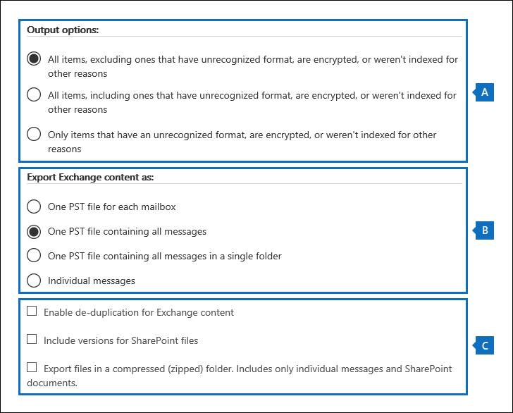

# <a name="manage-gdpr-data-subject-requests-with-the-dsr-case-tool-in-the-security--compliance-center"></a><span data-ttu-id="c57e9-103">Gérer les Demandes des personnes associées aux données RGPD à l’aide de l’outil de dossier de DPC dans le Centre de sécurité et conformité.</span><span class="sxs-lookup"><span data-stu-id="c57e9-103">Manage GDPR data subject requests with the DSR case tool in the Security & Compliance Center</span></span>

<span data-ttu-id="c57e9-104">Le règlement général de protection des données (RGPD) de l’UE vise à protéger et à faire respecter les droits liés à la protection des données personnelles des utilisateurs dans l’Union Européenne (UE).</span><span class="sxs-lookup"><span data-stu-id="c57e9-104">The EU General Data Protection Regulation (GDPR) is about protecting and enabling individuals' privacy rights inside the European Union (EU).</span></span> <span data-ttu-id="c57e9-105">Le RGPD donne aux utilisateurs de l’Union européenne (également appelés sujets de données) le droit d’accéder, de récupérer, de corriger, d’effacer et de restreindre le traitement de leurs données personnelles.</span><span class="sxs-lookup"><span data-stu-id="c57e9-105">The GDPR gives individuals in the European Union (known as data subjects) the right to access, retrieve, correct, erase, and restrict processing of their personal data.</span></span> <span data-ttu-id="c57e9-106">Sous le RGPD, les données personnelles signifient toutes les informations relatives à une personne identifiée ou identifiable.</span><span class="sxs-lookup"><span data-stu-id="c57e9-106">Under the GDPR, personal data means any information relating to an identified or identifiable natural person.</span></span> <span data-ttu-id="c57e9-107">Une demande officielle d’une personne à son organisation d’effectuer une action sur ses données personnelles est appelée Demande de droits de la personne concernée ou DPC.</span><span class="sxs-lookup"><span data-stu-id="c57e9-107">A formal request by a person to their organization to take an action on their personal data is called a Data Subject Request or DSR.</span></span> <span data-ttu-id="c57e9-108">Pour plus d’informations sur la réponse aux demandes de DPC dans Office 365, voir [Guide de demande de la personne concernée Office 365](https://go.microsoft.com/fwlink/?linkid=871169 ).</span><span class="sxs-lookup"><span data-stu-id="c57e9-108">For detailed information about responding to DSRs for data in Office 365, see [Office 365 Data Subject Request Guide](https://go.microsoft.com/fwlink/?linkid=871169 ).</span></span>
  
<span data-ttu-id="c57e9-109">Pour gérer les enquêtes en réponse à une DPC envoyée par un membre de votre organisation, vous pouvez utiliser l’outil Cas de rapport DPC dans le Centre de sécurité et conformité pour rechercher le contenu stocké dans :</span><span class="sxs-lookup"><span data-stu-id="c57e9-109">To manage investigations in response to a DSR submitted by a person in your organization, you can use the DSR case tool in the Security & Compliance Center to find content stored in:</span></span>
  
- <span data-ttu-id="c57e9-110">Toute boîte aux lettres d’utilisateur dans votre organisation.</span><span class="sxs-lookup"><span data-stu-id="c57e9-110">Any user mailbox in your organization.</span></span> <span data-ttu-id="c57e9-111">Cela inclut les conversations Skype Entreprise et les conversations un-à-un dans Microsoft Teams</span><span class="sxs-lookup"><span data-stu-id="c57e9-111">This includes Skype for Business conversations and one-to-one chats in Microsoft Teams</span></span>
    
- <span data-ttu-id="c57e9-112">Toutes les boîtes aux lettres associées à un groupe Microsoft 365 et toutes les boîtes aux lettres d’équipe dans Microsoft Teams</span><span class="sxs-lookup"><span data-stu-id="c57e9-112">All mailboxes associated with an Microsoft 365 Group and all team mailboxes in Microsoft Teams</span></span>
    
- <span data-ttu-id="c57e9-113">Tous les sites SharePoint Online et les comptes OneDrive Entreprise dans votre organisation</span><span class="sxs-lookup"><span data-stu-id="c57e9-113">All SharePoint Online sites and OneDrive for Business accounts in your organization</span></span>
    
- <span data-ttu-id="c57e9-114">Tous les sites Microsoft Teams et les sites de groupes Microsoft 365 dans votre organisation</span><span class="sxs-lookup"><span data-stu-id="c57e9-114">All Teams sites and Microsoft 365 Group sites in your organization</span></span>
    
- <span data-ttu-id="c57e9-115">Tous les dossiers publics dans Exchange Online</span><span class="sxs-lookup"><span data-stu-id="c57e9-115">All public folders in Exchange Online</span></span>
    
<span data-ttu-id="c57e9-116">L’outil de cas DPC vous permet de :</span><span class="sxs-lookup"><span data-stu-id="c57e9-116">Using the DSR case tool you can:</span></span>
  
- <span data-ttu-id="c57e9-117">Créer un dossier distinct pour chaque examen de DPC.</span><span class="sxs-lookup"><span data-stu-id="c57e9-117">Create a separate case for each DSR investigation.</span></span>
    
- <span data-ttu-id="c57e9-118">Contrôler les personnes autorisées à accéder au cas DPC en ajoutant des personnes en tant que membres du cas ; seuls les membres peuvent accéder au cas et ne peuvent voir que leur cas dans la liste des cas sur la page de **cas DPC** dans le Centre de Conformité & Sécurité.</span><span class="sxs-lookup"><span data-stu-id="c57e9-118">Control who has access to the DSR case by adding people as members of the case; only members can access the case and can only see their cases in the list of cases on the **DSR cases** page in the Security & Compliance Center.</span></span> <span data-ttu-id="c57e9-119">De plus, vous pouvez attribuer des autorisations différentes aux différents membres du même cas.</span><span class="sxs-lookup"><span data-stu-id="c57e9-119">Also, you can assign different permissions to different members of the same case.</span></span> <span data-ttu-id="c57e9-120">Par exemple, vous pouvez autoriser certains membres à afficher uniquement le cas et les résultats d’une recherche de contenu, et permettre à d’autres membres de créer des recherches et d’exporter des résultats de recherche.</span><span class="sxs-lookup"><span data-stu-id="c57e9-120">For example, you can allow some members to only view the case and search results and allow other members to create searches and export search results.</span></span> 
    
- <span data-ttu-id="c57e9-121">Utilisez la recherche intégrée pour rechercher tout le contenu créé ou téléchargé à un sujet de données spécifique.</span><span class="sxs-lookup"><span data-stu-id="c57e9-121">Use the built-in search to search for all content created or uploaded by a specific data subject.</span></span>
    
- <span data-ttu-id="c57e9-122">Facultativement, réviser la requête de recherche intégrée, puis relancer la recherche pour limiter les résultats de recherche.</span><span class="sxs-lookup"><span data-stu-id="c57e9-122">Optionally revise the built-in search query and rerun the search to narrow the search results.</span></span>
    
- <span data-ttu-id="c57e9-123">Ajoutez d’autres recherches de contenu associées au cas DPC.</span><span class="sxs-lookup"><span data-stu-id="c57e9-123">Add other content searches associated with the DSR case.</span></span> <span data-ttu-id="c57e9-124">Cela inclut la création de recherches qui retournent des éléments partiellement indexés et des journaux générés par le système à partir du Service d’itinérance Office.</span><span class="sxs-lookup"><span data-stu-id="c57e9-124">This includes creating searches that return partially indexed items and system-generated logs from the Office Roaming Service.</span></span>
    
- <span data-ttu-id="c57e9-125">Exporter des données en réponse à une demande d’accès ou d’exportation de DPC.</span><span class="sxs-lookup"><span data-stu-id="c57e9-125">Export data in response to a DSR access or export request.</span></span>
    
- <span data-ttu-id="c57e9-p105">Supprimer des dossiers une fois le processus d’examen des DPC terminé. Cette action permet de supprimer toutes les recherches de contenu et d’exporter des tâches associées au cas.</span><span class="sxs-lookup"><span data-stu-id="c57e9-p105">Delete cases when the DSR investigation process is complete. This removes all searches and export jobs associated with the case.</span></span>
    
<span data-ttu-id="c57e9-128">Voici le processus haut-niveau d’utilisation de l’outil Cas DPC pour gérer les enquêtes DPC :</span><span class="sxs-lookup"><span data-stu-id="c57e9-128">Here's the high-level process for using the DSR case tool to manage DSR investigations:</span></span>
  
[<span data-ttu-id="c57e9-129">Étape 1 : attribuer des autorisations de découverte électronique aux membres de cas potentiels</span><span class="sxs-lookup"><span data-stu-id="c57e9-129">Step 1: Assign eDiscovery permissions to potential case members</span></span>](#step-1-assign-ediscovery-permissions-to-potential-case-members)

[<span data-ttu-id="c57e9-130">Étape 2 : créer un cas DPC et ajouter des membres</span><span class="sxs-lookup"><span data-stu-id="c57e9-130">Step 2: Create a DSR case and add members</span></span>](#step-2-create-a-dsr-case-and-add-members)

[<span data-ttu-id="c57e9-131">Étape 3 : exécuter la demande de recherche</span><span class="sxs-lookup"><span data-stu-id="c57e9-131">Step 3: Run the search query</span></span>](#step-3-run-the-search-query)

[<span data-ttu-id="c57e9-132">Étape 4 : exporter les données</span><span class="sxs-lookup"><span data-stu-id="c57e9-132">Step 4: Export the data</span></span>](#step-4-export-the-data)

[<span data-ttu-id="c57e9-133">(Facultatif) Étape 5 : réviser la requête de recherche intégrée</span><span class="sxs-lookup"><span data-stu-id="c57e9-133">(Optional) Step 5: Revise the built-in search query</span></span>](#optional-step-5-revise-the-built-in-search-query)

[<span data-ttu-id="c57e9-134">Informations supplémentaires sur l’utilisation de l’outil Cas DPC</span><span class="sxs-lookup"><span data-stu-id="c57e9-134">More information about using the DSR case tool</span></span>](#more-information-about-using-the-dsr-case-tool)
  
> [!IMPORTANT]
> <span data-ttu-id="c57e9-135">Nos outils peuvent aider les administrateurs à effectuer des demandes d’accès DPC ou d’exporter les demandes en les autorisant à utiliser les fonctionnalités intégrées de recherche et d’exportation présentes dans l’outil Cas DPC.</span><span class="sxs-lookup"><span data-stu-id="c57e9-135">Our tools can help admins perform DSR access or export requests by enabling them to utilize the built-in search and export functionality found in the DSR case tool.</span></span> <span data-ttu-id="c57e9-136">L’outil facilite la méthode d’exportation des données pertinentes pour une demande de rapport DPC soumise par un sujet de données.</span><span class="sxs-lookup"><span data-stu-id="c57e9-136">The tool helps to facilitate a best-effort method to export data that's relevant to a DSR request submitted by a data subject.</span></span> <span data-ttu-id="c57e9-137">Toutefois, il est important de noter que les résultats de la recherche peuvent varier en fonction du sujet des données ou des actions de l’administrateur qui peuvent avoir une incidence sur le fait qu’un élément soit ou non considéré comme étant des « données personnelles » à des fins d’exportation.</span><span class="sxs-lookup"><span data-stu-id="c57e9-137">However, it's important to note that search results can vary based on the data subject or the admin actions taken that may impact whether or not an item would be deemed as "personal data" for export purposes.</span></span> <span data-ttu-id="c57e9-138">Par exemple, si le sujet des données était la dernière personne à modifier un fichier qu’elle n’a pas créé, il se peut que le fichier ne soit pas renvoyé dans les résultats de recherche.</span><span class="sxs-lookup"><span data-stu-id="c57e9-138">For example, if the data subject was the last person to modify a file they didn't create, the file might not be returned in the search results.</span></span> <span data-ttu-id="c57e9-139">De même, un administrateur peut exporter des données sans inclure les éléments partiellement indexés ou toutes les versions des documents SharePoint.</span><span class="sxs-lookup"><span data-stu-id="c57e9-139">Similarly, an admin could export data without including partially indexed items or all versions of SharePoint documents.</span></span> <span data-ttu-id="c57e9-140">Par conséquent, les outils fournis peuvent faciliter l’accès et l’exportation des demandes de données. Toutefois, les résultats sont soumis à des scénarios d’utilisation spécifiques d’administrateurs et de sujets de données.</span><span class="sxs-lookup"><span data-stu-id="c57e9-140">Therefore, the tools provided can help facilitate accessing and exporting data requests; however, the results are subject to specific admin and data subject usage scenarios.</span></span> 
  
## <a name="step-1-assign-ediscovery-permissions-to-potential-case-members"></a><span data-ttu-id="c57e9-141">Étape 1 : attribuer des autorisations de découverte électronique aux membres potentiels de cas</span><span class="sxs-lookup"><span data-stu-id="c57e9-141">Step 1: Assign eDiscovery permissions to potential case members</span></span>

<span data-ttu-id="c57e9-142">Par défaut, un administrateur général peut accéder à l’outil Cas DPC dans le Centre de sécurité et de conformité.</span><span class="sxs-lookup"><span data-stu-id="c57e9-142">By default, a global administrator can access the DSR case tool in the Security & Compliance Center.</span></span> <span data-ttu-id="c57e9-143">Par design, les autres utilisateurs tels qu’un agent de la confidentialité des données, un responsable des ressources humaines ou d’autres personnes impliquées dans des enquêtes DPC n’ont pas accès à l’outil cas DPC et doivent se voir attribuer les autorisations appropriées pour accéder à l’outil.</span><span class="sxs-lookup"><span data-stu-id="c57e9-143">By design, other users such as a data privacy officer, a human resources manager, or other people involved in DSR investigations don't have access to the DSR case tool and will have to be assigned the appropriate permissions to access the tool.</span></span> <span data-ttu-id="c57e9-144">Pour ce faire, le plus simple consiste à se rendre sur la page **Autorisations** du Centre de sécurité et conformité et à ajouter des utilisateurs au groupe de rôles Gestionnaire découverte électronique.</span><span class="sxs-lookup"><span data-stu-id="c57e9-144">The easiest way to do this is to go to the **Permissions** page in the Security & Compliance Center and add users to the eDiscovery Manager role group.</span></span> <span data-ttu-id="c57e9-145">Vous devez également attribuer ces autorisations pour pouvoir les ajouter en tant que membres du cas DPC que vous avez créé à l’Étape 2.</span><span class="sxs-lookup"><span data-stu-id="c57e9-145">You also have to assign these permissions so you can add them as members of the DSR case that you create in Step 2.</span></span> 
  
<span data-ttu-id="c57e9-146">Pour obtenir des instructions détaillées, voir [Attribuer des autorisations de Découverte électronique dans le Centre de sécurité et conformité Office 365](/microsoft-365/compliance/assign-ediscovery-permissions).</span><span class="sxs-lookup"><span data-stu-id="c57e9-146">For step-by-step instructions, see [Assign eDiscovery permissions in the Office‍ 365 Security & Compliance Center](/microsoft-365/compliance/assign-ediscovery-permissions).</span></span>
  
> [!NOTE]
> <span data-ttu-id="c57e9-147">Par défaut, un administrateur général (ou d’autres membres du groupe de rôles Gestion de l’organisation dans le Centre de sécurité et conformité) n’ont pas les autorisations nécessaires pour exporter des résultats de recherche de contenu (voir l’Étape 4 de cet article).</span><span class="sxs-lookup"><span data-stu-id="c57e9-147">By default, a global administrator (or other members of the Organization Management role group in the Security & Compliance Center don't have the necessary permissions to export Content Search results (see Step 4 in this article).</span></span> <span data-ttu-id="c57e9-148">Pour résoudre ce problème, un administrateur peut s’ajouter lui-même en tant que membre du groupe de rôles Gestionnaire de Découverte électronique.</span><span class="sxs-lookup"><span data-stu-id="c57e9-148">To address this, an admin can add themselves as a member of the eDiscovery Manager role group.</span></span> 
  
## <a name="step-2-create-a-dsr-case-and-add-members"></a><span data-ttu-id="c57e9-149">Étape 2 : créer un cas DPC et ajouter des membres</span><span class="sxs-lookup"><span data-stu-id="c57e9-149">Step 2: Create a DSR case and add members</span></span>

<span data-ttu-id="c57e9-150">L'étape suivante consiste à créer un cas DPC.</span><span class="sxs-lookup"><span data-stu-id="c57e9-150">The next step is to create a DSR case.</span></span> <span data-ttu-id="c57e9-151">Lorsque vous créez un cas, vous pouvez choisir de lancer la recherche intégrée ou créer un cas sans lancer la recherche.</span><span class="sxs-lookup"><span data-stu-id="c57e9-151">When you create a case, you can choose to start the built-in search or you can create the case without starting the search.</span></span> <span data-ttu-id="c57e9-152">La procédure suivante vous demande de créer le cas sans lancer la recherche, puis vous montre comment ajouter des membres au cas.</span><span class="sxs-lookup"><span data-stu-id="c57e9-152">The following procedure instructs you to create the case without starting the search and then show you how to add members to the case.</span></span>
  
1. <span data-ttu-id="c57e9-153">Allez sur [https://protection.office.com](https://protection.office.com) et connectez-vous à l’aide de votre compte professionnel ou scolaire.</span><span class="sxs-lookup"><span data-stu-id="c57e9-153">Go to [https://protection.office.com](https://protection.office.com) and sign in using your work or school account.</span></span> 
    
2. <span data-ttu-id="c57e9-154">Dans le Centre de sécurité et conformité, cliquez sur **Confidentialité des données** \> **Demandes de sujet de données**, puis sur  **Nouveau cas DPC** .</span><span class="sxs-lookup"><span data-stu-id="c57e9-154">In the Security & Compliance Center, click **Data privacy** \> **Data subject requests**, and then click  **New DSR case**.</span></span>
    
3. <span data-ttu-id="c57e9-155">Dans la page volante **Nouveau cas DPC**, donnez un nom au cas, tapez une description facultative, puis cliquez **Suivant**.</span><span class="sxs-lookup"><span data-stu-id="c57e9-155">On the **New DSR case** flyout page, give the case a name, type an optional description, and then click **Next**.</span></span> <span data-ttu-id="c57e9-156">Le nom du cas doit être unique dans toute votre organisation.</span><span class="sxs-lookup"><span data-stu-id="c57e9-156">The name of the case must be unique in your organization.</span></span>
    
    > [!TIP]
    > <span data-ttu-id="c57e9-157">Songez à ajouter le nom de la personne qui a envoyé la demande DPC que vous êtes en train d’examiner dans le nom et/ou la description du nouveau cas.</span><span class="sxs-lookup"><span data-stu-id="c57e9-157">Consider adding the name of the person who submitted the DSR request that you're investigating in the name and/or description of the new case.</span></span> <span data-ttu-id="c57e9-158">Notez que seuls les membres de ce cas (et les administrateurs eDiscovery) pourront voir le cas dans la liste des cas sur la page **Demandes d’objet de données** .</span><span class="sxs-lookup"><span data-stu-id="c57e9-158">Note that only members of this case (and eDiscovery Administrators) will be able to see the case in the list of cases on the **Data subject requests** page.</span></span> 
  
4. <span data-ttu-id="c57e9-159">Sur la page **Détails de la demande**, sous **Sujet de données (la personne ayant classé cette demande)**, sélectionnez la personne pour qui vous voulez rechercher et exporter des données, puis cliquez sur **Suivant**.</span><span class="sxs-lookup"><span data-stu-id="c57e9-159">On the **Request details** page, under **Data subject (the person who filed this request)**, select the person that you want to find and export data for and then click **Next**.</span></span>
    
5. <span data-ttu-id="c57e9-160">Dans la page **Confirmer vos paramètres de cas** , vous pouvez modifier le nom et la description du cas, puis sélectionner un autre sujet de données.</span><span class="sxs-lookup"><span data-stu-id="c57e9-160">On the **Confirm your case settings** page, you can change the case name and description, and select a different data subject.</span></span> <span data-ttu-id="c57e9-161">Sinon, cliquez sur **Enregistrer**.</span><span class="sxs-lookup"><span data-stu-id="c57e9-161">Otherwise, click **Save**.</span></span>
    
    <span data-ttu-id="c57e9-162">Une page s’affiche pour confirmer que le nouveau cas DPC a été créé.</span><span class="sxs-lookup"><span data-stu-id="c57e9-162">A page is displayed that confirms the new DSR case has been created.</span></span>
    
    
  
    <span data-ttu-id="c57e9-164">À ce stade, vous avez le choix entre les options suivantes :</span><span class="sxs-lookup"><span data-stu-id="c57e9-164">At this point, you can do one of two things:</span></span>
    
    <span data-ttu-id="c57e9-165">a.</span><span class="sxs-lookup"><span data-stu-id="c57e9-165">a.</span></span> <span data-ttu-id="c57e9-166">Cliquer sur **Afficher les résultats de la recherche** démarre la recherche.</span><span class="sxs-lookup"><span data-stu-id="c57e9-166">Clicking **Show me search results** starts the search.</span></span> <span data-ttu-id="c57e9-167">Il s'agit de la sélection par défaut.</span><span class="sxs-lookup"><span data-stu-id="c57e9-167">This is the default selection.</span></span> <span data-ttu-id="c57e9-168">La recherche intégrée exécutée lorsque vous sélectionnez cette option et les résultats retournés sont abordés à l’Étape 3.</span><span class="sxs-lookup"><span data-stu-id="c57e9-168">The built-in search that's run when you select this option and the results that are returned are discussed in Step 3.</span></span>
    
    <span data-ttu-id="c57e9-169">b.</span><span class="sxs-lookup"><span data-stu-id="c57e9-169">b.</span></span> <span data-ttu-id="c57e9-170">Cliquer sur **Terminer** ferme le nouveau cas DPC sans démarrer la recherche intégrée.</span><span class="sxs-lookup"><span data-stu-id="c57e9-170">Clicking **Finish** closes the new DSR case without starting the built-in search.</span></span> <span data-ttu-id="c57e9-171">Lorsque vous sélectionnez cette option, le nouveau cas DPC s’affiche sur la page **Demandes des personnes concernées**.</span><span class="sxs-lookup"><span data-stu-id="c57e9-171">When you select this option, the new DSR case is displayed on the **Data subject requests** page.</span></span>
    
6. <span data-ttu-id="c57e9-172">Cliquez sur **Terminer** afin de pouvoir accéder au nouveau cas DPC et y ajouter des membres.</span><span class="sxs-lookup"><span data-stu-id="c57e9-172">Click **Finish** so that you can go in to the new DSR case and add members to it.</span></span> 
    
7. <span data-ttu-id="c57e9-173">Dans la page **Demandes de personnes concernées** , cliquez sur le nom du cas DPC que vous avez créé.</span><span class="sxs-lookup"><span data-stu-id="c57e9-173">On the **Data subject requests** page, click the name of the DSR case that you created.</span></span> 
    
8. <span data-ttu-id="c57e9-174">Dans la page de menu volant **Gérer ce cas** , sous **Gérer les membres**, cliquez sur **Ajouter**.</span><span class="sxs-lookup"><span data-stu-id="c57e9-174">On the **Manage this case** flyout page, under **Manage members**, click **Add**.</span></span> 
    
    <span data-ttu-id="c57e9-175">Sous **Utilisateurs**, une liste des personnes qui se voient attribuer les autorisations eDiscovery appropriées s’affiche.</span><span class="sxs-lookup"><span data-stu-id="c57e9-175">Under **Users**, a list of people that are assigned the appropriate eDiscovery permissions is displayed.</span></span> <span data-ttu-id="c57e9-176">Les personnes auxquelles vous avez attribué des autorisations eDiscovery à l’Étape 1 s’affichent dans cette liste.</span><span class="sxs-lookup"><span data-stu-id="c57e9-176">The people you assigned eDiscovery permissions to in Step 1 will be displayed in this list.</span></span> 
    
9. <span data-ttu-id="c57e9-177">Sélectionnez les personnes à ajouter en tant que membres du cas DPC, cliquez sur **Ajouter**, puis enregistrez vos modifications.</span><span class="sxs-lookup"><span data-stu-id="c57e9-177">Select the people to add as members of the DSR case, click **Add**, and then save your changes.</span></span>
    
    <span data-ttu-id="c57e9-178">Vous pouvez également choisir d’ajouter un groupe de rôles au cas DPC en cliquant sur **Ajouter** sous **Gérer les groupes de rôles**.</span><span class="sxs-lookup"><span data-stu-id="c57e9-178">You can also add role groups as members of DSR case by clicking **Add** under **Manage role groups**.</span></span> 
    
## <a name="step-3-run-the-search-query"></a><span data-ttu-id="c57e9-179">Étape 3 : exécuter la demande de recherche</span><span class="sxs-lookup"><span data-stu-id="c57e9-179">Step 3: Run the search query</span></span>

<span data-ttu-id="c57e9-180">Après avoir créé un cas DPC et ajouté des membres, l’étape suivante consiste à exécuter la recherche intégrée associée au cas.</span><span class="sxs-lookup"><span data-stu-id="c57e9-180">After you create a DSR case and add members, the next step is to run the built-in search that's associated with the case.</span></span> <span data-ttu-id="c57e9-181">Cette requête de recherche par défaut effectue les opérations suivantes :</span><span class="sxs-lookup"><span data-stu-id="c57e9-181">This default search query does the following things:</span></span>
  
- <span data-ttu-id="c57e9-182">Recherche dans toutes les boîtes aux lettres de votre organisation tous les éléments de courrier qui ont été envoyés ou reçus par la personne concernée.</span><span class="sxs-lookup"><span data-stu-id="c57e9-182">Searches all mailboxes in your organization for all email items that were sent or received by the data subject.</span></span> <span data-ttu-id="c57e9-183">Pour ce faire, utilisez la propriété d’e-mail *Participants*, qui recherche la personne concernée dans tous les champs des personnes dans un message électronique.</span><span class="sxs-lookup"><span data-stu-id="c57e9-183">This is accomplished by using the  *Participants*  email property, which searches for the data subject in all the people fields in an email message.</span></span> <span data-ttu-id="c57e9-184">Cette propriété retourne les éléments dans lesquels la personne concernée se trouve dans les champs **De**, **À**, **CC** et **Cci** .</span><span class="sxs-lookup"><span data-stu-id="c57e9-184">This property returns items in which the data subject is in the **From**, **To**, **CC**, and **BCC** fields.</span></span> <span data-ttu-id="c57e9-185">Les dossiers publics dans Exchange Online sont également recherchés pour les messages envoyés ou reçus par la personne concernée.</span><span class="sxs-lookup"><span data-stu-id="c57e9-185">Public folders in Exchange Online are also searched for messages sent or received by the data subject.</span></span> 
    
- <span data-ttu-id="c57e9-186">Recherche dans tous les sites de votre organisation les documents et les éléments créés ou chargés par la personne concernée.</span><span class="sxs-lookup"><span data-stu-id="c57e9-186">Searches all sites in your organization for documents and items created or uploaded by the data subject.</span></span> <span data-ttu-id="c57e9-187">Pour ce faire, utilisez les propriétés de site suivantes :</span><span class="sxs-lookup"><span data-stu-id="c57e9-187">This is accomplished by using the following site properties:</span></span>
    
  - <span data-ttu-id="c57e9-188">La propriété  *Auteur*  retourne les éléments où la personne concernée est répertoriée dans le champ Auteur dans les documents Office.</span><span class="sxs-lookup"><span data-stu-id="c57e9-188">The  *Author*  property returns items where the data subject is listed in the author field in Office documents.</span></span> <span data-ttu-id="c57e9-189">Cette valeur persiste, même si le document est copié et chargé par une autre personne.</span><span class="sxs-lookup"><span data-stu-id="c57e9-189">This value persists, even if the document is copied and uploaded by someone else.</span></span> 
    
  - <span data-ttu-id="c57e9-190">La propriété  *CrééPar* retourne les éléments qui ont été créés ou chargés par la personne concernée.</span><span class="sxs-lookup"><span data-stu-id="c57e9-190">The  *CreatedBy*  property returns items that were created or uploaded by the data subject.</span></span> 
    
<span data-ttu-id="c57e9-191">Voici à quoi ressemble la requête de mot clé pour la recherche intégrée qui est créée automatiquement lorsque vous créez un cas DPC.</span><span class="sxs-lookup"><span data-stu-id="c57e9-191">Here's what the keyword query looks like for the built-in search that gets automatically created when you create a DSR case.</span></span>
  
```powershell
participants:"<email address>" OR author:"<display name>" OR createdby:"<display name>"
```

<span data-ttu-id="c57e9-192">Par exemple, si le nom de la personne concernée est Ina Leonte, la requête de mot clé se présente comme suit :</span><span class="sxs-lookup"><span data-stu-id="c57e9-192">For example, if the name of the data subject is Ina Leonte, the keyword query would look like this:</span></span>
  
```powershell
participants:"ina@contoso.com" OR author:"Ina Leonte" OR createdby:"Ina Leonte"
```

 <span data-ttu-id="c57e9-193">**Pour exécuter la recherche intégrée d’un cas DPC :**</span><span class="sxs-lookup"><span data-stu-id="c57e9-193">**To run the built-in search for a DSR case:**</span></span>
  
1. <span data-ttu-id="c57e9-194">Dans le Centre de sécurité et conformité, cliquez sur **Confidentialité des données** \> **Demandes de sujet de données**, puis sur **Ouvrir** en regard du cas DPC créé à l’Étape 2.</span><span class="sxs-lookup"><span data-stu-id="c57e9-194">In the Security & Compliance Center, click **Data privacy** \> **Data subject requests**, and then click **Open** next to the DSR case that you created in Step 2.</span></span> 
    
    <span data-ttu-id="c57e9-195">Cliquez sur l’onglet **Rechercher** en haut de la page, puis cochez la case en regard de la recherche intégrée qui a été créée lorsque vous avez créé le cas DPC.</span><span class="sxs-lookup"><span data-stu-id="c57e9-195">Click the **Search** tab at the top of the page, and then click the checkbox next to the built-in search that was created when you created the DSR case.</span></span> <span data-ttu-id="c57e9-196">La recherche porte le même nom que le cas DPC.</span><span class="sxs-lookup"><span data-stu-id="c57e9-196">The search has the same name as the DSR case.</span></span> 
    
2. <span data-ttu-id="c57e9-197">Sur la page volante, cliquez sur **Ouvrir la requête**.</span><span class="sxs-lookup"><span data-stu-id="c57e9-197">In the search flyout page, click **Open query**.</span></span>
    
    <span data-ttu-id="c57e9-198">Lorsque vous ouvrez la requête, la recherche est démarrée et se termine en quelques instants.</span><span class="sxs-lookup"><span data-stu-id="c57e9-198">When you open the query, the search is started and will complete in a few moments.</span></span> 
    
3. <span data-ttu-id="c57e9-199">Une fois la recherche terminée, cliquez sur **Aperçu des résultats** pour afficher un aperçu des résultats de la recherche.</span><span class="sxs-lookup"><span data-stu-id="c57e9-199">When the search is complete, click **Preview results** to preview the search results.</span></span> <span data-ttu-id="c57e9-200">Pour plus d’informations, voir [Afficher les résultats de recherche](/microsoft-365/compliance/content-search#preview-search-results).</span><span class="sxs-lookup"><span data-stu-id="c57e9-200">For more information, see [Preview search results](/microsoft-365/compliance/content-search#preview-search-results).</span></span>
    
    > [!TIP]
    > <span data-ttu-id="c57e9-201">Vous pouvez également afficher les statistiques de requête de recherche pour voir le nombre d’éléments de boîte aux lettres et de site retournés par la recherche, ainsi que les emplacements de contenu supérieurs qui contiennent des éléments qui correspondent à la requête de recherche.</span><span class="sxs-lookup"><span data-stu-id="c57e9-201">You can also view the search query statistics to see the number of mailbox and site items that are returned by the search, and the top content locations that contain items that match the search query.</span></span> <span data-ttu-id="c57e9-202">Pour plus d’informations, voir [Afficher les informations et les statistiques d’une recherche](/microsoft-365/compliance/content-search#view-information-and-statistics-about-a-search).</span><span class="sxs-lookup"><span data-stu-id="c57e9-202">For more information, see [View information and statistics about a search](/microsoft-365/compliance/content-search#view-information-and-statistics-about-a-search).</span></span> 
  
<span data-ttu-id="c57e9-203">Vous pouvez modifier la requête de recherche intégrée, modifier les emplacements de contenu recherchés, puis réexécuter la recherche.</span><span class="sxs-lookup"><span data-stu-id="c57e9-203">You can edit the built-in search query, change the content locations that are searched, and then rerun the search.</span></span> <span data-ttu-id="c57e9-204">Pour plus d’informations, consultez l’[Étape 5](#optional-step-5-revise-the-built-in-search-query).</span><span class="sxs-lookup"><span data-stu-id="c57e9-204">See [Step 5](#optional-step-5-revise-the-built-in-search-query) for more information.</span></span> 
  
## <a name="step-4-export-the-data"></a><span data-ttu-id="c57e9-205">Étape 4 : exporter les données</span><span class="sxs-lookup"><span data-stu-id="c57e9-205">Step 4: Export the data</span></span>

<span data-ttu-id="c57e9-206">Après avoir effectué une recherche intégrée, vous pouvez exporter les résultats de la recherche.</span><span class="sxs-lookup"><span data-stu-id="c57e9-206">After you run the built-in search, you can export the search results.</span></span> <span data-ttu-id="c57e9-207">Avant d’exporter les données, vous pouvez également modifier la requête pour réduire le nombre de résultats de recherche.</span><span class="sxs-lookup"><span data-stu-id="c57e9-207">Alternatively, before you export the data, you may want to revise the query to reduce the number of search results.</span></span> <span data-ttu-id="c57e9-208">Voir l’Étape 5 pour plus d’informations sur le filtrage des résultats.</span><span class="sxs-lookup"><span data-stu-id="c57e9-208">See Step 5 for more information about narrowing the search results.</span></span>
  
<span data-ttu-id="c57e9-209">Lorsque vous exportez des résultats de recherche, les éléments de boîte aux lettres peuvent être téléchargés dans des fichiers PST ou en tant que messages individuels.</span><span class="sxs-lookup"><span data-stu-id="c57e9-209">When you export search results, mailbox items can be downloaded in PST files or as individual messages.</span></span> <span data-ttu-id="c57e9-210">Lorsque vous exportez le contenu à partir de sites SharePoint et OneDrive, les copies des documents Office originaux et des autres documents sont exportées.</span><span class="sxs-lookup"><span data-stu-id="c57e9-210">When you export content from SharePoint and OneDrive accounts, copies of native Office documents and other documents are exported.</span></span> <span data-ttu-id="c57e9-211">Un fichier de résultats qui contient des informations sur chaque élément exporté est inclus dans les résultats de la recherche.</span><span class="sxs-lookup"><span data-stu-id="c57e9-211">A results file that contains information about every exported item is included with the search results.</span></span> <span data-ttu-id="c57e9-212">Pour plus d’informations sur l’exportation, consultez [Exporter les résultats de la recherche de contenu](/microsoft-365/compliance/export-search-results).</span><span class="sxs-lookup"><span data-stu-id="c57e9-212">For more detailed information about exporting, see [Export Content Search results](/microsoft-365/compliance/export-search-results).</span></span>
  
> [!NOTE]
> <span data-ttu-id="c57e9-213">Par défaut, un administrateur général (ou d’autres membres du groupe de rôles Gestion de l’organisation dans le Centre de sécurité et conformité) n’ont pas les autorisations nécessaires pour exporter des résultats de recherche de contenu.</span><span class="sxs-lookup"><span data-stu-id="c57e9-213">By default, a global administrator (or other members of the Organization Management role group in the Security & Compliance Center) don't have the necessary permissions to export Content Search results.</span></span> <span data-ttu-id="c57e9-214">Pour résoudre ce problème, un administrateur peut s’ajouter lui-même en tant que membre du groupe de rôles Gestionnaire de Découverte électronique.</span><span class="sxs-lookup"><span data-stu-id="c57e9-214">To address this, an admin can add themselves as a member of the eDiscovery Manager role group.</span></span> 
  
<span data-ttu-id="c57e9-215">L’ordinateur que vous utilisez pour exporter les résultats de recherche doit répondre aux exigences système suivantes :</span><span class="sxs-lookup"><span data-stu-id="c57e9-215">The computer you use to export data has to meet the following system requirements:</span></span>
  
- <span data-ttu-id="c57e9-216">versions 32 ou 64 bits de Windows 7 et versions ultérieures</span><span class="sxs-lookup"><span data-stu-id="c57e9-216">32-bit or 64-bit versions of Windows 7 and later versions</span></span>
    
- <span data-ttu-id="c57e9-217">Microsoft .NET Framework 4.7.</span><span class="sxs-lookup"><span data-stu-id="c57e9-217">Microsoft .NET Framework 4.7</span></span>
    
- <span data-ttu-id="c57e9-218">Navigateur pris en charge :</span><span class="sxs-lookup"><span data-stu-id="c57e9-218">A supported browser:</span></span>
    
  - <span data-ttu-id="c57e9-219">Microsoft Edge</span><span class="sxs-lookup"><span data-stu-id="c57e9-219">Microsoft Edge</span></span>
    
    <span data-ttu-id="c57e9-220">Ou</span><span class="sxs-lookup"><span data-stu-id="c57e9-220">Or</span></span>
    
  - <span data-ttu-id="c57e9-221">Microsoft Internet Explorer 10 et versions ultérieures</span><span class="sxs-lookup"><span data-stu-id="c57e9-221">Microsoft Internet Explorer 10 and later versions</span></span>
    
    > [!NOTE]
    > <span data-ttu-id="c57e9-222">Microsoft ne fabrique pas d’extensions ou de modules complémentaires tiers pour les applications ClickOnce.</span><span class="sxs-lookup"><span data-stu-id="c57e9-222">Microsoft doesn't manufacture third-party extensions or add-ons for ClickOnce applications.</span></span> <span data-ttu-id="c57e9-223">L’exportation de données à l’aide d’un navigateur non pris en charge avec des extensions ou extensions tierces n’est pas prise en charge.</span><span class="sxs-lookup"><span data-stu-id="c57e9-223">Exporting data using an unsupported browser with third-party extensions or add-ons isn't supported.</span></span> 
  
 <span data-ttu-id="c57e9-224">**Pour exporter des données à partir de la recherche intégrée dans un cas de DPC :**</span><span class="sxs-lookup"><span data-stu-id="c57e9-224">**To export data from the built-in search in a DSR case:**</span></span>
  
1. <span data-ttu-id="c57e9-225">Dans le Centre de sécurité et conformité, cliquez sur **Confidentialité des données** \> **Demandes de sujet de données**, puis sur **Ouvrir** en regard du cas DPC dont vous voulez exporter les données.</span><span class="sxs-lookup"><span data-stu-id="c57e9-225">In the Security & Compliance Center, click **Data privacy** \> **Data subject requests**, and then click **Open** next to the DSR case that you want to export data from.</span></span> 
    
2. <span data-ttu-id="c57e9-226">Cliquez sur l’onglet **Rechercher** en haut de la page, puis cochez la case en regard de la recherche intégrée qui a été créée lorsque vous avez créé le cas DPC.</span><span class="sxs-lookup"><span data-stu-id="c57e9-226">Click the **Search** tab at the top of the page, and then click the checkbox next to the built-in search that was created when you created the DSR case.</span></span> <span data-ttu-id="c57e9-227">Vous pouvez également cliquer sur une autre recherche pour exporter des données à partir de cette recherche.</span><span class="sxs-lookup"><span data-stu-id="c57e9-227">Or click another search to export data from that search.</span></span> 
    
3. <span data-ttu-id="c57e9-228">Dans la page de menu volant, cliquez sur l’icône, **Plus**, puis cliquez sur **Exporter les résultats** dans le menu déroulant.</span><span class="sxs-lookup"><span data-stu-id="c57e9-228">On the search flyout page, click  **More**, and then select **Export results** from the drop-down list.</span></span> 
    
4. <span data-ttu-id="c57e9-229">Dans la page **Exporter les résultats** , sélectionnez les options recommandées suivantes pour les demandes d’exportation DPC.</span><span class="sxs-lookup"><span data-stu-id="c57e9-229">On the **Export results** page, select the following recommended options for DSR export requests.</span></span> 
    
    
  
    <span data-ttu-id="c57e9-231">a.</span><span class="sxs-lookup"><span data-stu-id="c57e9-231">a.</span></span> <span data-ttu-id="c57e9-232">Sous **Options de sortie**, sélectionnez la première option (**Tous les éléments, à l’exclusion de ceux dont le format n’est pas reconnu, sont chiffrés ou n’ont pas été indexés pour d’autres raisons**) pour exporter uniquement les éléments indexés.</span><span class="sxs-lookup"><span data-stu-id="c57e9-232">Under **Output options**, select the first option (**All items, excluding ones that have ones that have an unrecognized format, are encrypted, or weren't indexed for other reasons**) to export indexed items only.</span></span> <span data-ttu-id="c57e9-233">Si vous ne souhaitez pas exporter des éléments partiellement indexés à partir de la recherche intégrée, c’est parce que des éléments partiellement indexés provenant d’autres utilisateurs seront également exportés.</span><span class="sxs-lookup"><span data-stu-id="c57e9-233">The reason you don't want to export partially indexed items from the built-in search is because partially indexed items from other users will also be exported.</span></span> <span data-ttu-id="c57e9-234">Pour exporter uniquement les éléments partiellement indexés pour la personne concernée, nous vous recommandons de créer une recherche distincte.</span><span class="sxs-lookup"><span data-stu-id="c57e9-234">To export only the partially indexed items for the data subject, we recommend that you create a separate search.</span></span> <span data-ttu-id="c57e9-235">Pour plus d’informations, consultez [Exportation d’éléments partiellement indexés](#exporting-partially-indexed-items) dans la section « Plus d’informations sur l’utilisation de l’outil de cas DPC ».</span><span class="sxs-lookup"><span data-stu-id="c57e9-235">For more information, see [Exporting partially indexed items](#exporting-partially-indexed-items) in the "More information about using the DSR case tool" section.</span></span>
    
    <span data-ttu-id="c57e9-236">b.</span><span class="sxs-lookup"><span data-stu-id="c57e9-236">b.</span></span> <span data-ttu-id="c57e9-237">Sous **Exporter le contenu Exchange en tant que**, sélectionnez la troisième option, **un fichier PST contenant tous les messages d’un dossier unique**.</span><span class="sxs-lookup"><span data-stu-id="c57e9-237">Under **Export Exchange content as**, select the third option, **One PST file containing all messages in a single folder**.</span></span> <span data-ttu-id="c57e9-238">Étant donné que certains des résultats peuvent être pour les éléments provenant de la boîte aux lettres d’un autre utilisateur, cette option répertorie simplement l’élément dans un dossier unique sans indiquer la boîte aux lettres réelle et constitue la meilleure option à utiliser lorsque vous dé-dupliquez les résultats comme recommandé dans l’élément suivant.</span><span class="sxs-lookup"><span data-stu-id="c57e9-238">Because some of the results may be for items that originated in another user's mailbox, this option just lists the item in a single folder without indicating the actual mailbox and is the best option to use when you de-duplicate the results as recommended in the next item.</span></span> <span data-ttu-id="c57e9-239">Cette option permet également à la personne concernée de passer en revue les éléments dans l’ordre chronologique (les éléments sont triés par date d’envoi) sans avoir à parcourir la structure de dossiers de boîte aux lettres d’origine pour chaque élément.</span><span class="sxs-lookup"><span data-stu-id="c57e9-239">This option also lets the data subject review items in chronological order (items are sorted by sent date) without having to navigate the original mailbox folder structure for each item.</span></span>
    
    <span data-ttu-id="c57e9-240">c.</span><span class="sxs-lookup"><span data-stu-id="c57e9-240">c.</span></span> <span data-ttu-id="c57e9-241">Sélectionnez l’option **Activer la déduplication** pour exclure les messages électroniques en double.</span><span class="sxs-lookup"><span data-stu-id="c57e9-241">Select **Enable de-duplication** option to excludes duplicate email messages.</span></span> <span data-ttu-id="c57e9-242">Nous vous recommandons cette option, car la recherche intégrée effectue une recherche dans toutes les boîtes aux lettres de votre organisation.</span><span class="sxs-lookup"><span data-stu-id="c57e9-242">We recommend this option because the built-in search searches all mailboxes in your organization.</span></span> <span data-ttu-id="c57e9-243">Par conséquent, si plusieurs copies du même message sont trouvées dans les boîtes aux lettres qui ont fait l’objet d’une recherche, cette option signifie qu’une seule copie d’un message sera exportée.</span><span class="sxs-lookup"><span data-stu-id="c57e9-243">So if multiple copies of the same message are found in the mailboxes that were searched, this option means that only one copy of a message will be exported.</span></span> <span data-ttu-id="c57e9-244">Cette option, qui permet d’exporter ensemble des messages dans un fichier PST dans un seul dossier, permet d’optimiser l’expérience utilisateur pour les demandes d’exportation DPC.</span><span class="sxs-lookup"><span data-stu-id="c57e9-244">This option, together will exporting messages in one PST file in a single folder, results in the best user experience for DSR export requests.</span></span> <span data-ttu-id="c57e9-245">Le rapport d’exportation Results.csv répertorie tous les emplacements où des messages en double ont été trouvés.</span><span class="sxs-lookup"><span data-stu-id="c57e9-245">The Results.csv export report lists all locations where duplicate messages were found.</span></span>
    
    <span data-ttu-id="c57e9-246">Si vous le souhaitez, vous pouvez sélectionner l’option **Inclure des versions pour les documents SharePoint** permettant d’exporter toutes les versions des documents SharePoint et OneDrive.</span><span class="sxs-lookup"><span data-stu-id="c57e9-246">Optionally, you can select **Include versions for SharePoint documents** option to export all versions of SharePoint and OneDrive documents.</span></span> <span data-ttu-id="c57e9-247">Cela nécessite que le contrôle de version soit activé pour les bibliothèques de documents.</span><span class="sxs-lookup"><span data-stu-id="c57e9-247">This requires that versioning is turned on for document libraries.</span></span> <span data-ttu-id="c57e9-248">Cette option permet de s’assurer que toutes les données pertinentes sont exportées.</span><span class="sxs-lookup"><span data-stu-id="c57e9-248">This option helps to ensure that all relevant data is exported.</span></span>
    
5. <span data-ttu-id="c57e9-249">Après avoir choisi les paramètres d’exportation, cliquez sur **Exporter**.</span><span class="sxs-lookup"><span data-stu-id="c57e9-249">After you choose the export settings, click **Export**.</span></span>
    
    <span data-ttu-id="c57e9-250">Les résultats de recherche sont préparés pour le téléchargement, ce qui signifie qu’ils sont chargés vers l’espace de stockage Azure dans le cloud Microsoft.</span><span class="sxs-lookup"><span data-stu-id="c57e9-250">The search results are prepared for downloading, which means they're uploaded to the Azure Storage area for your organization in the Microsoft cloud.</span></span> <span data-ttu-id="c57e9-251">Les étapes suivantes vous montrent comment télécharger ces données sur votre ordinateur local.</span><span class="sxs-lookup"><span data-stu-id="c57e9-251">The next steps show you how to download this data to your local computer.</span></span>
    
6. <span data-ttu-id="c57e9-252">Cliquez sur l’onglet **Exporter** pour afficher le travail d’exportation que vous avez créé.</span><span class="sxs-lookup"><span data-stu-id="c57e9-252">Click the **Export** tab to display the export job you created.</span></span> <span data-ttu-id="c57e9-253">Les travaux d’exportation portent le même nom que la recherche correspondante avec **_Export** ajouté à la fin du nom de recherche.</span><span class="sxs-lookup"><span data-stu-id="c57e9-253">Export jobs have the same name as the corresponding search with **_Export** appended to the end of search name.</span></span> 
    
7. <span data-ttu-id="c57e9-254">Cliquez sur le travail d’exportation que vous venez de créer pour afficher la page de menu volant d’exportation.</span><span class="sxs-lookup"><span data-stu-id="c57e9-254">Click the export job that you just created to display the export flyout page.</span></span> <span data-ttu-id="c57e9-255">Cette page affiche des informations sur la recherche, telles que la taille et le nombre total d’éléments à exporter, ainsi que le pourcentage d’éléments qui ont été transférés vers une zone de stockage Azure.</span><span class="sxs-lookup"><span data-stu-id="c57e9-255">This page shows information about the search, such as the size and total number of items to be exported, and the percentage of the items that have been transferred to an Azure storage area.</span></span> <span data-ttu-id="c57e9-256">Cliquez sur **Actualiser** pour mettre à jour les informations d’état du chargement.</span><span class="sxs-lookup"><span data-stu-id="c57e9-256">Click **Refresh** to update the upload status information.</span></span> 
    
8. <span data-ttu-id="c57e9-257">Sous **Clé d’exportation**, cliquez sur **Copier dans le Presse-papiers**.</span><span class="sxs-lookup"><span data-stu-id="c57e9-257">Under **Export key**, click **Copy to clipboard**.</span></span> <span data-ttu-id="c57e9-258">Cette clé vous permet de télécharger les résultats de recherche à l’étape 11.</span><span class="sxs-lookup"><span data-stu-id="c57e9-258">You use this key in step 11 to download the search results.</span></span>
    
9. <span data-ttu-id="c57e9-259">Cliquez sur l **Télécharger les résultats** en haut de la page de menu volant d’exportation.</span><span class="sxs-lookup"><span data-stu-id="c57e9-259">Click  **Download results** at the top of the export flyout page.</span></span> 
    
10. <span data-ttu-id="c57e9-260">Dans la fenêtre contextuelle en bas de la page, cliquez sur **Ouvrir** pour ouvrir l’**outil d’exportation eDiscovery**.</span><span class="sxs-lookup"><span data-stu-id="c57e9-260">In the pop-up window at the bottom of the page, click **Open** to open the **eDiscovery Export Tool**.</span></span> <span data-ttu-id="c57e9-261">L’**outil d’exportation eDiscovery** sera installé la première fois que vous téléchargerez les résultats de la recherche.</span><span class="sxs-lookup"><span data-stu-id="c57e9-261">The **eDiscovery Export Tool** will be installed the first time you download search results.</span></span> 
    
11. <span data-ttu-id="c57e9-262">Dans l’**outil d’exportation de découverte électronique**, collez la clé d’exportation que vous avez copiée à l’étape 8 dans la zone appropriée.</span><span class="sxs-lookup"><span data-stu-id="c57e9-262">In the **eDiscovery Export Tool**, paste the export key that you copied in step 8 in the appropriate box.</span></span>
    
12. <span data-ttu-id="c57e9-263">Cliquez sur **Parcourir** pour spécifier l’emplacement de téléchargement du fichier des résultats de recherche.</span><span class="sxs-lookup"><span data-stu-id="c57e9-263">Click **Browse** to specify the location where you want to download the search result files.</span></span> 
    
    > [!NOTE]
    > <span data-ttu-id="c57e9-264">En raison de la quantité élevée d’activité disque (lectures et écritures), vous devez télécharger les résultats de la recherche sur un lecteur de disque local ; ne les téléchargez pas sur un lecteur réseau mappé ou un autre emplacement réseau.</span><span class="sxs-lookup"><span data-stu-id="c57e9-264">Due to the high amount of disk activity (reads and writes), you should download search results to a local disk drive; don't download them to a mapped network drive or other network location.</span></span> 
  
13. <span data-ttu-id="c57e9-265">Cliquez sur **Démarrer** pour télécharger les résultats de recherche sur votre ordinateur.</span><span class="sxs-lookup"><span data-stu-id="c57e9-265">Click **Start** to download the search results to your computer.</span></span> 
    
    <span data-ttu-id="c57e9-266">L’**outil d’exportation de découverte électronique** affiche l’état du processus d’exportation, ainsi qu’une estimation du nombre (et de la taille) d’éléments qui doivent encore être téléchargés.</span><span class="sxs-lookup"><span data-stu-id="c57e9-266">The **eDiscovery Export Tool** displays status information about the export process, including an estimate of the number (and size) of the remaining items to be downloaded.</span></span> <span data-ttu-id="c57e9-267">Lorsque le processus d’exportation est terminé, vous pouvez accéder aux fichiers à l’emplacement où ils ont été téléchargés.</span><span class="sxs-lookup"><span data-stu-id="c57e9-267">When the export process is complete, you can access the files in the location where they were downloaded.</span></span> <span data-ttu-id="c57e9-268">Pour plus d’informations sur les rapports inclus lorsque vous téléchargez les résultats de la recherche de contenu, consultez la section[Plus d’informations](/microsoft-365/compliance/export-search-results#more-information) « Exporter les résultats de la recherche de contenu ».</span><span class="sxs-lookup"><span data-stu-id="c57e9-268">For more information about the reports that included when you download Content Search results, see the [More information](/microsoft-365/compliance/export-search-results#more-information) section in "Export Content Search results".</span></span> 
    
<span data-ttu-id="c57e9-269">Une fois les données exportées, les résultats de la recherche et les rapports d’exportation se trouvent dans un dossier portant le même nom que le cas DPC.</span><span class="sxs-lookup"><span data-stu-id="c57e9-269">After the data is exported, the search results and export reports are located in a folder that has the same name as the DSR case.</span></span> <span data-ttu-id="c57e9-270">Les fichiers PST qui contiennent des éléments de boîte aux lettres se trouvent dans un sous-dossier nommé **Exchange**.</span><span class="sxs-lookup"><span data-stu-id="c57e9-270">The PST files that contain mailbox items are located in a subfolder named **Exchange**.</span></span> <span data-ttu-id="c57e9-271">Les documents et autres éléments des sites se trouvent dans un sous-dossier nommé **SharePoint**.</span><span class="sxs-lookup"><span data-stu-id="c57e9-271">Documents and other items from sites are located in a subfolder named **SharePoint**.</span></span> 
  
## <a name="optional-step-5-revise-the-built-in-search-query"></a><span data-ttu-id="c57e9-272">(Facultatif) Étape 5 : réviser la requête de recherche intégrée</span><span class="sxs-lookup"><span data-stu-id="c57e9-272">(Optional) Step 5: Revise the built-in search query</span></span>

<span data-ttu-id="c57e9-273">Après avoir exécuté la recherche intégrée, vous pouvez la réviser pour limiter l’étendue afin de renvoyer moins de résultats de recherche.</span><span class="sxs-lookup"><span data-stu-id="c57e9-273">After you run the built-in search, you can revise it to narrow the scope to return fewer search results.</span></span> <span data-ttu-id="c57e9-274">Vous pouvez exécutez cette étape en ajoutant des conditions à la requête.</span><span class="sxs-lookup"><span data-stu-id="c57e9-274">You can do this by adding conditions to the query.</span></span> <span data-ttu-id="c57e9-275">Les conditions sont logiquement connectées à la requête de mot clé par l’opérateur **ET**.</span><span class="sxs-lookup"><span data-stu-id="c57e9-275">A condition is logically connected to the keyword query by the **AND** operator.</span></span> <span data-ttu-id="c57e9-276">Cela signifie que pour être retournés dans les résultats de la recherche, les éléments doivent satisfaire à la fois à la requête de mot clé et aux conditions que vous ajoutez.</span><span class="sxs-lookup"><span data-stu-id="c57e9-276">That means to be returned in the search results, items must satisfy both the keyword query and any conditions you add.</span></span> <span data-ttu-id="c57e9-277">C’est ainsi que les conditions contribuent à affiner vos résultats.</span><span class="sxs-lookup"><span data-stu-id="c57e9-277">This is how conditions help to narrow the results.</span></span> <span data-ttu-id="c57e9-278">Si vous ajoutez au moins deux conditions uniques à une requête de recherche (des conditions qui spécifient des propriétés différentes), celles-ci sont connectées sur le plan logique par l’opérateur **ET**.</span><span class="sxs-lookup"><span data-stu-id="c57e9-278">If you add two or more unique conditions to a search query (conditions that specify different properties), those conditions are logically connected by the **AND** operator.</span></span> <span data-ttu-id="c57e9-279">Cela signifie que seuls les éléments qui répondent à toutes les conditions (en plus des requêtes de mot-clé) sont renvoyés.</span><span class="sxs-lookup"><span data-stu-id="c57e9-279">That means only items that satisfy all the conditions (in addition to the keyword query) are returned.</span></span> <span data-ttu-id="c57e9-280">Si vous ajoutez plusieurs valeurs (séparées par des virgules ou des points-virgules) à une condition unique, ces valeurs sont connectées par l’opérateur **OU**.</span><span class="sxs-lookup"><span data-stu-id="c57e9-280">If you add multiple values (separated by commas or semi-colons) to a single condition, those values are connected by the **OR** operator.</span></span> <span data-ttu-id="c57e9-281">Les éléments renvoyés sont ceux qui contiennent l’une des valeurs spécifiées pour la propriété dans la condition.</span><span class="sxs-lookup"><span data-stu-id="c57e9-281">That means items are returned if they contain any of the specified values for the property in the condition.</span></span> 
  
<span data-ttu-id="c57e9-282">Voici quelques exemples de conditions que vous pouvez ajouter à la requête de recherche intégrée d’un cas DPC.</span><span class="sxs-lookup"><span data-stu-id="c57e9-282">Here are some examples of the conditions that you can add to the built-in search query of a DSR case.</span></span> <span data-ttu-id="c57e9-283">Le nom de la propriété réelle utilisée dans une requête de recherche s’affiche entre parenthèses.</span><span class="sxs-lookup"><span data-stu-id="c57e9-283">The name of the actual property used in a search query is shown parentheses.</span></span>
  
- <span data-ttu-id="c57e9-284">**Type de fichier ( `filetype`)** : spécifie l’extension d’un document ou d’un fichier.</span><span class="sxs-lookup"><span data-stu-id="c57e9-284">**File type ( `filetype`)** – Specifies the extension of a document or file.</span></span> <span data-ttu-id="c57e9-285">Utilisez cette condition pour rechercher des documents et des fichiers créés par des applications Office spécifiques, telles que Word, Excel et OneNote.</span><span class="sxs-lookup"><span data-stu-id="c57e9-285">Use this condition to search for documents and files created by specific Office applications, such as Word, Excel, and OneNote.</span></span> 
    
- <span data-ttu-id="c57e9-286">**Type de message ( `kind`)** : spécifie le type d’élément de courrier à rechercher.</span><span class="sxs-lookup"><span data-stu-id="c57e9-286">**Message type ( `kind`)** – Specifies the type of email item to search for.</span></span> <span data-ttu-id="c57e9-287">Par exemple, vous pouvez utiliser la syntaxe  `kind:email OR kind:im` pour renvoyer uniquement les messages électroniques et les conversations Skype Entreprise ou les conversations un-à-un dans Microsoft Teams.</span><span class="sxs-lookup"><span data-stu-id="c57e9-287">For example, you can use the syntax  `kind:email OR kind:im` to return only email messages and Skype for Business conversations or one-to-one chats in Microsoft Teams.</span></span> 
    
- <span data-ttu-id="c57e9-288">**Balise de conformité (`compliancetag`)** : spécifie une étiquette affectée à un message électronique ou à un document.</span><span class="sxs-lookup"><span data-stu-id="c57e9-288">**Compliance tag (`compliancetag`)** – Specifies a label assigned to an email message or a document.</span></span> <span data-ttu-id="c57e9-289">Cette condition retourne les éléments classés avec une étiquette spécifique.</span><span class="sxs-lookup"><span data-stu-id="c57e9-289">This condition returns items that are classified with a specific label.</span></span> <span data-ttu-id="c57e9-290">Les étiquettes sont utilisées pour classer les e-mails et les documents dans le cadre de la gouvernance des données et pour appliquer des règles de rétention basées sur la classification définie par l’étiquette.</span><span class="sxs-lookup"><span data-stu-id="c57e9-290">Labels are used to classify email and documents for data governance and enforce retention rules based on the classification defined by the label.</span></span> <span data-ttu-id="c57e9-291">Il s’agit d’une condition utile pour examiner des DPC, car votre organisation utilise peut-être des étiquettes pour classer du contenu relatif à la confidentialité des données ou qui contient des données personnelles ou des informations sensibles.</span><span class="sxs-lookup"><span data-stu-id="c57e9-291">This is a useful condition for DSR investigations because your organization may be using labels to classify content related to data privacy or that contains personal data or sensitive information.</span></span> <span data-ttu-id="c57e9-292">Pour la valeur de cette condition, utilisez le nom complet de l’étiquette ou la première partie du nom de l’étiquette avec un caractère générique.</span><span class="sxs-lookup"><span data-stu-id="c57e9-292">For the value of this condition, use the complete label name or the first part of the label name with a wildcard.</span></span> <span data-ttu-id="c57e9-293">Pour plus d’informations, voir [En savoir plus sur les stratégies et les étiquettes de rétention dans Office 365](/microsoft-365/compliance/retention).</span><span class="sxs-lookup"><span data-stu-id="c57e9-293">For more information, see [Learn about retention policies and retention labels in Office 365](/microsoft-365/compliance/retention).</span></span>
    
<span data-ttu-id="c57e9-294">Pour obtenir la liste et la description de toutes les conditions disponibles dans l’outil de cas DPC, consultez [Conditions de recherche](/microsoft-365/compliance/keyword-queries-and-search-conditions#search-conditions) dans l’article « Requêtes de mot clé et conditions de recherche pour la recherche de contenu ».</span><span class="sxs-lookup"><span data-stu-id="c57e9-294">For a list and description of all the conditions available in the DSR case tool, see [Search conditions](/microsoft-365/compliance/keyword-queries-and-search-conditions#search-conditions) in the "Keyword queries and search conditions for Content Search" article.</span></span> 
  
### <a name="changing-the-content-locations-that-are-searched"></a><span data-ttu-id="c57e9-295">Modification des emplacements de contenu recherchés</span><span class="sxs-lookup"><span data-stu-id="c57e9-295">Changing the content locations that are searched</span></span>

<span data-ttu-id="c57e9-296">Outre la révision de la recherche intégrée d’un cas DPC, vous pouvez également modifier les emplacements de contenu recherchés.</span><span class="sxs-lookup"><span data-stu-id="c57e9-296">In addition to revising the built-in search for a DSR case, you can also change the content locations that are searched.</span></span> <span data-ttu-id="c57e9-297">Comme expliqué précédemment, la recherche intégrée recherche chaque boîte aux lettres et site de l’organisation, ainsi que tous les dossiers publics Exchange Online.</span><span class="sxs-lookup"><span data-stu-id="c57e9-297">As previously explained, the built-in search searches every mailbox and site in the organization, and any Exchange Online public folders.</span></span> <span data-ttu-id="c57e9-298">Par exemple, vous pouvez limiter la recherche pour rechercher uniquement la boîte aux lettres de la personne concernée, le compte OneDrive et les sites SharePoint sélectionnés.</span><span class="sxs-lookup"><span data-stu-id="c57e9-298">For example, you could narrow the search to only search the data subject's mailbox and OneDrive account and selected SharePoint sites.</span></span> <span data-ttu-id="c57e9-299">Si vous choisissez de rechercher des sites spécifiques, vous devez ajouter chaque site que vous souhaitez rechercher.</span><span class="sxs-lookup"><span data-stu-id="c57e9-299">If you choose to search specific sites, you have to add each site that you want to search.</span></span>
  
<span data-ttu-id="c57e9-300">Pour modifier les emplacements de contenu à rechercher :</span><span class="sxs-lookup"><span data-stu-id="c57e9-300">To modify the content locations to search:</span></span>
  
1. <span data-ttu-id="c57e9-301">Ouvrez la recherche intégrée pour laquelle vous souhaitez modifier les emplacements de contenu.</span><span class="sxs-lookup"><span data-stu-id="c57e9-301">Open the built-in search that you want to change the content locations for.</span></span>
    
2. <span data-ttu-id="c57e9-302">Dans la demande de recherche, sous **Emplacements**, cliquez sur **Modifier** en regard de l’option **Emplacements spécifiques**.</span><span class="sxs-lookup"><span data-stu-id="c57e9-302">In the search query, under **Locations**, click **Modify** next to the **Specific locations** option.</span></span> 
    
    
  
    <span data-ttu-id="c57e9-304">La page de menu volant **Modifier les emplacements** s’affiche.</span><span class="sxs-lookup"><span data-stu-id="c57e9-304">The **Modify locations** flyout page is displayed.</span></span> <span data-ttu-id="c57e9-305">Voici une description des emplacements de contenu dans la recherche intégrée, et des informations sur la modification des emplacements recherchés.</span><span class="sxs-lookup"><span data-stu-id="c57e9-305">Here's a description of the content locations in the built-in search and some information about modifying the locations that are searched.</span></span> 
    
    
  
    <span data-ttu-id="c57e9-307">a.</span><span class="sxs-lookup"><span data-stu-id="c57e9-307">a.</span></span> <span data-ttu-id="c57e9-308">Le bouton bascule sous **Tout sélectionner** dans la section boîte aux lettres en haut de la page de menu volant est sélectionné, ce qui indique que toutes les boîtes aux lettres font l’objet d’une recherche.</span><span class="sxs-lookup"><span data-stu-id="c57e9-308">The toggle under **Select all** in mailbox section at the top of the flyout page is selected, which indicates that all mailboxes are searched.</span></span> <span data-ttu-id="c57e9-309">Pour affiner l’étendue de recherche, cliquez sur le bouton bascule pour le désactiver, puis cliquez sur **Choisir des utilisateurs, groupes ou équipes** et choisissez des boîtes de messagerie spécifiques à rechercher.</span><span class="sxs-lookup"><span data-stu-id="c57e9-309">To narrow the scope of the search, click the toggle to unselect it, and then click **Choose users, groups, or teams** and choose specific mailboxes to search.</span></span>
    
    <span data-ttu-id="c57e9-310">b.</span><span class="sxs-lookup"><span data-stu-id="c57e9-310">b.</span></span> <span data-ttu-id="c57e9-311">Le bouton bascule sous **Tout sélectionner** dans la section Sites au milieu de la page de menu volant est sélectionné, ce qui indique que tous les sites font l’objet d’une recherche.</span><span class="sxs-lookup"><span data-stu-id="c57e9-311">The toggle under **Select all** in the sites section in the middle of the flyout page is selected, which indicates that all sites are searched.</span></span> <span data-ttu-id="c57e9-312">Pour affiner la recherche aux sites sélectionnées, vous devez désactiver le bouton bascule puis cliquer sur **Choisir des sites**.</span><span class="sxs-lookup"><span data-stu-id="c57e9-312">To narrow the search to selected sites, you would unselect the toggle and then click **Choose sites**.</span></span> <span data-ttu-id="c57e9-313">Vous devez ajouter chaque site spéficique que vous souhaitez rechercher, en incluant le compte OneDrive du sujet de données.</span><span class="sxs-lookup"><span data-stu-id="c57e9-313">You have to add each specific site that you want to search, including the data subject's OneDrive account.</span></span>
    
    <span data-ttu-id="c57e9-314">c.</span><span class="sxs-lookup"><span data-stu-id="c57e9-314">c.</span></span> <span data-ttu-id="c57e9-315">Le bouton bascule dans la section Dossiers publics Exchange est sélectionné, ce qui signifie que tous les dossiers publics Exchange font l’objet d’une recherche.</span><span class="sxs-lookup"><span data-stu-id="c57e9-315">The toggle in the Exchange public folders section is selected, which means all Exchange public folders are searched.</span></span> <span data-ttu-id="c57e9-316">Vous ne pouvez rechercher que tous les dossiers publics Exchange ou aucun d’entre eux.</span><span class="sxs-lookup"><span data-stu-id="c57e9-316">You can only search all Exchange public folders or none of them.</span></span> <span data-ttu-id="c57e9-317">Vous ne pouvez pas choisir de dossiers spécifiques à rechercher.</span><span class="sxs-lookup"><span data-stu-id="c57e9-317">You can't choose specific ones to search.</span></span>
    
3. <span data-ttu-id="c57e9-318">Si vous modifiez les emplacements de contenu dans la recherche intégrée, cliquez sur **Enregistrer &amp; exécuter** pour redémarrer la recherche.</span><span class="sxs-lookup"><span data-stu-id="c57e9-318">If you modify the content locations in the built-in search, click **Save &amp; run** to restart the search.</span></span> 

> [!NOTE]
> <span data-ttu-id="c57e9-319">Lorsque vous effectuez une recherche dans tous les emplacements de boîtes aux lettres ou uniquement des boîtes aux lettres spécifiques, les données d’autres applications Office 365 qui sont enregistrées dans les boîtes aux lettres d’utilisateur sont incluses lorsque vous exportez les résultats d’une recherche de contenu.</span><span class="sxs-lookup"><span data-stu-id="c57e9-319">When you search all mailbox locations or just specific mailboxes, data from other Office 365 applications that's saved to user mailboxes is included when you export the results of the search.</span></span> <span data-ttu-id="c57e9-320">Ces données ne sont pas incluses dans les résultats de recherche estimés et ne sont pas disponibles pour en aperçu.</span><span class="sxs-lookup"><span data-stu-id="c57e9-320">This data won't be included in the estimated search results and isn't available for preview.</span></span> <span data-ttu-id="c57e9-321">Elles sont incluses lorsque vous exportez et téléchargez les résultats de recherche.</span><span class="sxs-lookup"><span data-stu-id="c57e9-321">But it's included when you export and download the search results.</span></span> <span data-ttu-id="c57e9-322">Pour plus d’informations sur les applications qui stockent des données dans la boîte aux lettres d’un utilisateur, consultez [Contenu stocké dans les boîtes aux lettres Exchange Online](/microsoft-365/compliance/what-is-stored-in-exo-mailbox).</span><span class="sxs-lookup"><span data-stu-id="c57e9-322">For more information the applications that store data in a user's mailbox, see [Content stored in Exchange Online mailboxes](/microsoft-365/compliance/what-is-stored-in-exo-mailbox).</span></span>
  
## <a name="more-information-about-using-the-dsr-case-tool"></a><span data-ttu-id="c57e9-323">Plus d’informations sur l’utilisation de l’outil de cas DPC</span><span class="sxs-lookup"><span data-stu-id="c57e9-323">More information about using the DSR case tool</span></span>

<span data-ttu-id="c57e9-324">Les sections suivantes contiennent plus d’informations sur l’utilisation de l’outil de cas DPC pour répondre aux demandes d’exportation DPC.</span><span class="sxs-lookup"><span data-stu-id="c57e9-324">The following sections contain more information about using the DSR case tool to respond to DSR export requests.</span></span>
  
[<span data-ttu-id="c57e9-325">Exportation de données à partir du service d’itinérance Office</span><span class="sxs-lookup"><span data-stu-id="c57e9-325">Exporting data from the Office Roaming Service</span></span>](#exporting-data-from-the-office-roaming-service)

[<span data-ttu-id="c57e9-326">Exportation d’éléments indexés partiellement</span><span class="sxs-lookup"><span data-stu-id="c57e9-326">Exporting partially indexed items</span></span>](#exporting-partially-indexed-items)

[<span data-ttu-id="c57e9-327">Rechercher et exporter des données dans Microsoft Teams et les Groupes Microsoft 365</span><span class="sxs-lookup"><span data-stu-id="c57e9-327">Searching and exporting data from Microsoft Teams and Microsoft 365 Groups</span></span>](#searching-and-exporting-data-from-microsoft-teams-and-microsoft-365-groups)

[<span data-ttu-id="c57e9-328">Rechercher les dossiers publics Exchange</span><span class="sxs-lookup"><span data-stu-id="c57e9-328">Searching Exchange public folders</span></span>](#searching-exchange-public-folders)
  
### <a name="exporting-data-from-the-office-roaming-service"></a><span data-ttu-id="c57e9-329">Exportation de données à partir du service d’itinérance Office</span><span class="sxs-lookup"><span data-stu-id="c57e9-329">Exporting data from the Office Roaming Service</span></span>

<span data-ttu-id="c57e9-330">Vous pouvez utiliser l’outil de cas DPC pour rechercher et exporter les données d’utilisation générées par le service d’itinérance Office.</span><span class="sxs-lookup"><span data-stu-id="c57e9-330">You can use the DSR case tool to search for and export usage data that's generated by the Office Roaming Service.</span></span> <span data-ttu-id="c57e9-331">Le Service d’itinérance Office est un service qui stocke les paramètres Office, tels que thème, le dictionnaire personnalisé, les paramètres de langue, le mode développeur et la correction automatique Office.</span><span class="sxs-lookup"><span data-stu-id="c57e9-331">Roaming is a service that stores Office-related settings, such as Office theme, custom dictionary, language settings, developer mode, and auto correct.</span></span> 
    
<span data-ttu-id="c57e9-332">Les données du service d’itinérance Office sont stockées dans la boîte aux lettres d’une personne concernée dans un dossier masqué situé dans une sous-arborescence de messages non volumineux (non IPM) des boîtes aux lettres Exchange Online.</span><span class="sxs-lookup"><span data-stu-id="c57e9-332">The data from the Office Roaming service is stored in a data subject's mailbox in a hidden folder located in a non-interpersonal message (non-IPM) subtree of Exchange Online mailboxes.</span></span> <span data-ttu-id="c57e9-333">Cela signifie que les données sont masquées lorsque l’utilisateur utilise Outlook ou d’autres clients mail lors de l’accès à leur boîte aux lettres.</span><span class="sxs-lookup"><span data-stu-id="c57e9-333">This means that the data is hidden from the user's view when they use Outlook or other mail clients to access their mailbox.</span></span> <span data-ttu-id="c57e9-334">Pour plus d’informations sur les dossiers masqués, voir [Dossiers masqués MAPI](https://go.microsoft.com/fwlink/?linkid=872758).</span><span class="sxs-lookup"><span data-stu-id="c57e9-334">For more information about hidden folders, see [MAPI Hidden Folders](https://go.microsoft.com/fwlink/?linkid=872758).</span></span>
  
<span data-ttu-id="c57e9-335">Vous pouvez créer une recherche de contenu distincte (et l’associer à un cas DPC) qui retourne les données d’utilisation du service d’itinérance Office à la boîte aux lettres du sujet de données.</span><span class="sxs-lookup"><span data-stu-id="c57e9-335">You can create a separate content search (and associate it with a DSR case) that returns the Office Roaming Service usage data in the data subject's mailbox.</span></span> <span data-ttu-id="c57e9-336">Ces données ne sont pas incluses dans les statistiques de recherche et ne seront pas disponibles en préversion.</span><span class="sxs-lookup"><span data-stu-id="c57e9-336">This data isn't included in the search statistics and it won't be available for preview.</span></span> <span data-ttu-id="c57e9-337">Mais vous pouvez les exporter, puis les donner à la personne concernée en réponse à une demande d’exportation DPC.</span><span class="sxs-lookup"><span data-stu-id="c57e9-337">But you can export it and then give it to the data subject in response to a DSR export request.</span></span>
  
<span data-ttu-id="c57e9-338">Lorsque vous exportez des données du service d’itinérance Office, les données sont sauvegardées dans un dossier distinct, situé dans le dossier **ApplicationDataRoot**, qui se trouve sous un dossier dont le nom est composé de l’adresse e-mail du sujet de données.</span><span class="sxs-lookup"><span data-stu-id="c57e9-338">When you export data from the Office Roaming Service, the data is saved to a separate folder that's located in the **ApplicationDataRoot** folder, which is under a folder that is name with the data subject's email address.</span></span> <span data-ttu-id="c57e9-339">Ces données sont exportées sous forme de fichiers JSON, qui sont des fichiers texte lisibles par l’homme semblables aux fichiers XML ou TXT, joints à des messages électroniques.</span><span class="sxs-lookup"><span data-stu-id="c57e9-339">This data is exported as JSON files, which are human-readable text files similar to XML or TXT files, that are attached to email messages.</span></span> <span data-ttu-id="c57e9-340">Actuellement, le dossier est nommé avec un identifiant global unique (GUID) : **1caee58f-eb14-4a6b-9339-1fe2ddf6692b**.</span><span class="sxs-lookup"><span data-stu-id="c57e9-340">Currently, this folder is named with the globally unique identifier (GUID): **1caee58f-eb14-4a6b-9339-1fe2ddf6692b**.</span></span> <span data-ttu-id="c57e9-341">Dans les versions ultérieures de l’outil de cas DPC, le GUID sera remplacé par le nom de l’application réelle.</span><span class="sxs-lookup"><span data-stu-id="c57e9-341">In future versions of the DSR case tool, the GUID will be replaced with the name of the actual application.</span></span> 

   
 <span data-ttu-id="c57e9-342">**Pour rechercher et exporter les données du service d’itinérance Office :**</span><span class="sxs-lookup"><span data-stu-id="c57e9-342">**To search for and export Office Roaming Service data:**</span></span>
  
1. <span data-ttu-id="c57e9-343">Dans le Centre de sécurité et conformité, cliquez sur **Confidentialité des données** \> **Demandes de sujet de données**, puis sur **Ouvrir** en regard du cas DPC dont vous voulez exporter l’utilisation de données.</span><span class="sxs-lookup"><span data-stu-id="c57e9-343">In the Security & Compliance Center, click **Data privacy** \> **Data subject requests**, and then click **Open** next to the DSR case for the data subject that you want to export usage data for.</span></span> 
    
2. <span data-ttu-id="c57e9-344">Cliquez sur l’onglet **Rechercher** en haut de la page, puis cliquez sur  **Recherche guidée.**</span><span class="sxs-lookup"><span data-stu-id="c57e9-344">Click the **Search** tab at the top of the page, and then click  **Guided search**.</span></span>
    
3. <span data-ttu-id="c57e9-345">Cliquez sur **Annuler** sur la page **Nommer votre recherche**.</span><span class="sxs-lookup"><span data-stu-id="c57e9-345">Click **Cancel** on the **Name your search** page.</span></span> 
    
4. <span data-ttu-id="c57e9-346">Sous **Demande de recherche**, dans la condition **Type**, cliquez la case à cocher **Service d’itinérance Office**.</span><span class="sxs-lookup"><span data-stu-id="c57e9-346">Under **Search query**, in the **Type** condition, select the check box next to **Office Roaming Service**.</span></span> 
    
    
  
    <span data-ttu-id="c57e9-348">La condition **Type** (qui sont des classes de message e-mail) doit être le seul élément dans la demande de recherche.</span><span class="sxs-lookup"><span data-stu-id="c57e9-348">The **Type** condition (which are email message classes) should be the only item in the search query.</span></span> <span data-ttu-id="c57e9-349">Vous pouvez supprimer la zone **Mots clés** ou la laisser vide.</span><span class="sxs-lookup"><span data-stu-id="c57e9-349">You can delete the **Keywords** box or leave it blank.</span></span> 
    
5. <span data-ttu-id="c57e9-350">Sous **Emplacements**, assurez-vous que **Emplacements spécifiques** est sélectionné, puis cliquez sur **Modifier**.</span><span class="sxs-lookup"><span data-stu-id="c57e9-350">Under **Locations**, make sure that **Specific locations** is selected, and then click **Modify**.</span></span>
    
6. <span data-ttu-id="c57e9-351">En haut de la page de menu volant **Modifier les emplacements**(section boîte aux lettres), cliquez sur **Choisir des utilisateurs, des groupes ou des équipes**.</span><span class="sxs-lookup"><span data-stu-id="c57e9-351">On top part of the **Modify locations** flyout page (the mailbox section), click **Choose users, groups, or teams**.</span></span>
    
7. <span data-ttu-id="c57e9-352">Dans la page **Modifier les emplacements** , cliquez sur **Choisir des utilisateurs, des groupes ou des équipes**, choisissez la boîte aux lettres de la personne concernée, puis enregistrez votre sélection.</span><span class="sxs-lookup"><span data-stu-id="c57e9-352">On the **Edit locations** page, click **Choose users, groups, or teams**, choose the data subject's mailbox, and then save your selection.</span></span> 
    
8. <span data-ttu-id="c57e9-353">Cliquez sur **Enregistrer et exécuter**, puis nommez la recherche et enregistrez-la.</span><span class="sxs-lookup"><span data-stu-id="c57e9-353">Click **Save & run**, and then name the search and save it.</span></span>
    
    <span data-ttu-id="c57e9-354">La recherche démarre.</span><span class="sxs-lookup"><span data-stu-id="c57e9-354">The search is started.</span></span>
    
 <span data-ttu-id="c57e9-355">**Pour exporter les données du service d’itinérance Office :**</span><span class="sxs-lookup"><span data-stu-id="c57e9-355">**To export Office Roaming Service data:**</span></span>
  
1. <span data-ttu-id="c57e9-356">Lorsque la recherche que vous avez créée à l’étape précédente est terminée, cliquez sur l’onglet **Rechercher** en haut de la page, puis cochez la case en regard de la recherche.</span><span class="sxs-lookup"><span data-stu-id="c57e9-356">When the search that you created in the previous step is complete, click the **Search** tab at the top of the page, and then click the checkbox next to the search.</span></span> <span data-ttu-id="c57e9-357">Vous devez peut-être cliquer sur **Actualiser** pour afficher la recherche.</span><span class="sxs-lookup"><span data-stu-id="c57e9-357">You may have to click  **Refresh** to display the search.</span></span> 
    
2. <span data-ttu-id="c57e9-358">Dans la page de menu volant, cliquez sur l’icône, **Plus**, puis cliquez sur **Exporter les résultats** dans le menu déroulant.</span><span class="sxs-lookup"><span data-stu-id="c57e9-358">On the search flyout page, click  **More**, and then select **Export results** from the drop-down list.</span></span> 
    
3. <span data-ttu-id="c57e9-359">Dans la page **Exporter les résultats** , sélectionnez les options recommandées suivantes pour exporter les données d’utilisation.</span><span class="sxs-lookup"><span data-stu-id="c57e9-359">On the **Export results** page, select the recommended options to export usage data.</span></span> 
    
    
  
    <span data-ttu-id="c57e9-361">a.</span><span class="sxs-lookup"><span data-stu-id="c57e9-361">a.</span></span> <span data-ttu-id="c57e9-362">Sous **Options de sortie**, sélectionnez la première option (**Tous les éléments, à l’exclusion de ceux dont le format n’est pas reconnu, sont chiffrés ou n’ont pas été indexés pour d’autres raisons**) pour exporter uniquement les éléments indexés.</span><span class="sxs-lookup"><span data-stu-id="c57e9-362">Under **Output options**, select the first option (**All items, excluding ones that have ones that have an unrecognized format, are encrypted, or weren't indexed for other reasons**) to export indexed items only.</span></span>
    
    <span data-ttu-id="c57e9-363">b.</span><span class="sxs-lookup"><span data-stu-id="c57e9-363">b.</span></span> <span data-ttu-id="c57e9-364">Sous **Exporter le contenu Exchange en tant que**, sélectionnez la deuxième option, **Un fichier PST contenant tous les messages**.</span><span class="sxs-lookup"><span data-stu-id="c57e9-364">Under **Export Exchange content as**, select the second option, **One PST file containing all messages**.</span></span>
    
    <span data-ttu-id="c57e9-365">c.</span><span class="sxs-lookup"><span data-stu-id="c57e9-365">c.</span></span> <span data-ttu-id="c57e9-366">Ne pas sélectionner les autres options d’exportation.</span><span class="sxs-lookup"><span data-stu-id="c57e9-366">Leave the remaining export options unselected.</span></span>
    
4. <span data-ttu-id="c57e9-367">Après avoir choisi les paramètres d’exportation, cliquez sur **Exporter**.</span><span class="sxs-lookup"><span data-stu-id="c57e9-367">After you choose the export settings, click **Export**.</span></span>
    
    <span data-ttu-id="c57e9-368">Les résultats de recherche sont préparés pour le téléchargement, ce qui signifie qu’ils sont chargés vers l’espace de stockage Azure de votre organisation dans le cloud Microsoft.</span><span class="sxs-lookup"><span data-stu-id="c57e9-368">The search results are prepared for downloading, which means they're uploaded to the Azure storage area for your organization in the Microsoft cloud.</span></span> <span data-ttu-id="c57e9-369">Les étapes suivantes vous montrent comment télécharger ces données sur votre ordinateur local.</span><span class="sxs-lookup"><span data-stu-id="c57e9-369">The next steps show you how to download this data to your local computer.</span></span>
    
5. <span data-ttu-id="c57e9-370">Cliquez sur l’onglet **Exporter** pour afficher le travail d’exportation que vous avez créé.</span><span class="sxs-lookup"><span data-stu-id="c57e9-370">Click the **Export** tab to display the export job you created.</span></span> <span data-ttu-id="c57e9-371">Les travaux d’exportation portent le même nom que la recherche correspondante avec **_Export** ajouté à la fin du nom de recherche.</span><span class="sxs-lookup"><span data-stu-id="c57e9-371">The export jobs have the same name as the corresponding search with **_Export** appended to the end of search name.</span></span> 
    
6. <span data-ttu-id="c57e9-372">Cliquez sur le travail d’exportation que vous venez de créer pour afficher la page de menu volant d’exportation.</span><span class="sxs-lookup"><span data-stu-id="c57e9-372">Click the export job that you just created to display the export flyout page.</span></span> 
    
7. <span data-ttu-id="c57e9-373">Sous **Clé d’exportation**, cliquez sur **Copier dans le Presse-papiers**.</span><span class="sxs-lookup"><span data-stu-id="c57e9-373">Under **Export key**, click **Copy to clipboard**.</span></span> <span data-ttu-id="c57e9-374">Cette clé vous permet de télécharger les résultats de recherche à l’étape 10.</span><span class="sxs-lookup"><span data-stu-id="c57e9-374">You use this key in step 10 to download the search results.</span></span>
    
8. <span data-ttu-id="c57e9-375">Cliquez sur l **Télécharger les résultats** en haut de la page de menu volant d’exportation.</span><span class="sxs-lookup"><span data-stu-id="c57e9-375">Click  **Download results** at the top of the export flyout page.</span></span> 
    
9. <span data-ttu-id="c57e9-376">Dans la fenêtre contextuelle en bas de la page, cliquez sur **Ouvrir** pour ouvrir l’**outil d’exportation eDiscovery**.</span><span class="sxs-lookup"><span data-stu-id="c57e9-376">In the pop-up window at the bottom of the page, click **Open** to open the **eDiscovery Export Tool**.</span></span> <span data-ttu-id="c57e9-377">L’**outil d’exportation eDiscovery** sera installé la première fois que vous téléchargerez les résultats de la recherche.</span><span class="sxs-lookup"><span data-stu-id="c57e9-377">The **eDiscovery Export Tool** will be installed the first time you download search results.</span></span> 
    
10. <span data-ttu-id="c57e9-378">Dans l’**outil d’exportation de découverte électronique**, collez la clé d’exportation que vous avez copiée à l’étape 7 dans la zone appropriée.</span><span class="sxs-lookup"><span data-stu-id="c57e9-378">In the **eDiscovery Export Tool**, paste the export key that you copied in step 7 in the appropriate box.</span></span>
    
11. <span data-ttu-id="c57e9-379">Cliquez sur **Parcourir** pour spécifier l’emplacement de téléchargement du fichier des résultats de recherche.</span><span class="sxs-lookup"><span data-stu-id="c57e9-379">Click **Browse** to specify the location where you want to download the search result files.</span></span> 
    
    > [!NOTE]
    > <span data-ttu-id="c57e9-380">En raison de la quantité élevée d’activité disque (lectures et écritures), vous devez télécharger les résultats de la recherche sur un lecteur de disque local ; ne les téléchargez pas sur un lecteur réseau mappé ou un autre emplacement réseau.</span><span class="sxs-lookup"><span data-stu-id="c57e9-380">Due to the high amount of disk activity (reads and writes), you should download search results to a local disk drive; don't download them to a mapped network drive or other network location.</span></span> 
  
12. <span data-ttu-id="c57e9-381">Cliquez sur **Démarrer** pour télécharger les résultats de recherche sur votre ordinateur.</span><span class="sxs-lookup"><span data-stu-id="c57e9-381">Click **Start** to download the search results to your computer.</span></span> 
    
    <span data-ttu-id="c57e9-382">L’**outil d’exportation de découverte électronique** affiche l’état du processus d’exportation, ainsi qu’une estimation du nombre (et de la taille) d’éléments qui doivent encore être téléchargés.</span><span class="sxs-lookup"><span data-stu-id="c57e9-382">The **eDiscovery Export Tool** displays status information about the export process, including an estimate of the number (and size) of the remaining items to be downloaded.</span></span> <span data-ttu-id="c57e9-383">Lorsque le processus d’exportation est terminé, vous pouvez ouvrir le fichier Exchange PST dans Outlook puis vous rendre au dossier **ApplicationDataRoot** pour accéder au sous-dossier du service d’itinérance.</span><span class="sxs-lookup"><span data-stu-id="c57e9-383">When the export process is complete, you can open the Exchange PST file in Outlook and then go to the **ApplicationDataRoot** folder to access the subfolder for the Roaming service.</span></span> 
    
    <span data-ttu-id="c57e9-384">Comme expliqué précédemment, les fichiers JSON qui contiennent des données d’usage sont attachés aux messages.</span><span class="sxs-lookup"><span data-stu-id="c57e9-384">As previously explained, the JSON files that contain usage data are attached to messages.</span></span> <span data-ttu-id="c57e9-385">Pour afficher un fichier JSON, cliquez sur un message et ouvrez le fichier JSON attaché.</span><span class="sxs-lookup"><span data-stu-id="c57e9-385">To view a JSON file, click a message and then open the attached JSON file.</span></span> 
  
### <a name="exporting-partially-indexed-items"></a><span data-ttu-id="c57e9-386">Exporter des éléments partiellement indexés</span><span class="sxs-lookup"><span data-stu-id="c57e9-386">Exporting partially indexed items</span></span>

<span data-ttu-id="c57e9-387">Nous vous recommandons de ne pas exporter d’éléments partiellement indexés (également appelés éléments non-indexés) depuis la recherche intégrée créée lorsque vous avez créé le cas DPC.</span><span class="sxs-lookup"><span data-stu-id="c57e9-387">We recommend that you don't export partially indexed items (also called unindexed items) from the built-in search that's created when you create a DSR case.</span></span> <span data-ttu-id="c57e9-388">Les résultats de recherche pourraient en effet inclure des éléments partiellement indexés pour d’autres utilisateurs de votre organisation, et pas seulement des éléments partiellement indexés pour le sujet de données).</span><span class="sxs-lookup"><span data-stu-id="c57e9-388">That's because the search results will more than likely include partially indexed items for other users in your organization, and not just partially indexed items for the data subject).</span></span> <span data-ttu-id="c57e9-389">Nous vous recommandons de plutôt créer une Recherche de contenu distincte associée au cas DPC, destinée à exporter uniquement les éléments partiellement indexés liés au sujet de données.</span><span class="sxs-lookup"><span data-stu-id="c57e9-389">Instead, we recommend that you create a separate Content Search that's associated with the DSR case that's designed to export only the partially indexed items related to the data subject.</span></span> 
  
<span data-ttu-id="c57e9-390">Voici un processus haut-niveau pour exporter des éléments partiellement indexés.</span><span class="sxs-lookup"><span data-stu-id="c57e9-390">Here's a high-level process to export partially indexed items.</span></span> <span data-ttu-id="c57e9-391">Une fois exportés, vous pouvez les évaluer pour déterminer si un élément fait l’objet d’un accès DPC ou une demande d’exportation.</span><span class="sxs-lookup"><span data-stu-id="c57e9-391">After they're export, you can review them to determine if an item is responsive to a DSR access or export request.</span></span>
  
1. <span data-ttu-id="c57e9-392">Ouvrez le cas DPC et créez une recherche sur la page de **Recherche**.</span><span class="sxs-lookup"><span data-stu-id="c57e9-392">Open the DSR case and create a search on the **Search** page.</span></span> 
    
2. <span data-ttu-id="c57e9-393">Utilisez les critères suivants pour configurer la requête de recherche et les emplacements de contenu à rechercher :</span><span class="sxs-lookup"><span data-stu-id="c57e9-393">Use the following criteria for configuring the search query and the content locations to search:</span></span>
    
    - <span data-ttu-id="c57e9-394">Utilisez une requête de mot clé vide/espace.</span><span class="sxs-lookup"><span data-stu-id="c57e9-394">Use an empty/blank keyword query.</span></span> <span data-ttu-id="c57e9-395">Cela retourne tous les éléments dans les emplacements de contenu qui font l’objet d’une recherche.</span><span class="sxs-lookup"><span data-stu-id="c57e9-395">This returns all items in the content locations that are searched.</span></span>
    
    - <span data-ttu-id="c57e9-396">Recherchez uniquement la boîte aux lettres Exchange Online de la personne concernée et son compte OneDrive.</span><span class="sxs-lookup"><span data-stu-id="c57e9-396">Search only the data subject's Exchange Online mailbox and their OneDrive account.</span></span>
    
3. <span data-ttu-id="c57e9-397">Une fois la recherche exécutée et terminée, vous pouvez exporter et télécharger les résultats de la recherche (comme décrit dans l['étape 4](#step-4-export-the-data)).</span><span class="sxs-lookup"><span data-stu-id="c57e9-397">After you run the search and it completes, you can export and download the search results (as described in [Step 4](#step-4-export-the-data)).</span></span> <span data-ttu-id="c57e9-398">Utilisez les paramètres suivants pour exporter des éléments partiellement indexés.</span><span class="sxs-lookup"><span data-stu-id="c57e9-398">Use the following settings to export partially indexed items.</span></span> 
    
    - <span data-ttu-id="c57e9-399">Sous **Options de sortie**, sélectionnez la troisième option (**Uniquement les éléments dont le format n’est pas reconnu, qui sont chiffrés ou n’ont pas été indexés pour d’autres raisons**) pour exporter uniquement les éléments partiellement indexés.</span><span class="sxs-lookup"><span data-stu-id="c57e9-399">Under **Output options**, select the third option (**Only items that have an unrecognized format, are encrypted, or weren't indexed for other reasons**) to export partially indexed items only.</span></span>
    
    - <span data-ttu-id="c57e9-400">Sous **Exporter le contenu Exchange en tant que**, vous pouvez sélectionner n’importe quelle option en fonction de vos préférences.</span><span class="sxs-lookup"><span data-stu-id="c57e9-400">Under **Export Exchange content as**, you can select any option based on your preferences.</span></span> 
    
    - <span data-ttu-id="c57e9-401">Sélectionner l’option **Inclure des versions des documents SharePoint** exporte les versions de documents si une version est partiellement indexée.</span><span class="sxs-lookup"><span data-stu-id="c57e9-401">Selecting the **Include versions for SharePoint documents** option exports versions of documents if a version is partially indexed.</span></span> 
    
<span data-ttu-id="c57e9-402">Pour plus d’informations sur les éléments partiellement indexés, voir :</span><span class="sxs-lookup"><span data-stu-id="c57e9-402">For more information about partially indexed items, see:</span></span> 
  
- [<span data-ttu-id="c57e9-403">Éléments partiellement indexés dans la recherche de contenu dans Office 365</span><span class="sxs-lookup"><span data-stu-id="c57e9-403">Partially indexed items in Content Search in Office 365</span></span>](/microsoft-365/compliance/partially-indexed-items-in-content-search)

- [<span data-ttu-id="c57e9-404">Exportation d’éléments indexés partiellement</span><span class="sxs-lookup"><span data-stu-id="c57e9-404">Exporting partially indexed items</span></span>](/microsoft-365/compliance/export-search-results#exporting-partially-indexed-items)

### <a name="searching-and-exporting-data-from-microsoft-teams-and-microsoft-365-groups"></a><span data-ttu-id="c57e9-405">Rechercher et exporter des données dans Microsoft Teams et les Groupes Microsoft 365</span><span class="sxs-lookup"><span data-stu-id="c57e9-405">Searching and exporting data from Microsoft Teams and Microsoft 365 Groups</span></span>

<span data-ttu-id="c57e9-406">De même, les conversations faisant partie de la liste de conversations dans Microsoft Teams (appelées conversations Teams ou conversations un-à-un) sont stockées dans la boîte aux lettres Exchange Online des utilisateurs qui participent à la conversation.</span><span class="sxs-lookup"><span data-stu-id="c57e9-406">Conversations that are part of the Chat list in Microsoft Teams (called Team chats or one-to-one chats) are stored in the Exchange Online mailbox of the users who participate in the chats.</span></span> <span data-ttu-id="c57e9-407">De plus, les fichiers partagés par une personne dans les conversations un-à-un sont stockés dans le compte OneDrive de la personne partageant le fichier.</span><span class="sxs-lookup"><span data-stu-id="c57e9-407">Also, the files a person shares in a one-to-one chat are stored in the OneDrive account of the person who shares the file.</span></span> <span data-ttu-id="c57e9-408">Parce que la recherche intégrée recherche toutes les boîtes aux lettres et les comptes OneDrive de l’organisation, les conversations d’équipe et les documents partagés dans une session chat (créée ou téléchargée par le sujet de données) sont retournées par la recherche intégrée dans un cas DPC.</span><span class="sxs-lookup"><span data-stu-id="c57e9-408">Because the built-in search searches all mailboxes and OneDrive accounts in the organization, team chats and documents shared in a chat session (that the data subject created or uploaded) are returned by built-in search in a DSR case.</span></span>
  
<span data-ttu-id="c57e9-409">Autrement, les conversations qui font partie d’un canal Teams (également appelés messages de canal) sont également stockées dans la boîte aux lettres associée à une équipe.</span><span class="sxs-lookup"><span data-stu-id="c57e9-409">Alternatively, conversations that are part of a Teams channel (also called channel messages) are stored in the mailbox that's associated with a team.</span></span> <span data-ttu-id="c57e9-410">Ces types de conversations auxquelles la personne concernée a participé sont également retournés par la recherche intégrée, car toutes les boîtes aux lettres associées à Teams sont recherchées.</span><span class="sxs-lookup"><span data-stu-id="c57e9-410">These types of conversations that the data subject participated in are also returned by the built-in search because all mailboxes associated with Teams are searched.</span></span> <span data-ttu-id="c57e9-411">En outre, les fichiers qu’une personne concernée partage dans un canal Teams sont stockés sur le site SharePoint de l’équipe.</span><span class="sxs-lookup"><span data-stu-id="c57e9-411">Additionally, files that a data subject shares in a Teams channel are stored on the team's SharePoint site.</span></span> <span data-ttu-id="c57e9-412">Les fichiers créés ou chargés par la personne concernée sont retournés par la recherche intégrée dans un cas DPC, car les sites associés à Teams sont inclus dans la recherche.</span><span class="sxs-lookup"><span data-stu-id="c57e9-412">Files created or uploaded by the data subject are returned by the built-in search in a DSR case because the sites associated with Teams are included in the search.</span></span>
  
<span data-ttu-id="c57e9-413">De même, les boîtes aux lettres et les sites SharePoint qui correspondent à un groupe Microsoft 365 sont également inclus dans la recherche intégrée.</span><span class="sxs-lookup"><span data-stu-id="c57e9-413">Similarly, mailboxes and SharePoint sites that correspond to an Microsoft 365 Group are also included in the built-in search.</span></span> <span data-ttu-id="c57e9-414">Cela signifie que les messages électroniques envoyés ou reçus par la personne concernée et les fichiers créés ou chargés par la personne concernée sont renvoyés.</span><span class="sxs-lookup"><span data-stu-id="c57e9-414">This means that email messages sent or received by the data subject and files created or uploaded by the data subject are returned.</span></span> 
  
<span data-ttu-id="c57e9-415">Pour plus d’informations sur l’utilisation de la Recherche de contenu pour rechercher des éléments dans Microsoft Teams et Groupes Microsoft 365 ou pour savoir comment obtenir une liste de membres, consultez la section « Recherche dans Microsoft Teams et Groupes Microsoft 365 » dans [Recherche de contenu dans Microsoft 365](/microsoft-365/compliance/content-search#searching-microsoft-teams-and-microsoft-365-groups).</span><span class="sxs-lookup"><span data-stu-id="c57e9-415">For more information about using Content Search to search for items in Microsoft Teams and Microsoft 365 Groups or to see how to get a list of members, see the "Searching Microsoft Teams and Microsoft 365 Groups" section in [Content Search in Microsoft 365](/microsoft-365/compliance/content-search#searching-microsoft-teams-and-microsoft-365-groups).</span></span> 
  
### <a name="searching-exchange-public-folders"></a><span data-ttu-id="c57e9-416">Recherche dans les dossiers publics Exchange</span><span class="sxs-lookup"><span data-stu-id="c57e9-416">Searching Exchange public folders</span></span>

<span data-ttu-id="c57e9-417">La recherche intégrée dans un cas DPC renvoie uniquement les messages électroniques envoyés par la personne concernée à un dossier public à extension messagerie ou les messages qu’une autre personne a envoyés à un dossier public et qui ont également copié la personne concernée.</span><span class="sxs-lookup"><span data-stu-id="c57e9-417">The built-in search in a DSR case will only return email messages that the data subject sent to a mail-enabled public folder or messages that someone else sent to a public folder and also copied the data subject.</span></span> <span data-ttu-id="c57e9-418">Elle ne retourne pas les messages que la personne concernée a publiés dans un dossier public.</span><span class="sxs-lookup"><span data-stu-id="c57e9-418">It doesn't return messages that the data subject posted to a public folder.</span></span> <span data-ttu-id="c57e9-419">Pour rechercher les éléments que la personne concernée a publiés dans un dossier public, vous pouvez créer une recherche de contenu distincte qui recherche tout élément publié dans un dossier public par la personne concernée.</span><span class="sxs-lookup"><span data-stu-id="c57e9-419">To search for items that the data subject posted to a public folder, you can create a separate create a separate Content Search that searches for any item posted to a public folder by the data subject.</span></span>
  
<span data-ttu-id="c57e9-420">Voici un processus de haut niveau pour rechercher les éléments que la personne concernée a publiés dans un dossier public.</span><span class="sxs-lookup"><span data-stu-id="c57e9-420">Here's a high-level process to search for items that the data subject posted to a public folder.</span></span> 
  
1. <span data-ttu-id="c57e9-421">Ouvrez le cas DPC et créez une recherche sur la page de **Recherche**.</span><span class="sxs-lookup"><span data-stu-id="c57e9-421">Open the DSR case and create a search on the **Search** page.</span></span> 
    
2. <span data-ttu-id="c57e9-422">Utilisez les critères suivants pour configurer la requête de recherche et les emplacements de contenu à rechercher :</span><span class="sxs-lookup"><span data-stu-id="c57e9-422">Use the following criteria for configuring the search query and the content locations to search:</span></span>
    
  - <span data-ttu-id="c57e9-423">Dans la zone **Mots clés**, utilisez la requête de recherche suivante :</span><span class="sxs-lookup"><span data-stu-id="c57e9-423">In the **Keywords** box, use the following search query:</span></span> 
    
    ```powershell
    itemclass:ipm.post AND "<email address of the data subject>"
    ```

  - <span data-ttu-id="c57e9-424">Rechercher tous les dossiers publics Exchange</span><span class="sxs-lookup"><span data-stu-id="c57e9-424">Search all Exchange public folders</span></span>
    
  - <span data-ttu-id="c57e9-425">Une fois la recherche exécutée et terminée, vous pouvez exporter et télécharger les résultats de la recherche (comme décrit dans l['étape 4](#step-4-export-the-data)).</span><span class="sxs-lookup"><span data-stu-id="c57e9-425">After you run the search and it completes, you can export and download the search results (as described in [Step 4](#step-4-export-the-data)).</span></span> <span data-ttu-id="c57e9-426">Utilisez les paramètres suivants pour exporter des éléments partiellement indexés.</span><span class="sxs-lookup"><span data-stu-id="c57e9-426">Use the following settings to export partially indexed items.</span></span> 
